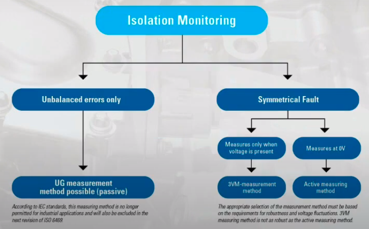
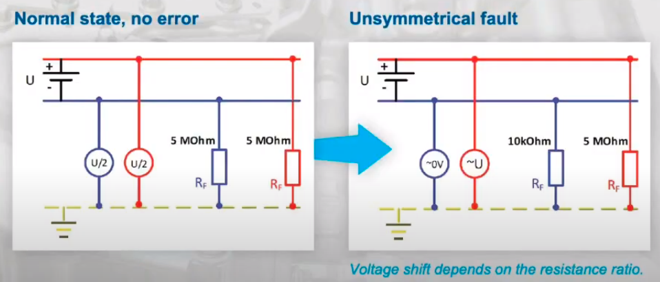
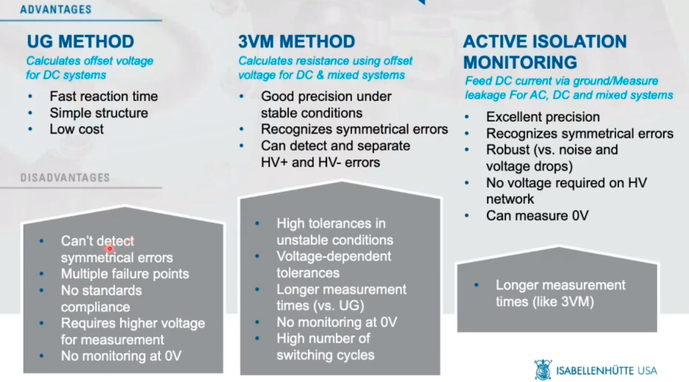
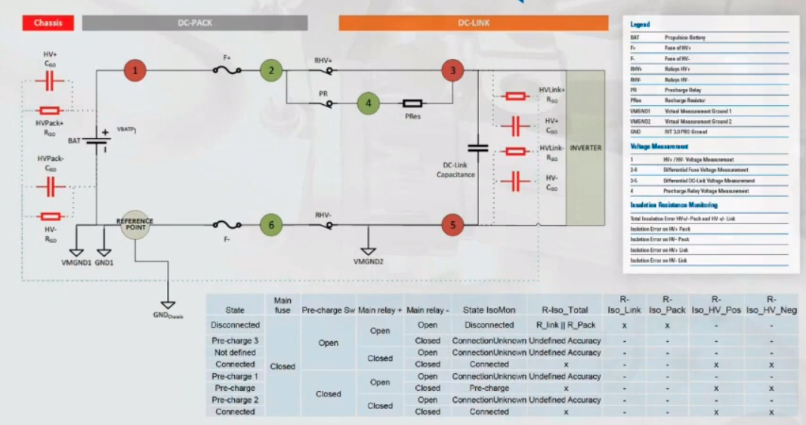
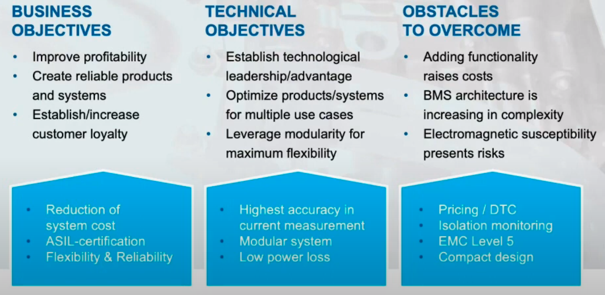

# Functional Safety in HV Battery Packs

## Major Topics

- Functional Safety for HV battery packs

  - including ISO 26262 requirements

- Isolation monitoring

  - Active vs passive

- Voltage sensing points for active isolation monitoring

## Priorities & Challenges for Today HV Battery Innovators

- Business objectives

  - Improve profitability
  - Create reliable products and systems
  - Establish/increase customer loyalty

- Technical Objectives

  - Establish technological leadership/advantage
  - Optimize products/systems for multiple use cases
  - Leverage modularity for maximum flexibility

- Obstacles to overcome
  - Adding functionality raises costs
  - BMS architecture is increasing in complexity
  - Eletromagnetic susceptibility presents risks

## Function Safety

**ISO2622 requirements in HV battery pack current and voltage sensing systems**

### Understanding ISO 26262

- Replaces IEC 61508 as functional safety standard for street vehicles (< 3.85 tons / 3500kg)
- 500+ pages, covering all steps from concept phase through production
- Implementation reduces product liability risk for OEMs

- The "V-Model"
- Higher-order processes
  - e.g. vocabulary definition & functional safety management
- Core process can be described as a "V-shaped" cyclic process
- Supporting processes and analyses

### Hazard Analysis

### Automotive Safety Integrity Levels (ASIL)

- Are determined according to fixed methods defined in the standard through parameters Exposure(E), Controllability(C) and Severity(S)
- Four ASIL levels A through D with D being the highest level
- ASIL QM level for non-safety relevant parts
- Example: HW design safety analysis
  

## Isolation Monitoring

### Why Isolation Monitoring?

Isolation monitorning systems in eletric vehicles are used to monitor the isolation between the electric vehicle high-side which means the high voltage battery, and the inverter, the motor, the drivertrain of the electric vehicle as well as some auxiliary components like the heater and the AC unit, which is shown in red line. And the 12V side of the eletric vehicle which is shown in green and includes the communication line like the CAN for instance.

It's important to monitor this isolation between the high-side and the low-side safety reasons as obviously the vehicle has an interface with humans and humans touch metal parts of the vehicle which serve as the ground side of the 12V system.

So if there's a leak between the high-side and the low-side of the eletric vehicle that can represent a hazard for humans interacting with the vehicle.

So that's why it's important that we constantly monitor the isolation level between the high-side and the low-side of the eletric vehicle.

### Isolation Monitoring Active vs Passive Overview

In the recent years, a lot of different isolation measuring methods have merged. But the basic three are described here.

The **UG** method which is an unsymmetrical voltage to ground measuring method was invented in the 1970s. **UG** is still used today but not allowed in newer EV standars anymore. However some countries like China still allows to use it.

The **3VM** method or **3V meter** method is also a passive measurement method and can still be used.

The **Active Measurement Pulse** method or **AMP** method works with unenergized bus systems and can also detect symmetrical as well as unsymmetrical isolation errors.

Coupling methods for all three isolation measurement methods can be either resistive, capactive or inductive. However resistive coupling is used the most frequent.

### Choosing the Right Measurement Technology

When choosing an isolation monitoring system, we have to decide what fault we want to detect. An unsymmetrical fault or a sysmmetrical fault.

Symmetrical faults can occur due to aging or corrosion on contacts. Unbalance errors are more frequent and typically occur due to a component failure or a short in the system. The **UG** measurement method is able to detect unbalance errors only.

While **3VM** measurement method as well as the active measurement method can detect both symmetrical faults and unbalanced errors.

## Normal State in a High Voltage Battery

### Difference between Asymmetrical and Symmetrical Errors

**In high voltage battery systems:**

You can see that the coupling resisances both from the positive pole and the negative pole of the battery to ground are at 5M omhms.

So there's no isolation fault in the system, an unsymmetrical fault would cause to drop one coupling resistance either on the positive or the negative pole of the battery further than the other.

### Symmetrical fault

In this case, our resistance from the positive pole of the battery is still at 5M ohms, so there doesn't seem to be a fault here, but the coupling resistance from the negative pole of the battery to ground is at 10k ohms, so there is some isolation fault here.

That means there is a difference in the coupling resistances between the positive and the negative pole, which causes the isolation voltage to drop to 0V on the negative pole, and the full isolation voltage is measured from the positive pole to ground.

In case there's no error in the system, the coupling resistance both from the positive pole and the negative pole to ground is 1/2 of the total voltage.

Still on the left side we see the normal state with no isolation error. On the right side we have simulated a symmetrical fault in our high voltage system. In that case, both coupling resistances between the positive battery side and chassis ground as well as the negative battery side and chassis ground dropped to 50k ohms.

Now what does that mean to the measured isolation voltages, you still measure 1/2 of the isolation voltage from the positive and the negative pole of the high voltage battery to ground.

So despite the presence of an isolation fault, there is no voltage shift to be detected when a symmetrical fault occurs.

### Pros and Cons of the 3 Various Methods

## Voltage Sensing Points For Active Isolation Monitoring In HV Batery Systems

### Preference Point in HV Minus Path

## Technical Objectives

## You Mentioned Active Isolation Measurement has Longer Response

## What Happens with the Isolation Monitor When the Vehicle Is Being Charged

## What is the Sensing Range of Your Isolation Monitoring Product
