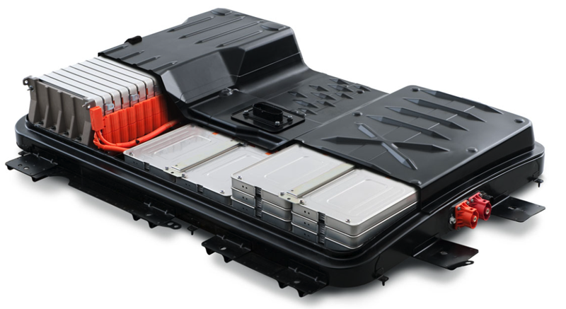
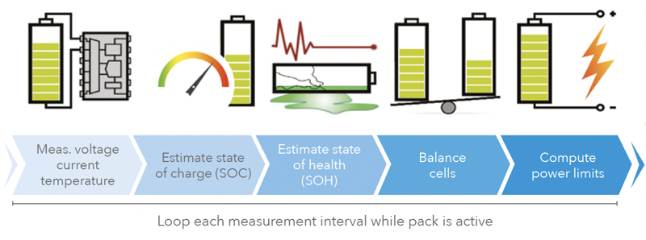
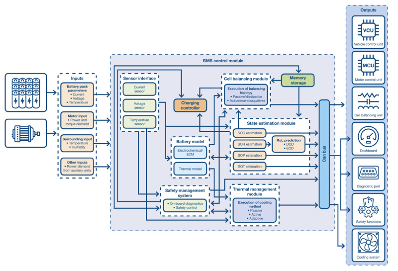
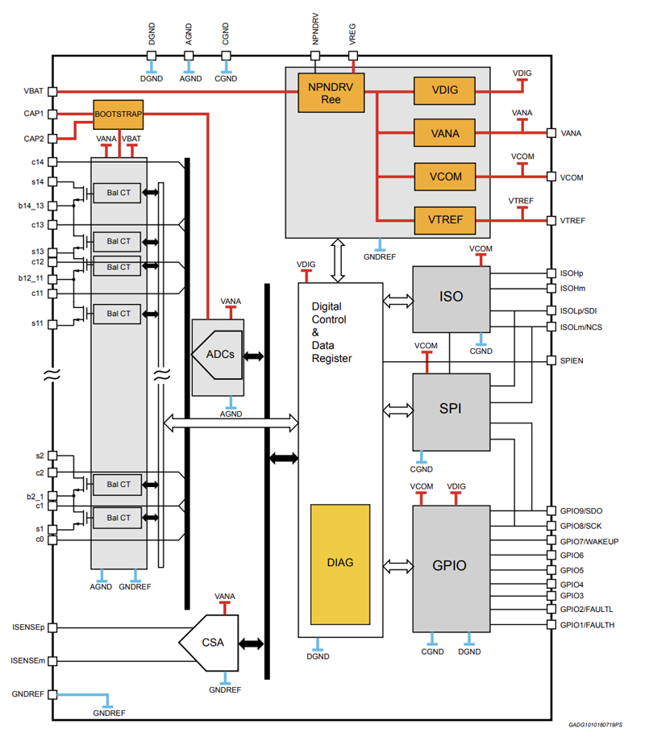

# An Engineer’s Guide to EV Battery Management Systems

Managing the state of charge of a single battery is straightforward, but managing 7,000 cells, the average number in an EV battery pack, is much more complex

## Battery Pack

An EV's primary energy source is a battery pack.

- Fit on the vehicle's underside, between the front and back wheels, and occupies the space usually reserved for a transmission tunnel, exhaust, and fuel tank in an internal combustion vehicle.
- Keeping the pack as low as possible significantly assists in lowering the centre of gravity, an essential factor in the vehicle's road handling characteristics.

- Major battery types:

  - cylindrical
  - pouch-style

- Cells are arranged in a combination of series and parallel configurations to create an output of 400V or 800V.
  - The current trend is towards 800V packs, the key reason being the ability to achieve a quicker charge cycle for a given current.
  - Each cell operates between 2.5V to 4.2V (chemistry dependant), and the behaviour of each impacts the overall effectiveness and efficiency of the battery pack.

## Key Criteria for Managing Battery Health

Lithium-ion cells are well known for their superior discharge characteristics, allowing EVs to accelerate like a performance sportscar. However, such impressive discharge abilities pose a significant safety risk in the wrong situation.

The pack's high output voltage also represents a risk to the driver, passengers, and any other persons involved in an accident. Adherence to relevant automotive functional safety legislation is crucial and another task on the list of requirements for the battery management system.

The key metrics of a BMS include the following:

- **State of charge (SOC) estimation:** The SOC indicates the energy remaining in an EV at a given time and is usually expressed as a percentage of the total capacity. SOC is a critical metric since it indicates to the driver how much charge remains and enables an estimation of the vehicle's possible range. Various sensors connected to the BMS provide the necessary inputs to algorithms running on the BMS microcontroller to estimate the state of charge.

- **State of health (SOH):** The SOH, also expressed as a percentage, indicates the overall health and capacity of the EV battery pack compared to its original capacity when new. It's a measure of the battery pack's ability to store and deliver energy over time, considering cell ageing due to repeated charge and discharge cycles and chemical changes within the cell.

- **State of function (SOF):** The SOF takes into account the SOH but provides a more real-world understanding of the pack's ability to deliver power across a range of operating conditions. Indicators influencing SOF include internal cell resistances, thermal behaviour of the battery pack, and cell voltages. The SOF helps determine cell and pack optimisation and whether maintenance or a replacement pack is required.

An important battery pack optimisation technique is cell balancing. Due to cell chemistry, subtle differences exist in how cells operate and age, creating an imbalance in output voltage and capacity during discharge. Cell balancing relies on equalising the charge across all cells in order to optimise overall performance and prolong battery life. Voltage and current monitoring by the BMS aims to achieve a uniform SOC and avoid overcharging or undercharging individual cells.

Other BMS functions include thermal management, overcurrent, and a**dditional functional safety (e.g., ISO 26262)** and **safety integrity (e.g, ASIL-D) features**.

Another important aspect of EV battery packs is **thermal management**.

- Increasingly, cell temperature monitoring involves sensors placed in several locations in the cell rather than simply on the outside casing or at a central location in a cell module.
- Increasingly, cell temperature monitoring involves sensors placed in several locations in the cell rather than simply on the outside casing or at a central location in a cell module.
- In cold environments, battery performance becomes compromised, so the BMS needs to actively regulate the load to avoid permanent cell damage.
- Active thermal cooling and heating techniques may be required for electric vehicles designed for continued operation in extreme environments.

Should a cell fail to sustain a charge or exhibit poor performance, the BMS can isolate the cell to avoid further damage or impact to the overall battery module and pack performance.

## Typical Architecture of a Battery Management System

The embedded hardware functions fall broadly into four categories:

- sensing
- cell management ICs and microcontrollers
- in-vehicle networking
- safety and isolation

- **Sensors (voltage and current monitoring):** The exact voltage-monitoring method varies, but the most efficient bill of materials approach uses just one sensor signal chain, employing an op-amp and an analogue-to-digital converter (ADC). Individual voltage sense wires are fed from each cell and module, and a multiplexer circuit switches the cell input to the signal chain. A similar approach is employed for current sensing, reading the voltage drop measured across an extremely low-value shunt resistor within the battery module. This approach, achieves the required monitoring task without adding circuit complexity to each cell and module.

- **Sensors (temperature):** Simple thermistors through digital output temperature sensors are available for cell monitoring applications. Thermistors offer a low-cost approach and occupy minimal space within a battery module. As highlighted above, research into more sophisticated cell-monitoring techniques using multiple temperature and magnetic field sensors placed inside each cell enable a more fine-grained approach to cell management.

- **Cell management ICs and microcontrollers:** Highly integrated cell-monitoring and management ICs are readily available for EV applications, providing a cost- and feature-optimised alternative to general-purpose microcontrollers. Most offer all the necessary analogue signal chain functions for voltage, current, and temperature monitoring. Some are also equipped with cell-balancing MOSFET drivers to achieve active cell balancing during charge and discharge. Other integrated functions include network connectivity for Ethernet and CAN interfaces to other in-vehicle systems. Battery management algorithms provide a more informed and adaptive approach to optimising battery pack performance across load and SOH conditions.

- **Isolation and safety:** Safety features range from a "get me home" capability, which provides a limited battery capacity to the drive chain, to the complete galvanic isolation of the battery pack from all EV functions. The latter uses one-time pyro circuit breakers that use a small explosive charge, termed a squib, to instantly interrupt the high-voltage battery output. The squib breaks the circuit much quicker than the typical rupturing time of a conventional fuse.

## BMS Component Showcase

**ST L9963E**

- An example of a multicell battery-monitoring and balancing IC
- AEC-Q100-qualified
- Can monitor the voltage and coulomb counting for up to 14 stacked battery cells in series with zero desynchronisation between samples
- Can monitor up to seven NTC thermistors and communicates with the host BMS microcontroller using SPI or an optically isolated interface

- Up to 31 L9963E devices can be daisy-chained to provide monitoring of 434 series-connected cells.
- A 16-bit ADC provides a maximum error of +/- 2mV across the full measurement range from 0.5V to 4.3V.
- Provides a 200mA passive cell-balancing function for discharge via an internal path or higher current through externally connected MOSFETs.

**Infineon TLE9012DQU**

- AEC-Q100, ISO26262, and ASIL-D
- Can monitor the voltage of 12 series-connected lithium-ion cells and features a dedicated 16-bit sigma-delta ADC for each cell
- Five temperature measurement channels are also integrated into the device for use with external NTC thermistors
- Passive cell balancing of up to 200mA per cell is accommodated internally.
