# Battery Management System from WMG

## What is BMS

Individual battery cells alone can not provide enough power to operate, so what we do is to combine many cells together in series and parallel to create a module, and the nconnect many modules together to create a pcak.

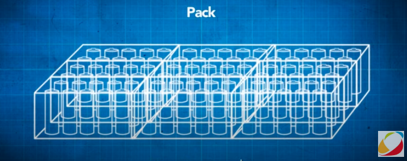

## Battery Management System (BMS)

At pack level, lithium-ion battery performance becomes difficult to manage, because the cell can get charged and discharged at varing rates, and can be operating at different conditions due to their different operational state. In term of temperature, state of charge (SoC), and state of health (SoH).

A complex eletronic system konwn as the Battery Management System, is required to monitor the charge rate, across the whole pack up to cell level, to ensure peak performance and prolong the battery life.

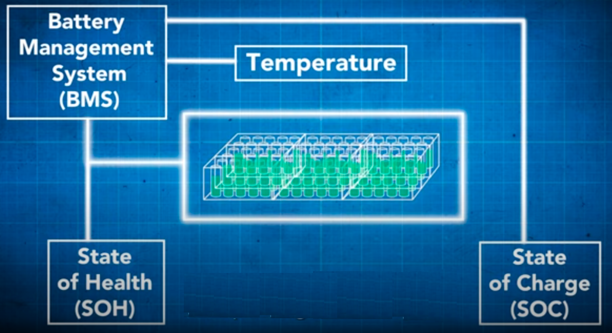

## Cells module and pack

Cells come in various formats, which have different characteristics.

- Cylindrical Cell
- Pouch Cell
- Coin Cell
- Prismativc Cell

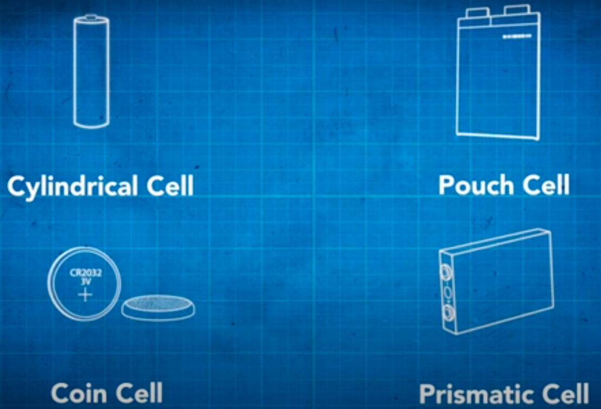

A module is formed by connecting multiple cells together, providing them with a mechanical support structure, thermal interface, and attaching terminals.

- mechanical support structure
  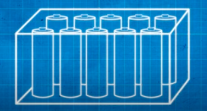
- thermal interface
  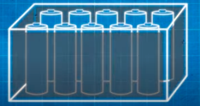
- attaching terminals
  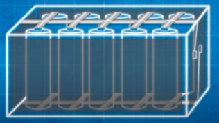

A pack is formed by connecting multiple modules together with a sensor and a controller all housed within the case.

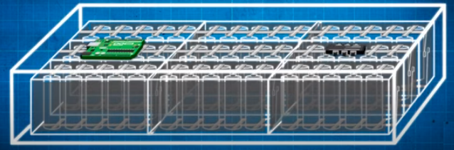

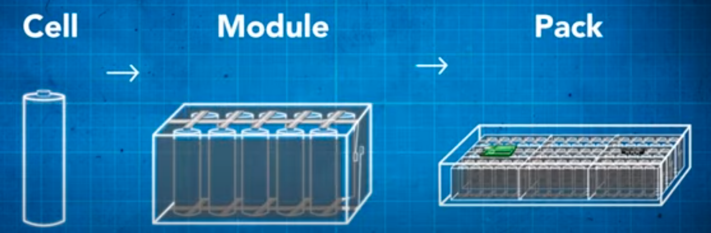

Within a battery pack, when multiple cells are connected in series, the cell with the lowest power will restrict the performance of the entire string.

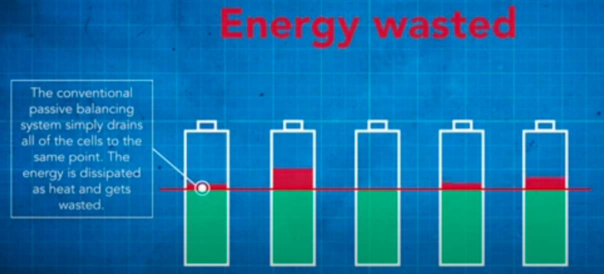

Any failure in a single cell can adversely affect the overall capacity of the series. The same is true of the cell thermal characteristics. Depending on their state of charge, cells in the module will be experiencing different temperature affecting the performance of the pack as a whole.

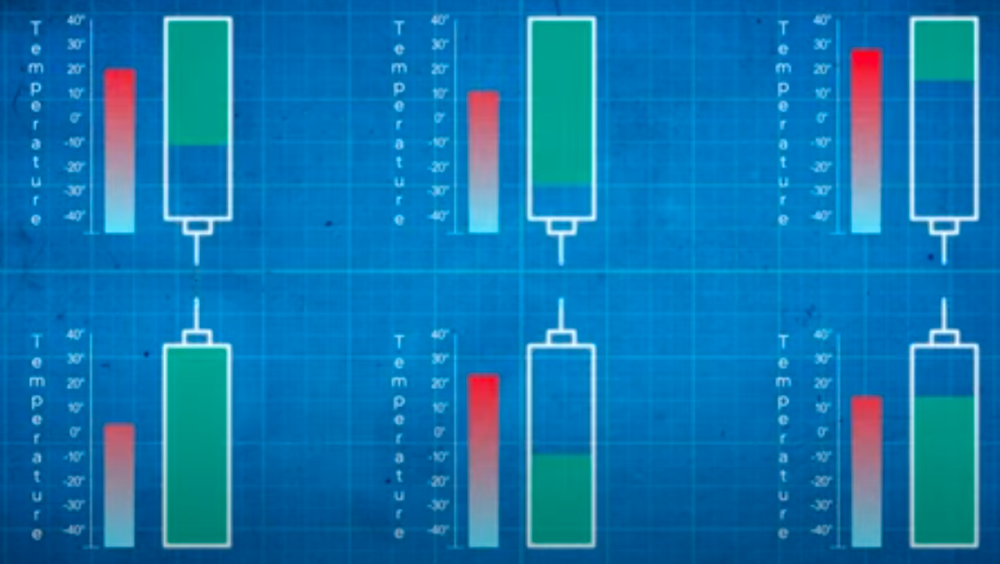

## Key funciton of BMS

There are two important aspects which are the key elements that make up and efficient Battery Management System: charge balancing and thermal management.

### Thermal management

Lithium-ion batteries each have an acceptable operating temperature range. A lithium-ion battery operating outside of this safe temperature range will cause performance degradation and irreversible damage.

In extreme cases, it can even cause thermal run away, excessive overheating of the cell and possible combustion.

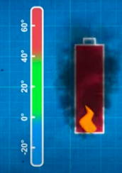

A BMS controls the temperature of the battery through heating and cooling.

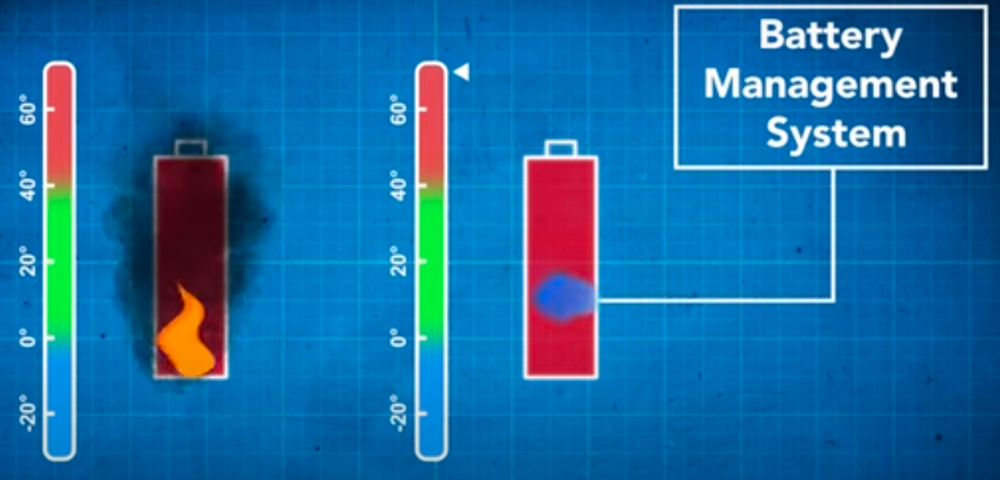

Temperature sensors are installed in the pack to provide cell temperature information. The BMS uses this information to distrubute coolant where it's needed to maintain the ideal temperature range.

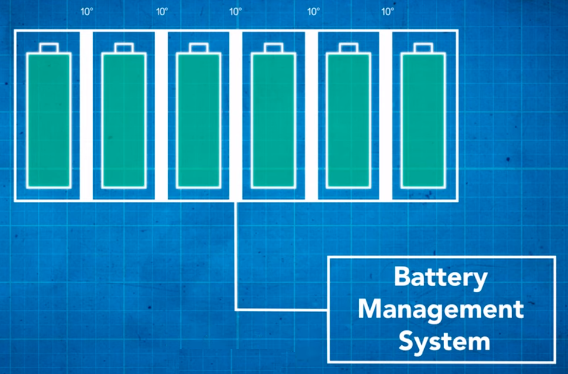

Common coolants used include:

- air
- water/glycol
- dielectric oil
- refrigerant

### Charge balancing

Due to manufacturing inconsistencies, even brand new cells of the same type have slight differences like **capacity, impedance and self-discharge rate**. This causes the cells to age at different rates, exacerbating those differences, and resulting in significant energy imbalance, among the cells in a module, hence the degradation of its performance.

If we have a battery module with several cells in series, the current that flows through each cell, is the same during its operation.

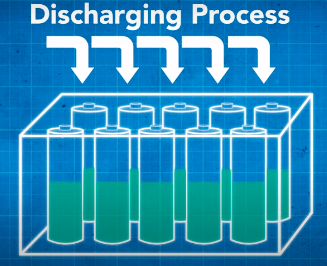

If one cell has charge capacity lower than others, it will become fully charged before other cells.

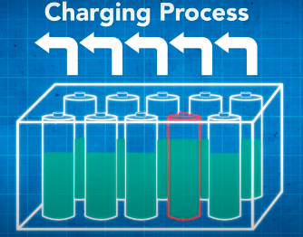

Equally, when the battery is being discharged, some cells still have charge left in them, and are never fully discharged. This causes a waste of energy, and reduce the module capacity.

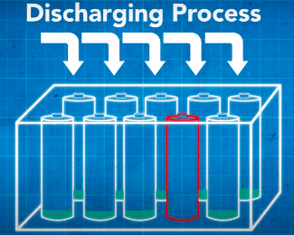

## Passive Balancing

Passive balancing is a conventional way to address this issue by removing excess energy in cells. The system drains all of the cells to the same point, so that they recharge fully and at the same rate.

But passive balancing is not helpful when the battery is being discharged, as the capacity of a module is stil limited by the weakest cell.

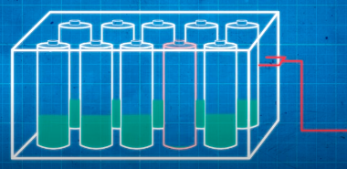

Since the excess energy is dissipated as heat, or external resistance, an additional cooling system is needed.

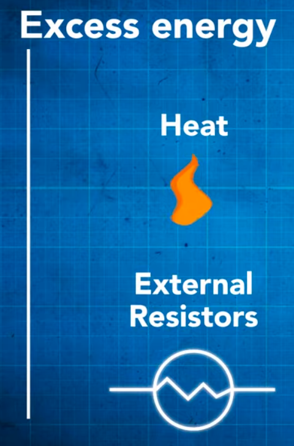

This is why we need active balancing.

## Active Balancing

Active balancing is a more energy efficient way to balance cell energy compared with passive balancing. It redistributes the energy amongst cells rather than dissipate and waste it.

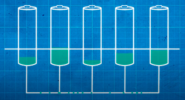

Power eletronic devices are used to move energy from the strong cells to weak cells, maximizing the available energy and increasing the effects of capacity of te module.

Here is an example of one form of active balancing system, a cell to external storage topology. The cells in series are connected to an external powersource via a bidirectional DC-DC converter.

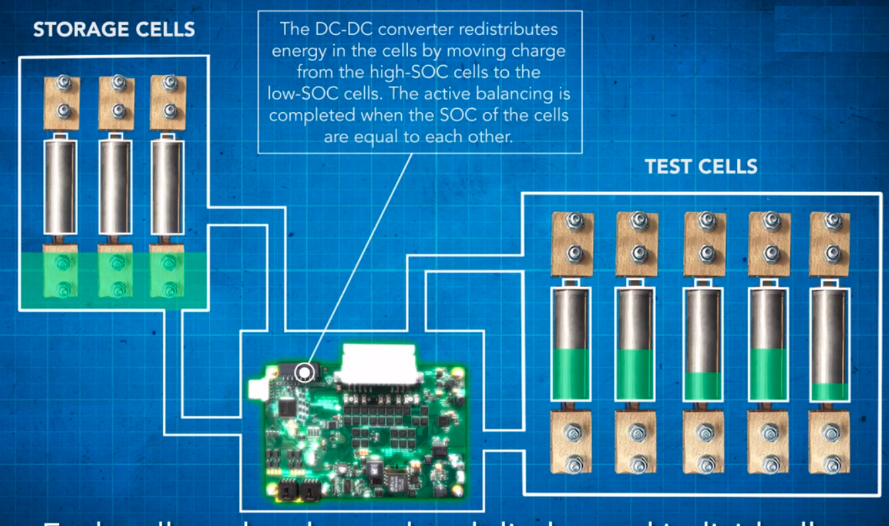

Each cell can be charged and discharged individually, to exchange energy with the external source. To balance the source, we take the energy from the strong cells in the module, temporarily store it in the external storage, and then give this energy to the weak cells.

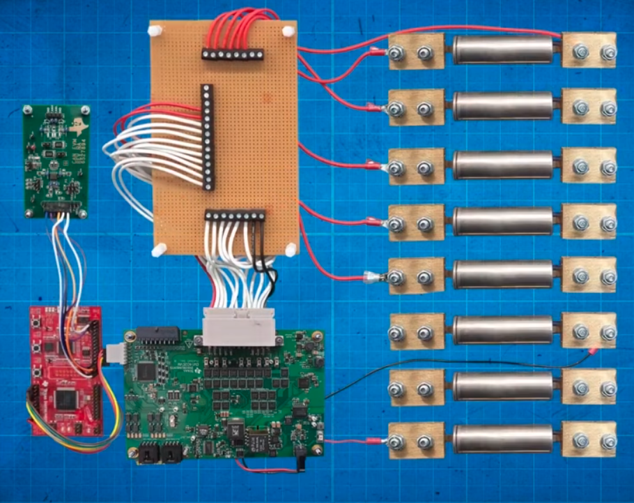

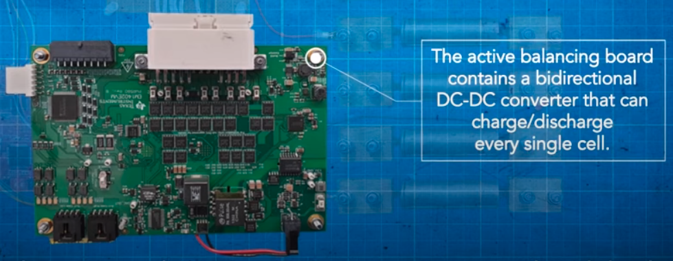

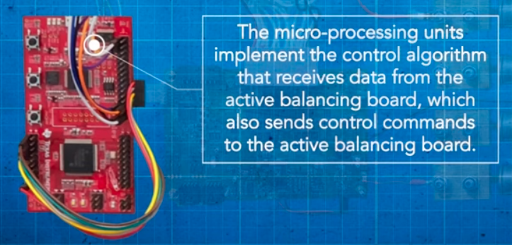

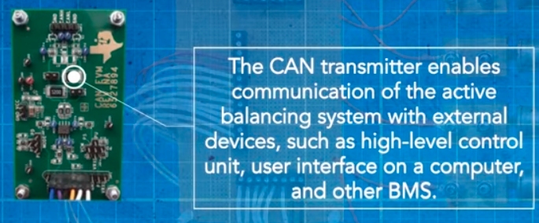

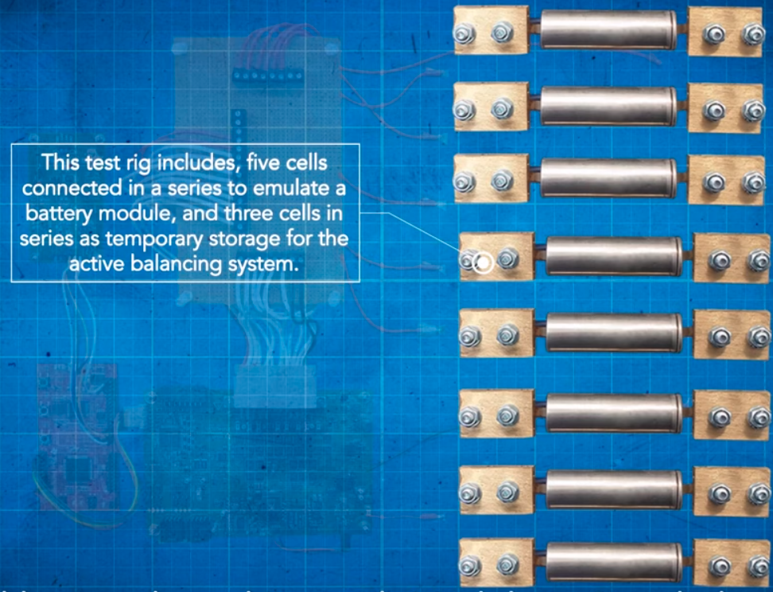
