# Unified Diagnostic Services (UDS)

## 1 Overview

### 1.1 Automotive Diagnostic System

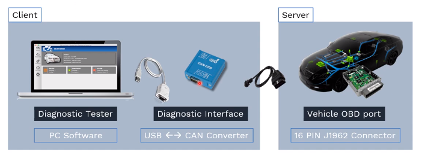

Automotive Diagnostic System consists of

- a diagnostic tester
- a vehicle communication interface
- OBD2 cable connected with vehicle OBD2 port
  - Also called as J1962 port

**The diagnostic tester**, could be an end user application running on a PC or a laptop, or in a tablet or in some special handheld devices.

The diagnostic software is connected with the vehicle communication interface via a USB cable. And the other side of the USB cable is RS232 connector which connected to the VCI.

The other side of the VCI is RS232 connector and the vehicle side is a J1962 connector.

**The communication interface**, is also called as a protocol converter which converts the USB signal into CAN, or any other protocol which are supported by the vehicle communication interface
and the vehicle issues together.

**From UDS perspective:**

- **Client**, as the UDS specification the diagnostic tester, whhich consists of the PC software or the VCI and the cable together.
- **Server**, the ECUs within the diagnostic server with the diagnostic server application, or the software which takes care of the diagnostic related functions.

### 1.2 UDS Diagnostic Clients

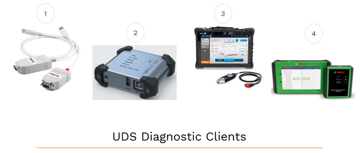

- Peak CAN USB VCA from **_Peak system_**
- VIN1000 from **Softing AG**
- Multi-diagram
- ADS525x from Bosch

Generally these diagnostic clients, are developed by OEM, and it's provided to their dealer vehicle service stations.

### 1.3 ECUs in a Car (on CAN Bus)

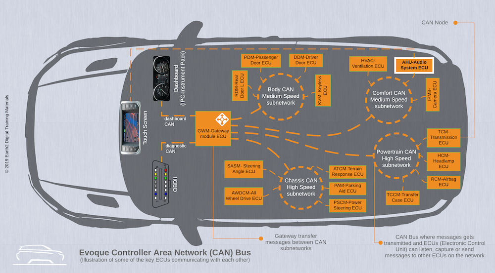

The CAN communication lines are extended to OBD2 port via diagnostic CAN.

The ECU can be connected in different. You know topologies in the vehicle. But every individual ECU can be accssed by the tester from this diagnostic port.

As we discussed previously, every ECU insdie the vehicle as assigned unique identifier their address, that means every ECU inside the vehicle must be assigned with an unique ID.

The Same address can be also used the physical address of these ECUs, can be also used as diagnostic server address.

### 1.4 UDS Diagnostic Servers

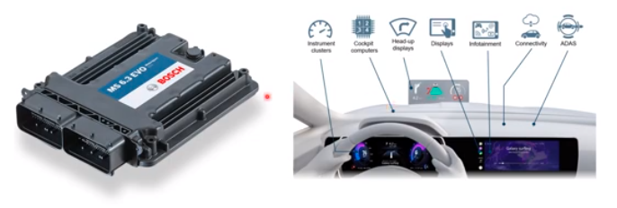

Here are two examples of ECUs which can act as diagnostic server:

- A Bosch engine management system ECU
- A Visteon digital cockpit ECU with instrument cluster, entertainment, connectivity, etc.

The OEM shall ensure that each of the ECU in the vehicle has a unique server identifier. The OEM must also ensure that the client in the system has also a client identifier that means the diagnostic tester also should be assigned with a unique ID.

The physical or the target address of the ECU shall be the same address of the diagnostic server.

### 1.5 UDS Diagnostic Servers - AUTOSAR

What are the elements you know which forms the diagnostic server inside the ECU?

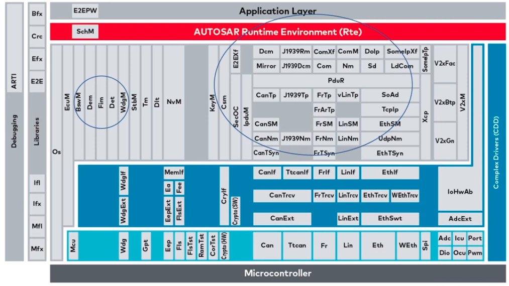

By taking the example of AUTOSAR architecture, the highlited areas where you find different components, can act as a diagnostic server for the tester, which will be connected to the diagnostic port, and number of service identifies are requested from the tester.

In this software architecture, the diagnostic software components acts a server for the diagnostic tester.

### 1.6 Automotive Diagnostic Addressing

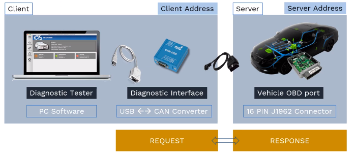

So the diagnostic tester are the client request different services from ECU services of the ECU diagnostic servers, with the well defined structured protocol called UDS or unified diagnstic services.

There is a client address assigned to each of the tester, and there is should be an address for every ECU inside the vehicle.

So the client can always address the ECU with two types of addressing mechanism:

- physical addressing
- functional addressing

#### 1.6.1 Physical Addressing

When the tester uses the physical addressing mode, the physical addressing shall always be a dedicated message to a diagnostic server software which is implemented in a particular ECU.

When a physical addressing is used the communication is a **point to point** communication that means the diagnostic test is talking to a specific ECU in the vehicle.

#### 1.6.2 Functional Addressing

The next addressing mechanism of functional addressing is used by the client. If it does not know the physical address of the server function that shall respond to a diagnostic service request, or if the server function is implemented as a distributed function in several ECUs, then the functional addressing method will be helpful to get the required data from each of the ECU or required functions in different ECU to perform actually.

When a functional addressing is used, the communication is a broadcast communication from the client to all the servers present in the vehicle.

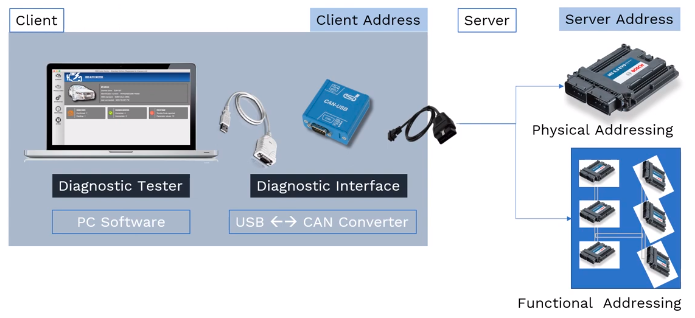

### 1.7 Automotive Diagnostic Request

The client always request for a specific service which needs to be executed in the ECU diagnostics server application.

And the server respond to the tester with the response and allows ECU software functions to perform necessary diagnostic operations.

There are two direct responses are possible from the ECU:

- A positive response
- A negative response

#### 1.7.1 Positive Response

A positive response inform the client or the diagnostic tester that the server as the requested data are the server or the ECU can perform the requested operation from the tester.

#### 1.7.2 Negative Response

A negative response from the ECU diagnostic servr informs the client that the requested service from the tester is not supported. z

Due to the invalid form of request, or some data length is not supprted and few more reasons are available.

#### 1.7.3 SID - Service Identifiers

Why an active response is sent by the ECU server? The diagnostic tester requests the ECU to perform diagnostic related software execution with a unique ID.

These unique ID numbers are called as service identifiers or SIDS, which is a one byte unsigned integer value.

There are 26 unique ID request can sent by the client to the vehicle ECU. Each unique request as called as service identifiers are SIDS.

### 1.8 UDS: SID Functional Units

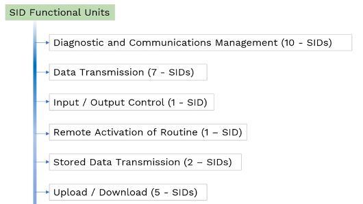

The 26 SIDS are formed into 6 different functional units. These 6 functionals units of differnet set of SIDS are assigned to them.

This grouping of SIDS are done to perform a specific set of operation with the help of each SIDS within one functional unit.

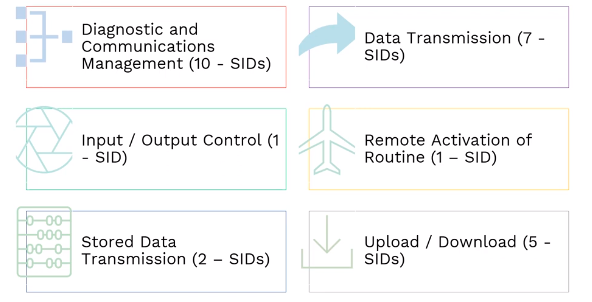

#### 1.8.1 Diagnostic and Communiction Managment functional unit (10 SIDs)

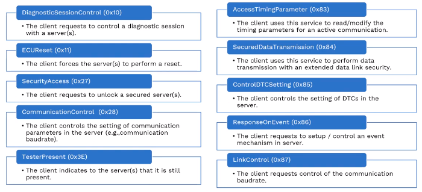

#### 1.8.2 Data Transmission functional unit (7 SIDs)

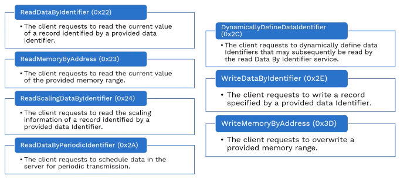

#### 1.8.3 SID Functional Units

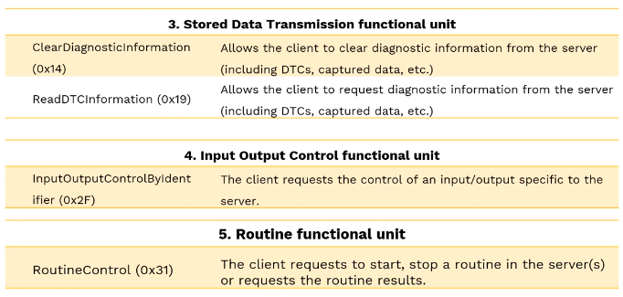

#### 1.8.4 Upload Download functional unit (5 SIDs)

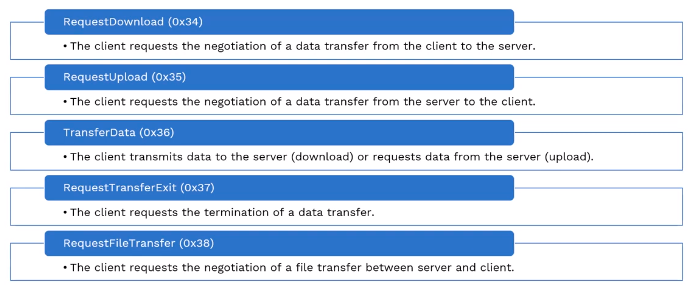
