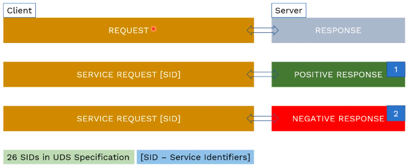

# Unified Diagnostic Services (UDS)

## 1 Overview

### 1.1 Automotive Diagnostic System

Automotive Diagnostic System consists of

- a diagnostic tester
- a vehicle communication interface
- OBD2 cable connected with vehicle OBD2 port
  - Also called as J1962 port

**The diagnostic tester**, could be an end user application running on a PC or a laptop, or in a tablet or in some special handheld devices.

The diagnostic software is connected with the vehicle communication interface via a USB cable. And the other side of the USB cable is RS232 connector which connected to the VCI.

The other side of the VCI is RS232 connector and the vehicle side is a J1962 connector.

**The communication interface**, is also called as a protocol converter which converts the USB signal into CAN, or any other protocol which are supported by the vehicle communication interface
and the vehicle issues together.

**From UDS perspective:**

- **Client**, as the UDS specification the diagnostic tester, whhich consists of the PC software or the VCI and the cable together.
- **Server**, the ECUs within the diagnostic server with the diagnostic server application, or the software which takes care of the diagnostic related functions.

### 1.2 UDS Diagnostic Clients

- Peak CAN USB VCA from **_Peak system_**
- VIN1000 from **Softing AG**
- Multi-diagram
- ADS525x from Bosch

Generally these diagnostic clients, are developed by OEM, and it's provided to their dealer vehicle service stations.

### 1.3 ECUs in a Car (on CAN Bus)

The CAN communication lines are extended to OBD2 port via diagnostic CAN.

The ECU can be connected in different. You know topologies in the vehicle. But every individual ECU can be accssed by the tester from this diagnostic port.

As we discussed previously, every ECU insdie the vehicle as assigned unique identifier their address, that means every ECU inside the vehicle must be assigned with an unique ID.

The Same address can be also used the physical address of these ECUs, can be also used as diagnostic server address.

### 1.4 UDS Diagnostic Servers

Here are two examples of ECUs which can act as diagnostic server:

- A Bosch engine management system ECU
- A Visteon digital cockpit ECU with instrument cluster, entertainment, connectivity, etc.

The OEM shall ensure that each of the ECU in the vehicle has a unique server identifier. The OEM must also ensure that the client in the system has also a client identifier that means the diagnostic tester also should be assigned with a unique ID.

The physical or the target address of the ECU shall be the same address of the diagnostic server.

### 1.5 UDS Diagnostic Servers - AUTOSAR

What are the elements you know which forms the diagnostic server inside the ECU?

By taking the example of AUTOSAR architecture, the highlited areas where you find different components, can act as a diagnostic server for the tester, which will be connected to the diagnostic port, and number of service identifies are requested from the tester.

In this software architecture, the diagnostic software components acts a server for the diagnostic tester.

### 1.6 Automotive Diagnostic Addressing

So the diagnostic tester are the client request different services from ECU services of the ECU diagnostic servers, with the well defined structured protocol called UDS or unified diagnstic services.

There is a client address assigned to each of the tester, and there is should be an address for every ECU inside the vehicle.

So the client can always address the ECU with two types of addressing mechanism:

- physical addressing
- functional addressing

#### 1.6.1 Physical Addressing

When the tester uses the physical addressing mode, the physical addressing shall always be a dedicated message to a diagnostic server software which is implemented in a particular ECU.

When a physical addressing is used the communication is a **point to point** communication that means the diagnostic test is talking to a specific ECU in the vehicle.

#### 1.6.2 Functional Addressing

The next addressing mechanism of functional addressing is used by the client. If it does not know the physical address of the server function that shall respond to a diagnostic service request, or if the server function is implemented as a distributed function in several ECUs, then the functional addressing method will be helpful to get the required data from each of the ECU or required functions in different ECU to perform actually.

When a functional addressing is used, the communication is a broadcast communication from the client to all the servers present in the vehicle.

### 1.7 Automotive Diagnostic Request

The client always request for a specific service which needs to be executed in the ECU diagnostics server application.

And the server respond to the tester with the response and allows ECU software functions to perform necessary diagnostic operations.

There are two direct responses are possible from the ECU:

- A positive response
- A negative response

#### 1.7.1 Positive Response

A positive response inform the client or the diagnostic tester that the server as the requested data are the server or the ECU can perform the requested operation from the tester.

#### 1.7.2 Negative Response

A negative response from the ECU diagnostic servr informs the client that the requested service from the tester is not supported. z

Due to the invalid form of request, or some data length is not supprted and few more reasons are available.

#### 1.7.3 SID - Service Identifiers

Why an active response is sent by the ECU server? The diagnostic tester requests the ECU to perform diagnostic related software execution with a unique ID.

These unique ID numbers are called as service identifiers or SIDS, which is a one byte unsigned integer value.

There are 26 unique ID request can sent by the client to the vehicle ECU. Each unique request as called as service identifiers are SIDS.

### 1.8 UDS: SID Functional Units

The 26 SIDS are formed into 6 different functional units. These 6 functionals units of differnet set of SIDS are assigned to them.

This grouping of SIDS are done to perform a specific set of operation with the help of each SIDS within one functional unit.

#### 1.8.1 Diagnostic and Communiction Managment functional unit (10 SIDs)

#### 1.8.2 Data Transmission functional unit (7 SIDs)

#### 1.8.3 SID Functional Units

#### 1.8.4 Upload Download functional unit (5 SIDs)

## 2 UDS: Diagnostic Session Control (SID: 0x10)

### 2.1 UDS: ECU Diagnostic Sessions

| Service ID(s) | Session Definition               |
| ------------- | -------------------------------- |
| 0x01          | Default Session                  |
| 0x02          | Programming Session              |
| 0x03          | Extended Diagnostic Session      |
| 0x04          | Safety System Diagnostic Session |
| 0x40 - 0x5F   | Vehicle Manufactureer Sepecific  |
| 0x60 - 0xyE   | System Supplier Specific         |

Session control service 0x10 is used to enable different diagnostic sessions in the ECU.

### 2.2 UDS: ECU Diagnostic Default Session

In normal operating condition of an ECU, default diagnostic session (**DEFAULT_SESSION**) is always active or in other terms whenever ECU is powered-on, its current active diagnostic session is set to **DEFAULT_SESSION**.

So the **DEFAULT_SESSION** is the first session of the diagnostic session.

### 2.3 Non-default Sessions

- **Programming Session**

  - This diagnostic sesion enables all diagnostic services required to support the memory programming of a server.
  - is used for flashing
  - the ECU at the EOL, or a software ban or updated the ECU garage
  - remote software updates like FOTA, SOTA are happening with the help of programming sessions

- **Extended Diagnostic Session**

  - This diagnostic session can be used to enable all diagnostic services required to support the adjustment of functions like "Idel Speed, CO Value, etc." in the server's memory.
  -

- **Safety System Diagnostic Session**

  - This diagnostic sesion enables all diagnostic services required to support safety system related functions (e.g., airbog deployment).

- **Vehicle Manufacturer Specific**

  - This range of value is reserved for vehicle manufacturer specific use.

- **System Supplier Specific**

  - This range of value is reserved for system supplier specific use.

### 2.4 UDS: SIDs Supported by Different Sessions

### 2.5 UDS: Non-Default Session SIDs

### 2.6 UDS: ECU Diagnostic Session State Diagram

### 2.7 UDS: DiagnosticSessionControl(ox10) Service

#### 2.7.1 Positive Response 0x50

What do we do with the help of tester is that we are able to get into these different kinds of session with the help of a request message from the tester.

And the ECU responds with a postive response, by informing that the ECU server diagnostics services are successully executed, and you know it got into those sessions.

In DiagnosticSessionControl(0x10),support these 6 sub-functions which are nothing but the different sessions of ECU diagnostic server.

With the help of this sub-function, the client can request the ECU diagnostic server to all possible diagnostic sessions, that means the tester or the client sends the SID request 0x10 DiagnosticSessionControl service request with the sub-function 0x01, to set the current session to default session.

If you replace the sub-function 0x01 with 0x02 or 0x03 or 0x04 ... or 0x70 or any other diagnostic session with that particular ID. Then it is possible to get into those sessions you know which is requested by the diagnositc tester.

So the request message starts with 0x10 which is nothing but diagnostic session control 0x10, and sub-function ID where you can see start with 0x1, 0x02, 0x04 and 0x40 to 0x5F, 0x60 to 0x7E. When the request is sent then the ECU diagnostic server responds back to the diagnostic tester with the positive response and the positive value is 0x50.

There is a relation between the tester SID and the response which is received from the diagnostic server. So whenever you have a positive response, the server always adds a value 0x40 into the SID request. So that means if you receive a value of 50 that means it's a positive response, and whatever the session that have been asked from the diagnostic tester is successfully executed in the ECU.

#### 2.7.2 Negative Response 0x7F

Note: The 0x22 - contions NOT Correct is a unqiue situation, where it is expected that whenever you perform a diagnstic session in the vehicle. It is expected that the vehicle is not moving or the engine should not be running. These are few environmental conditons, that will impact your diagnostic session.

## 3 UDS: Input Output By Identifier - SID: 0x2F

### 3.1 Service Description

The client requests the control of an input/output specific to the server. The server

### 3.2 Engine Management System - Block Diagram

- Left hand side -> a number of sensors
- Right hand side -> a number of actuators

The understanding of InputOutputByIdentifier_0x2F in this example is to substitute a value for the sensor, or take a momentory control of the actuators directly from the tester by providing a SID along with some parameter values.

So these are helpful in the garage diagnostic to identify some of the faults in some particular components. Either both in the sensor side as well as on the actuator side.

### 3.3 Bosch ESP ECU

The input unit on the left side and output unit on the right side, the values can be substituted with the help InputOutputByIdentifier_0x2F, and momentarily we can take control of these values from diagnostic tester, thereby creating some scenario to understand how the given or observed component is working.

### 3.4 The Input Output Conrol by Identifier

The Input Output Conrol by Identifier service is used by the client to substitute a value for an input signal, internal server function, either it could be an input signal directly which is comming from the sensor. you can change the value of it, or any sub-function which is using this sensor signal.

Then there is some calculation happens internally even then with the help of a specifiic data indentifiers you can replace those values.

That is also possible, so either you can directly change the input signal and then use.

The client to substitude the value of input signal that means either it could be a input signal.
