# Charging - Power Line Communicator

## Introduction

### Current and Near Future Regional Standards
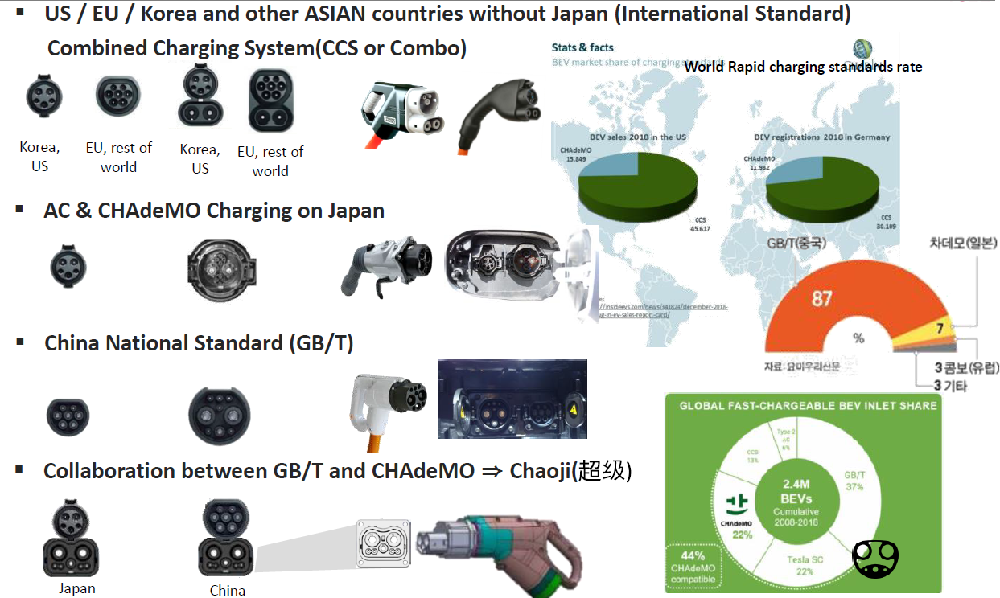

### Electric Vehicle Communication Controller

- **The component which controls the communication between EVSE(Eletric Vehicle Supply Equipment) and Vehicle main ECU for charging the EV battery**

- **Various Charging standards depending on region**
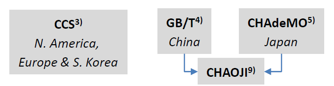

- **Various types of EVCC system configuration exist based on OEM's E-PT syste**m
    1. Standalone EVCC
    2. Embedded in OBC(On Board Charger)
    3. Embedded in BMS(Battery Management System)
    4. Embedded in DCCM(DC Charging Contactor)
    5. Embedded in VCU(Vehicle Control Unit)

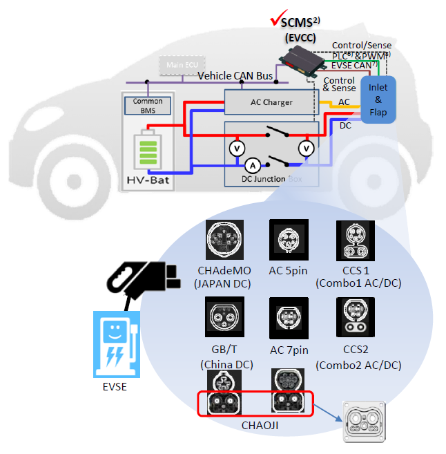

- Design considerations
    - durability
    - maintenance
    - design flexibility
    - cyber security
    - logistics
    - VCU complexity & load reducing
    - application to different charging standard region

### Comparison between Gateway Dedicated and Complex (SCMS) EVCC

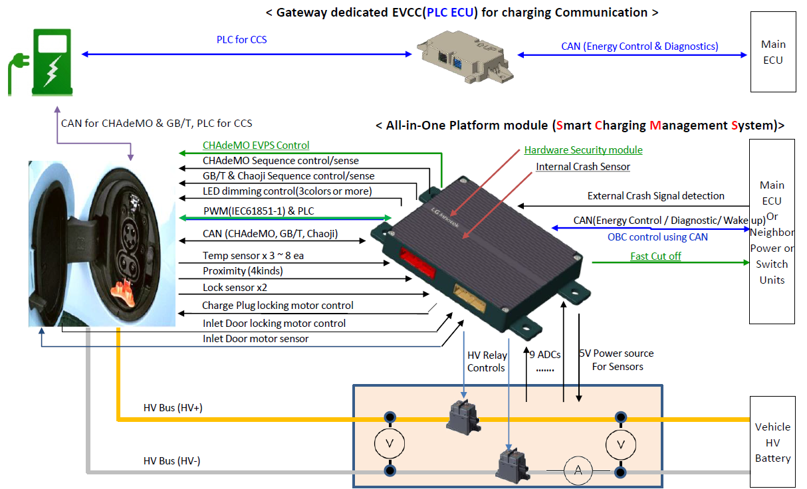

### Low Level and High Level communications with EVSE (CCS)

- **Low level communication with EVSE**
    - PWM(Pulse Width Modulation) level control function required on EVCC or EV energy control ECU
    - CP(Control Pilot) signal level control for PLC  communication start and end
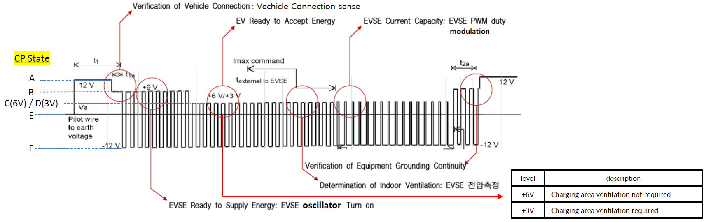

- **High(PLC(HPGP)) level communication between EVSE and EVCC on CCS charging standard**
    - High level communication is required for DC Fast charging ( High Level communication should be performed on EV charging that has the charging current range of **80~200A**. )
    - EVCC perform the HPGP communication with EVSE and re transmit the data to vehicle ECU using CAN channel. Also hind foremost, vehicle ECU’s data is sent to the EVSE.

### High Level communication detail

- **PLC PSD(Power Spectral Density) tuning on CP for CCS Conductive charging standard**
    - Ability to measure PSD & edit PIB values for tuning
    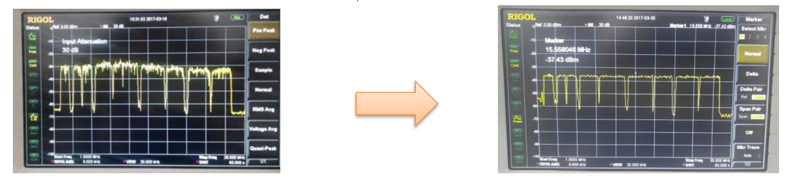

    - PSD measurement and management on actual vehicle
    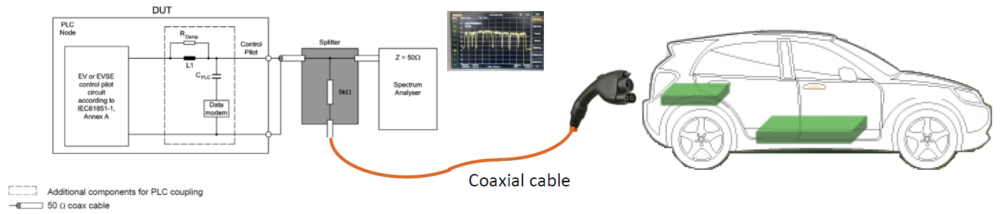

- **Other Charging standard’s High level Communication methods**
    - CHAdeMO, GB/T, Chaoji → CAN (Control Area Network) communication
        - Chaoji will use Ethernet finally on 2030

### Required Cybersecurity Algorithm for CCS P&C

**ISO 15118 Requirement (7.3.2 Certificate and key management)**

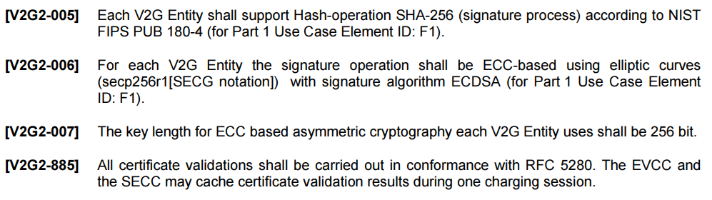

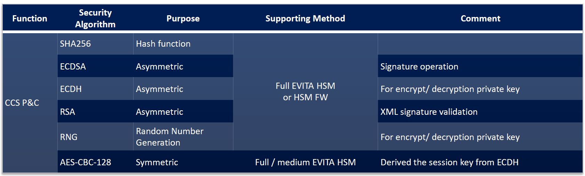

### CCS Gateway Dedicated Module’s Example Architecture

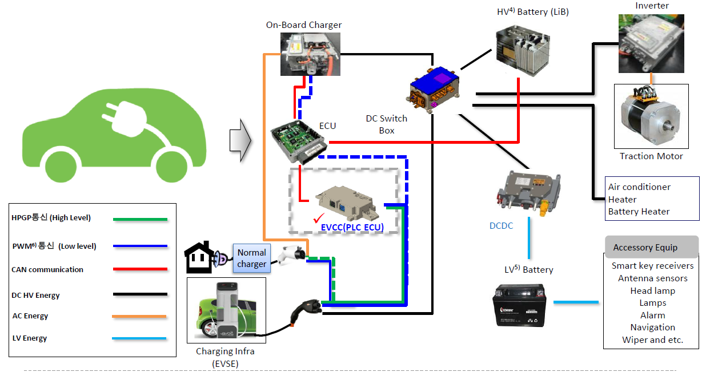

### Future Plan for EV Charging Comm. Control

- **Renewable Energy Storage**

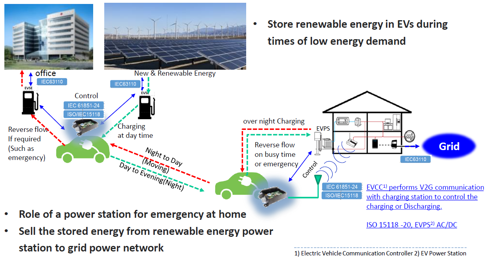

- **Charging Schedule Optimization**

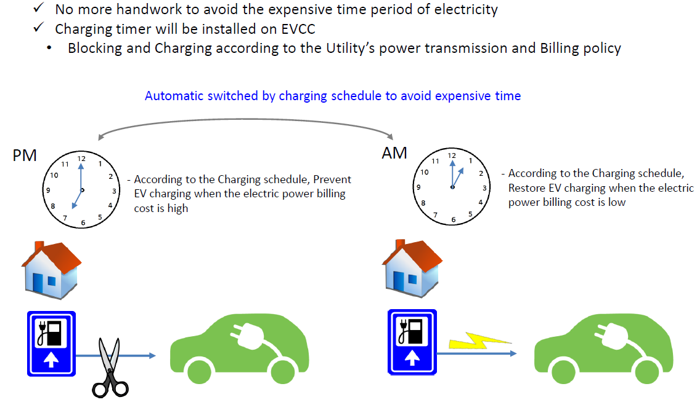

### LGIT EVCC Product Roadmap

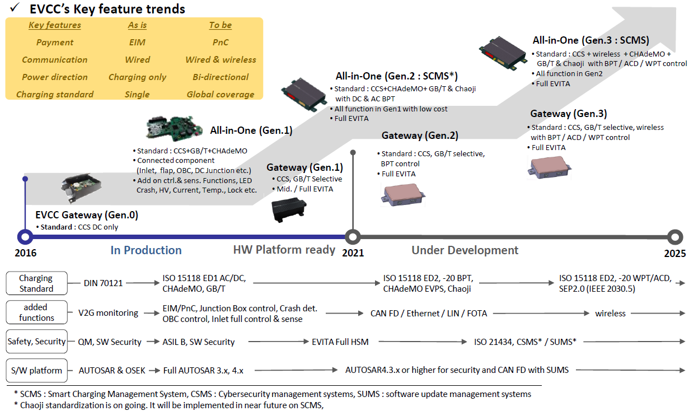

## Referenced Documentations

- [DIN-70121] - DIN 70121:2012-08
  - Electromobility – Digital communication between a d.c. EV charging station and an electric vehicle for control of d.c. charging in the Combined Charging System
- [HPGP] - HomePlug GreenPHY - HomePlug GreenPHY Specification, release version 1.1 of 2012
- [IEC-1] - IEC 61851-1:2010 - Electric vehicles conductive charging system - Part 1: General requirements, release 2010
- [IEC-21] - IEC 61851-21:2001 
  - Electric vehicles conductive charging system - Part 21: Electric vehicle requirements for conductive connection to an a.c./d.c. supply, release 2001
- [IEC-22] - IEC 61851-22:2001
  - Electric vehicle conductive charging system - Part 22: AC electric vehicle charging station, release 2001
- [ISO-2] - ISO/IEC 15118-2:2014
  - Road vehicles - Vehicle to grid communication interface - Part 2: Network and application protocol requirements, release 2014
- [ISO-3] - ISO/IEC 15118-3:2015
  - Road vehicles - Vehicle to grid communication interface - Part 3: Physical and data link layer requirements, release 2015
- [OSI] - ISO/IEC standard 7498-1:1994
  - Information technology -- Open Systems Interconnection -- Basic Reference Model: The Basic Model
- [RFC 2119] - RFC 2119
  - Key words for use in RFCs to indicate requirement levels.
- [RN-PLC-HWT] - 36-02-044
  - Validation Test Plan for PLC Communication hardware
- [RN-PLC-SWS] - 36-02-046
  - PLC Communication, ISO/IEC 15118 compliant, Software specification

## Definitions

- **Basic Charging (BC)**: Charging phase during a charging session controlled by IEC 61851-1 only.
- **Calibration profile**: List of values defining the power emission calibration for each carrier
- **Communication Media**: The physical media carrying the low-layer communication signal is given by the cable assembly, which connects the charging infrastructure and the EV
- **Control Pilot State**: Control Pilot State according to IEC 61851-1 signalled on Control Pilot Line
- **Data Link Setup**: Setup phase for establishing the data link
- **High Level Communication Charging (HLC-C)**: Charging phase during a charging session controlled by ISO/IEC 15118
- **Logical Network**: A logical network is defined for the OSI layer 2. This is a set of low-layer communication stations, which use the same network key. Only members of the same logical network are able to exchange encrypted payload data and are visible for each other on higher OSI layers
- **Low-layer communication**: Functions managed by the OSI layer 1 and layer 2 of the modem
- **Matching**: The process to determine the low-layer communication module of the EV and the low-layer communication module of the EVSE, where the EV is physically connected to, in a direct way
- **Nominal Duty Cycle**: A 10-96 % Control Pilot duty cycle generated by the EVSE [IEC1]
- **Signal Coupling**: Method of coupling the signal on the Communication Media
- **Signal Level Attenuation Characterization (SLAC)**: Protocol used to measure the signal strength of a signal between HomePlug GreenPHY stations
- **V2G Charging Loop**: V2G messaging phase for controlling the charging process by ISO/IEC 15118 [ISO-2]
  - Starts just before the transmission of PowerDeliveryReq(Charge) and ends after the reception of a D-LINK_READY.indication(No link).
- **V2G Setup**: Setup phase for V2G messaging [ISO-2]
  - Starts just after the reception of a D-LINK_READY.indication(Link Established) and ends before the transmission of a PowerDeliveryReq(Charge).
- **Valid Duty Cycle**: 5 % or 10-96 % Control Pilot duty cycle generated by the EVSE [IEC1]

## Abbreviations

- **BC**: Basic Charging
- **EVCC**: Electric Vehicle Communication Controller
- **EVSE**: Electric Vehicle Supply Equipment
- **HLC-C**: High Level Communication Charging
- **MAC**: Media Access Control
- **PLC**: Power Line Communication
- **PSD**: Power Spectral Density
- **SAP**: Service Access Point
- **SECC**: Supply Equipment Communication Controller
- **SLAC**: Signal Level Attenuation Characterization
- **V2G**: Vehicle-to-Grid

## Hardware 

### Hardware System Architecture Overview and Context

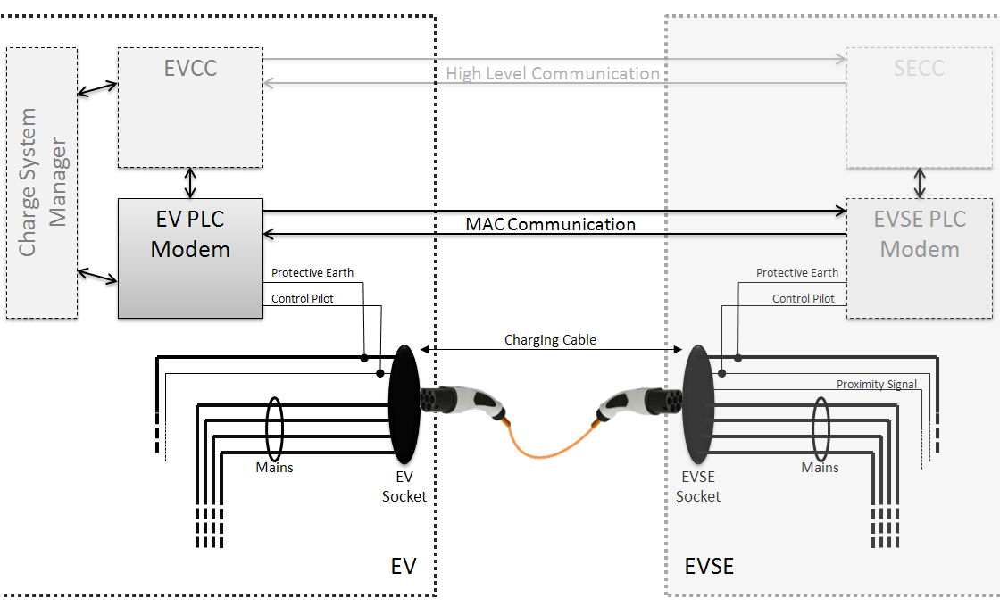

##### [PLC-HWS-GEN-001a] 
The PLC Modem system shall comply with all [ISO-3] requirements.

##### [PLC-HWS-GEN-002a] 
[ISO-3] requirements shall be understand at the light of this document.

##### [PLC-HWS-GEN-003a] 
The PLC Modem shall comply with HomePlug GreenPHY specification ([HPGP]) with complementary requirements specified in [ISO-3] – Annex A

As defined in [ISO-3], the Control Pilot (CP) and the Protective Earth (PE) wires are the transmission line for the [HPGP] signal, in order to set the EV-EVSE physical and logical communication link supporting the High Level Communication stack and messaging.

The system “PLC Modem” main functions are:
- manage the Matching with the counterpart EVSE PLC Modem;
- manage and insure the physical and the logical communications with the EVSE PLC modem;
- manage the data link with the higher communication layers;
- insure the coherence with the EV [IEC-1] module according to [ISO-3];
- manage the HomePlug GreenPHY related parameter settings;
- manage its wake-up and sleep.

### Internal interfaces of the PLC Modem

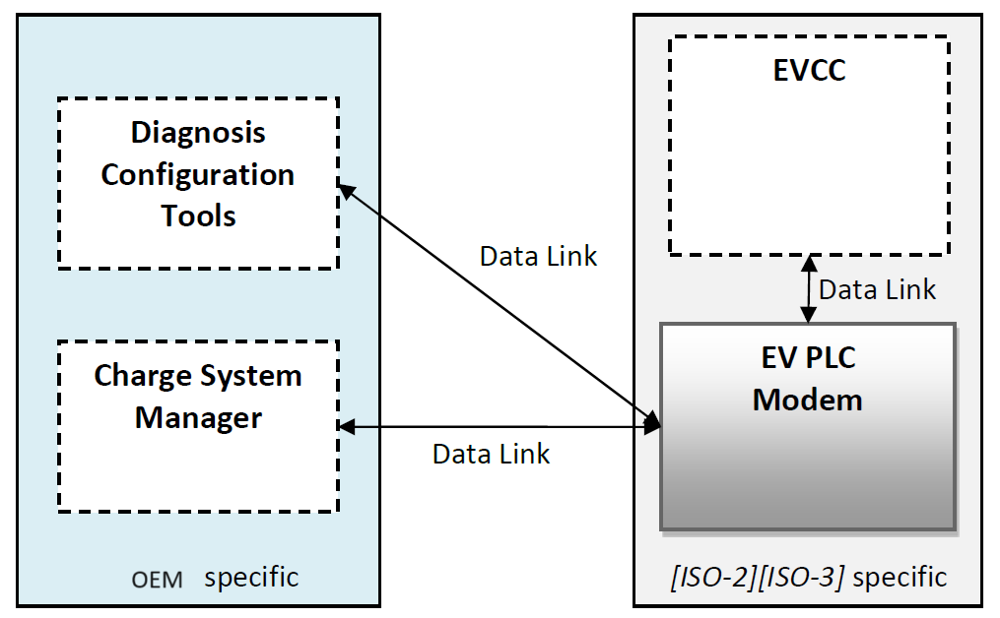

- **EVCC** 

  - The EVCC (Electrical Vehicle Communication Controller) holds the High Level Communication stack specified in [ISO-2] and [RN-PLC-SWS]. It mainly focuses on managing the High Level Communication stack, sending and receiving the [ISO-2] applicative messages, and managing the whole smart charging function (authentication, charging profile, etc.).

  - The PLC Modem offers a Data interface (Data Link layer) to the EVCC, as specified in [ISO-3], in order to send and receive messages to and from the SECC (Supply Equipment Communication Controller). It also provides a Control interface (Data Link layer) to exchange link status information.

##### [PLC-HWS-GEN-004a] 
The PLC Modem shall implement Data and Control interfaces with the EVCC, as specified in [ISO-3] and OEM specifications.

Note: This link is specified in a separate document provided by OEM.

- **Charge System Manager**

    - The Charge System Manager is a conceptual module representing any other EV ECUs having data interactions with the PLC Modem. It mainly includes:
      - Basic Signalling function: Control Pilot States and PWM detection and monitoring.
      - Management data: sleep and wake-up management, error handling, PLC Modem state and control, etc.

##### [PLC-HWS-GEN-005a] 
The PLC Modem shall implement a Control interface with the Charge System Manager compliant with the OEM specifications.

### PLC Modem Capabilities

##### [PLC-HWS-GEN-007a] 
If the PLC Modem is required to manage both “Standalone” and “Controlled” modes by a specialised specification, the PLC Modem shall provide mean to configure the selected Functional Mode.

##### [PLC-HWS-GEN-008a] 
If the PLC Modem is required to manage both “BC Priority” and “HLC-C Priority” modes by a specialised specification, the PLC Modem shall provide mean to configure the selected Error Recovery Mode.

- **Functional Mode: Standalone / Controlled**
  - “Standalone” and “Controlled” modes define how actions are triggered in the PLC Modem.
  - “Standalone” mode
    - The PLC Modem is able to trigger by itself
    - The HLC, set up a “communication pause” and manage the [IEC-1] Control Pilot State transitions (in through the Charge Service Manager)
    - We can see this operation as a “Master mode”.
  - “Controlled” mode
    - The PLC Modem is under the control of the Charge Service Manager
      - it receives commands from the Charge Service Manager to trigger the HLC and manage “communication pause”
      - It does not command directly the Control Pilot State
      - We can see this operation as a “Slave mode”
  
- **Error Recovery Mode: BC / HLC-C Priority**
  - The Error Recovery Mode defines how the PLC Modem will act to recover from an HLC-C error with Nominal Duty Cycle, application level issue or even charging issue.
  - “BC Priority” mode
    - The PLC Modem performs action to let the EV continue charging in BC and try to restart a HLC-C if authorised by the EVSE
  - “HLC-C Priority” mode
    - The PLC Modem performs action to let the EV stop the charge and try to restart a HLC-C charge

### PLC Modem Communication Layers

#### ISO/IEC 15118 Communication Stack

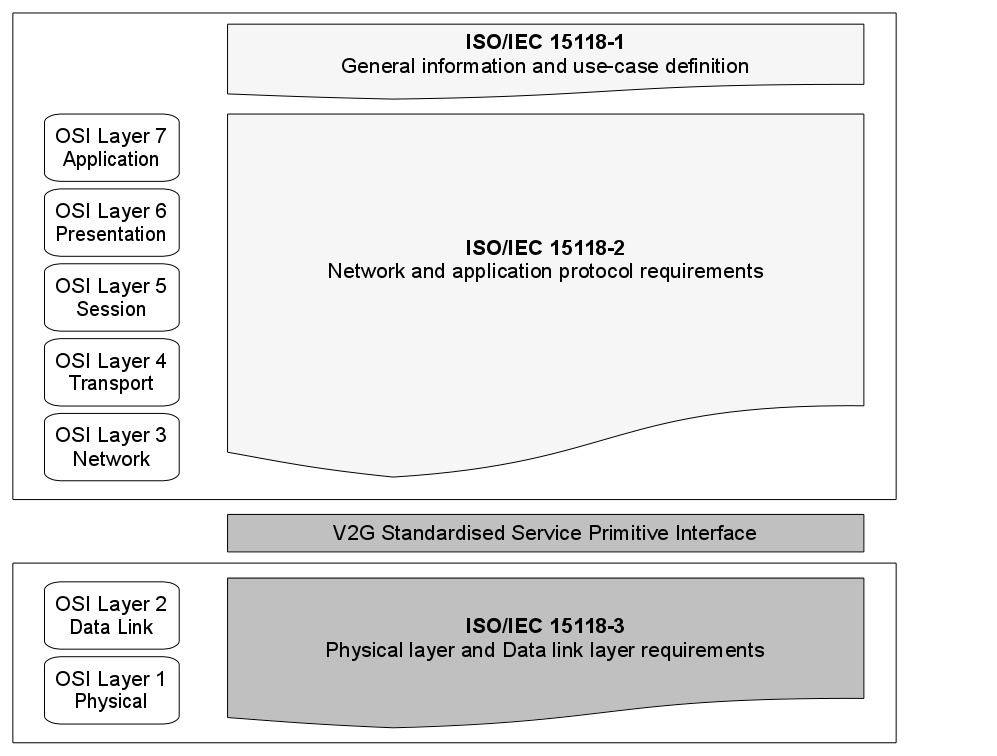

The PLC Modem is only concerned by the lower layers: Physical and Data Link.

#### Physical and Data Link Layers

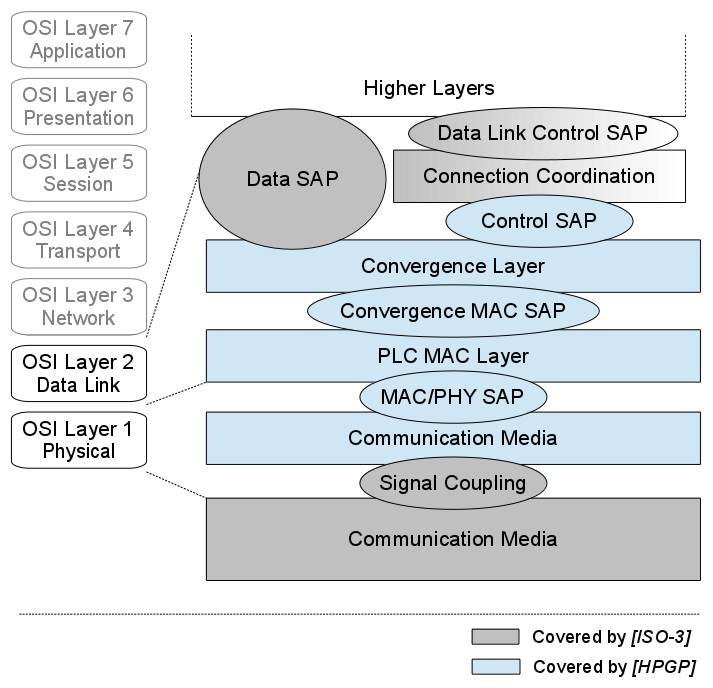

The MAC and PHY layers of the PLC Modem V2G communication stack are compliant with [HPGP] specification.

##### [PLC-HWS-GEN-009a] - Communication Media
The PLC Signal Coupling shall be realised between the Control Pilot line and the Protective Earth. See [ISO-3] – V2G3-A11-07

##### [PLC-HWS-GEN-010a] - Data Link Data SAP (Service Access Point)
The PLC Modem shall implement an Ethernet class II interface as defined in [ISO-3].

The Data Link Data SAP is provided by the Convergence Layer. The Convergence Layer adapts the generic HomePlug GreenPHY MAC to an IEEE 802.3 Ethernet II-class interface. It is fully covered by the [HPGP] specification, and includes the following service primitives:
  - ETH_SEND.REQ: PDU (Payload Data Unit) to be sent
  - ETH_SEND.CNF: empty PDU to be sent in response to a request
  - ETH_RECEIVE.IND: PDU received

#### Data Link Control SAP

The Data Link Control SAP is provided by the Connection Coordination which covers the whole functionality for the initialisation and management of the PLC Modem. It is covered by [ISO-3] with further OEM 
- The selected Amplitude Map is named “Active Amplitude Map”.
- An Amplitude Map selected in mode “Computation only” is not sent to the EVSE during the Amplitude Map exchange, but is only used for the computation of the attenuation to be applied on power emission when an Amplitude Map is received from the EVSE.
- An Amplitude Map selected in mode “Computation and Exchange” is also used for sending a Map to the EVSE during the Amplitude Map exchange.- [PLC-HWS-AMP-004a] The PLC Modem shall not reset the stored Amplitude Map and the Active Amplitude Map (if any) when unpowered or between two communication sessions.specific requirements described in this document. It includes the following service primitives:
- CONTROL_RECEIVE.request: PDU coming from a higher layer
- CONTROL_SEND.indication: PDU to be sent to the higher layers
- CONTROL_SEND/RECEIVE.response: Response to a request or an indication
  
These primitives are used for the configuration of the PLC Modem (behaviour, power lines calibration, etc.), the Matching and Initialisation mechanisms (encryption key management, SLAC, validation, amplitude map exchange, etc.), the indication of the link status and errors to the EVCC, and, in “Standalone” mode only, the monitoring and control of the Basic Signalling.

### Physical Layer Requirements

#### Theoretical Signal Coupling circuit of the PLC Modem

In order to realise the PLC Signal Coupling on the Control Pilot line, the PLC Modem shall be wired to the CP (Control Pilot) line and the PE (Protective Earth) (Refer to: [PLC-HWS-EMC-002a](#plc-hws-gen-002a)).

Hence, to allow both [IEC-1] and [HPGP] communications at the same time, a proper Signal Coupling shall be applied (Refer to: [PLC-HWS-EMC-003a](#plc-hws-gen-003a)).

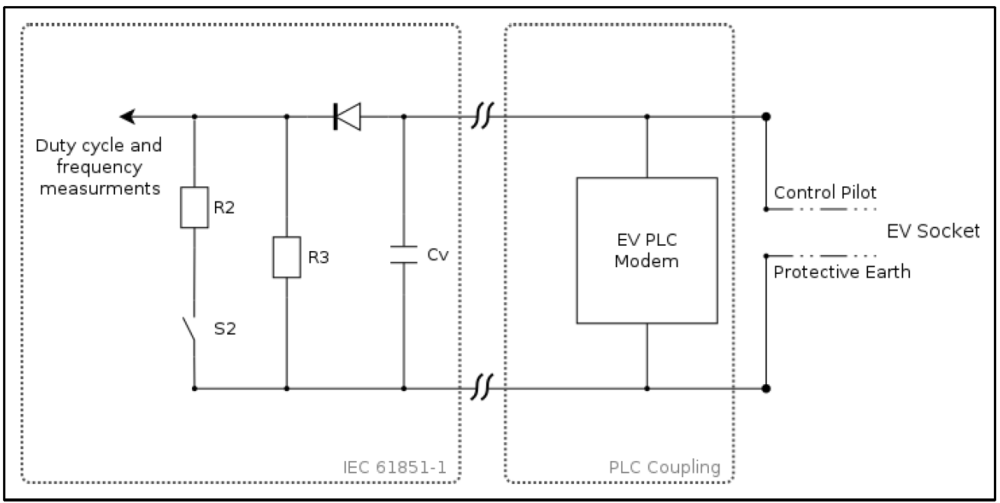

Different topologies may be applied and require adaptation of this given implementation example.

#### PLC Modem Wiring

##### [PLC-HWS-EMC-001a] 
The PLC Modem shall be coupled between the Control Pilot line and the Protective Earth. See [ISO-3] – V2G3-A11-02

##### [PLC-HWS-EMC-002a] 
The PLC Modem shall be wired to the Control Pilot line and the Protective Earth. See [ISO-3] – V2G3-A11-02, V2G3-A11-04

Control Pilot and Protective Earth wires shall be picked directly at the EV inlet, they shall have nearly the same size and be twisted (unshielded). The PLC Modem have to be located as near as possible to the EV inlet to have the shortest wire: this is recommended to avoid PLC signal attenuation on-board EV.

##### [PLC-HWS-EMC-003a] 
The PLC Modem shall be able to inject HPGP signal with any valid Control Pilot duty cycle or state as defined in [IEC-1]. See [ISO-3] – V2G3-A11-05

##### [PLC-HWS-EMC-004b] 
The PLC Modem coupling shall have an input impedance value of 90Ω (+/- 40Ω) in the 1.8 to 30 MHz band.

##### [PLC-HWS-EMC-005a] 
The PLC Modem coupling shall have an input impedance value of at least 1MΩ for frequency lower than 10 kHz.

##### [PLC-HWS-EMC-006a] 
If the impedance to ground of the PLC Modem is less than 10 kΩ, the total value of additional capacitors for the PLC Modem coupling shall not exceed a total of 1.35nF. See [IEC-1] – RA02-170

##### [PLC-HWS-EMC-016a] 
The injection circuit of the PLC Modem shall include a galvanic isolation using a transformer 1:1:1 with a minimum inductance of 28μH.

- Galvanic isolation will protect the modem from electro-static discharge and isolation faults.
- A CMC is neither a transformer nor an opto-isolator and does not offer electro-static discharge protection.
- The selected transformer shall be ESD proof with low input output capacitance, low leakage. For BCI robustness transformer center pin can be added and connected to GND if common mode termination is not possible.

##### Recommended injection circuit for the PLC signal

The injection circuit of the PLC chip and all surge suppression stages implementations will greatly depend of the selected PLC chip.

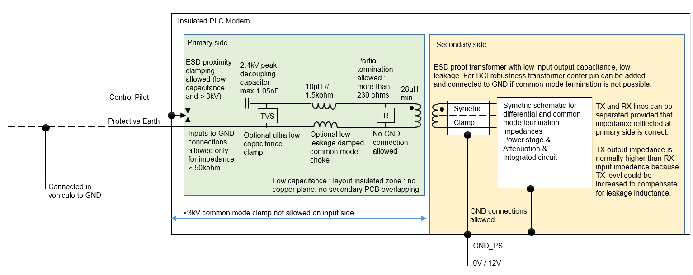

#### EMC Requirements

##### [PLC-HWS-EMC-007a] 
The emission requirements are based on [IEC-21] and [IEC-22], with additional requirements provided by [HPGP]. See [ISO-3] – Section 10 and A.10

##### [PLC-HWS-EMC-008a] 
According to [HPGP], the PLC Modem shall notch out the list of carriers listed as below. See [ISO-3] – V2G3-A10-01

| HomePlug GreenPHY Notched Carriers |
|------------------------------------|
| 0 - 85                             |
| 140 - 167                          |
| 215 - 225                          |
| 283 - 302                          |
| 410 - 419                          |
| 570 - 591                          |
| 737 - 748                          |
| 857 - 882                          |
| 1016 - 1027                        |
| 1144 - 1535                        |

##### [PLC-HWS-EMC-009a] 
At the output of the PLC Modem, the Power Spectral Density (PSD) of the signal shall be less than -73dBm/Hz, typically -75dBm/Hz, linearly on 1.8 to 30MHz with notched carriers. See [ISO-3] – V2G3-A11-07

In order to calibrate the PSD to less than -73dBm/Hz **at the output of the EV Socket**, **regardless the PLC Modem location and wiring**, as defined by [ISO-3], OEM requires the capability of the PLC Modem to be calibrated with power emission values (PSD) for each not notched carrier. The description of the power emission values of the carriers is called a Calibration Profile. A Calibration Profile describes around 1 500 power emission values.

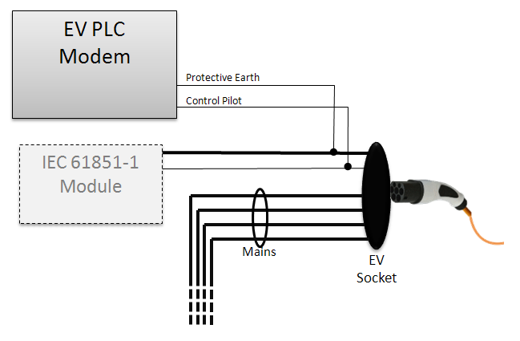

##### [PLC-HWS-EMC-010a] 
The PLC Modem shall be able to increase the power of at least -25dB on each not notched carrier from a reference of -75dBm/Hz flat at the PLC Modem output.

- The Calibration Profile is used by the PLC Modem to apply a given power emission for each carrier. As defined by this requirement, the Calibration Profile will allow to increase the power of at least -25dB on each not notched carrier from a reference of -75dBm/Hz flat at the PLC Modem output.
- The purpose of this requirement is to allow flexibility for power emission calibration at EV socket.
- Typical PLC signal attenuation inside the vehicle is less than -10dB in transmission and reception. This requirement should allow to increase power emission to compensate attenuation induced by the vehicle wiring for PLC transmissions.

##### [PLC-HWS-EMC-011a] 
The PLC Modem shall be able to store at least 5 Calibration Profiles.

##### [PLC-HWS-EMC-012a] 
The PLC Modem shall provide means to select the Calibration Profile to be applied.

##### [PLC-HWS-EMC-013a] 
The PLC Modem shall apply one Calibration Profile at a time.

##### [PLC-HWS-EMC-014a] 
The PLC Modem shall not reset the stored Calibration Profiles and the selected Calibration Profile when unpowered or between two communication sessions.

#### PLC Modem Physical Characteristics

##### [PLC-HWS-EMC-015a] 
The PLC Modem electrical clock signal used for signal processing shall follow [HPGP] requirements. See [HPGP] – Section 3.7.3.1

### Data Link Layer Requirements

#### Data Link Setup Management

##### [PLC-HWS-MAT-001a] 
The Matching process shall be based on the messages defined in [HPGP]. See [ISO-3] – V2G3-A09-01

##### [PLC-HWS-MAT-002a] 
During a Matching process, a change in the duty cycle shall not terminate nor interrupt the Matching process on the EV side. See [ISO-3] – V2G3-M06-15

**Data Link Setup - Triggering the Matching Process**

The PLC Modem shall initiate a Matching process once a plug-in of the charging cable is detected or after an error in the Matching process or the High Level Communication.

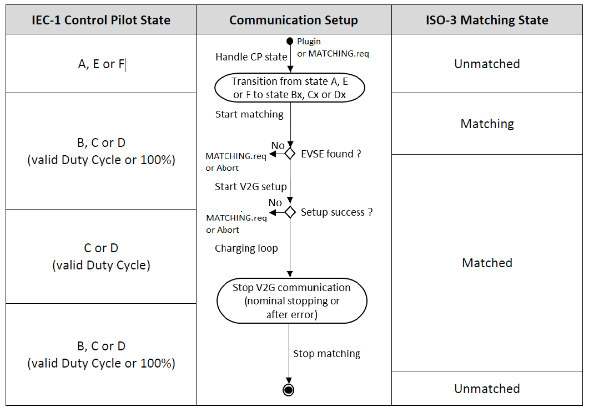

The next requirements describe the interface used by the Charge Service Manager to trigger the Matching process on the PLC Modem **in “Controlled” mode**. Other requirements, only applicable on “Standalone” mode, will then describe how the PLC Modem uses the same interface to trigger internally its Matching process.

##### [PLC-HWS-MAT-003a] 
When receiving a MATCHING.request, if the PLC Modem is in the “Unmatched” state and if C_MATCHING_FAILED is equal to 0, the PLC Modem shall start the Matching process.

##### [PLC-HWS-MAT-004a] 
When receiving a MATCHING.request, if the PLC Modem is in the “Unmatched” state and if C_MATCHING_FAILED is equal to 1 or 2, the PLC Modem shall start the Matching process if T_MATCHING_RETRY timer has expired or once it has expired.
- If C_MATCHING_FAILED has reached 3, the PLC Modem will not accept to restart the Matching process anymore until it receives a MATCHING_RESET.request.
- These two requirements imply that, instead of what is discussed in [ISO-3] – Section 7.6, the PLC Modem will wait a MATCHING.request at the end of a session before to restart a new Matching process.

##### [PLC-HWS-MAT-005a] 
When a Matching process is triggered, the PLC Modem shall set its Matching State to “Matching”.

##### [PLC-HWS-MAT-006a] 
When a Matching process finishes with the result “No EVSE Found”, the PLC Modem shall increase C_MATCHING_FAILED by one.

##### [PLC-HWS-MAT-007a] 
When C_MATCHING_FAILED counter is increased by one, if C_MATCHING_FAILED is still strictly less than 3, the PLC Modem shall start the T_MATCHING_RETRY timer.

##### [PLC-HWS-MAT-008a] 
At start-up, the PLC Modem shall set C_MATCHING_FAILED to 0 and shall reset and stop the T_MATCHING_RETRY timer.

The next requirements, **only applicable in “Standalone” mode**, describe how the PLC Modem internally triggers MATCHING.request and MATCHING_RESET.request to trigger the Matching process.

##### [PLC-HWS-MAT-009a] 
In “Standalone” mode, once detecting a transition to PWM state A, E or F, the PLC Modem shall internally trigger a MATCHING_RESET.request and set C_EVSE_MATCHING_RETRY to 0.

- The detection of a state A, E or F will stop any communication as defined in [ISO-2].

##### [PLC-HWS-MAT-010b] 
In “Standalone” mode, once detecting a transition from state A, E or F to state Bx, Cx or Dx, with a PWM value nominal or 100%, the PLC Modem shall internally trigger a MATCHING.request. See [ISO-3] – V2G3-M06-13.

##### [PLC-HWS-MAT-011a] 
In “Standalone” mode, if C_EVSE_MATCHING_RETRY is strictly less than 3, once detecting an X1 / X2 transition, the PLC Modem shall increase C_EVSE_MATCHING_RETRY by one, and internally trigger a MATCHING_RESET.request, and then MATCHING.request.

##### [PLC-HWS-MAT-012a] 
In “Standalone” mode, when the PLC Modem changes its Matching state from “Matching” to “Unmatched” and indicates a D-LINK_READY(DLINKSTATUS=No link), the PLC Modem shall internally trigger a MATCHING.request.

- After 3 retries without reset, the PLC Modem will not respond anymore to MATCHING.request, and therefore not indicating any new D-LINK_READY(DLINKSTATUS=No link), until it receives a MATCHING_RESET.request.

**Data Link Setup - End of the Matching Process**

At the end of the Matching process, there are two possible Matching conclusions:

- EVSE found: the Matching has succeed and the link to the EVSE PLC Modem is established.
- No EVSE found: the Matching has failed and the high level communication will not be performed.

However, because several EVSE PLC Modem may be detected during the SLAC phase, the PLC Modem may not be able to select the relevant one (i.e. the one physically connected to the EV) by using the SLAC mechanism only. It may want to perform a Validation process before finishing the Matching process. In this case, the PLC Modem will temporarily set the Matching conclusion to “EVSE potentially found” and will continue with a Validation process to have more confidence in the selected EVSE.

Even if [ISO-3] authorises several interpretations of “EVSE Found” and “EVSE potentially found”, these interpretations have been specified in this document by the requirements below:

##### [PLC-HWS-MAT-013a] 
If the Matching conclusion is 'EVSE found', the PLC Modem shall select the found EVSE and continue the Data Link Setup process. See [ISO-3] – V2G3-A09-48

##### [PLC-HWS-MAT-014a] 
If the Matching conclusion is 'EVSE found', the PLC Modem shall set the Matching state to 'Matched' and indicate a D-LINK_READY(DLINKSTATUS=Link established) once the link is detected and the Amplitude Maps are exchanged. See [ISO-3] – V2G3-M09-16, V2G3-A09-119

##### [PLC-HWS-MAT-015a] 
If the Matching conclusion is 'EVSE potentially found', the PLC Modem shall start the Validation process. See [ISO-3] – V2G3-A09-4

##### [PLC-HWS-MAT-016a] 
If the Matching conclusion is 'No EVSE found', the PLC Modem shall set the Matching state to 'Unmatched' and indicate a D-LINK_READY(DLINKSTATUS=No link).

**Data Link Setup - Validation Process**

The Validation process is a method to validate the SLAC based Matching by means of the Control Pilot line. It consists, for the PLC Modem, on sending a duration to the EVSE PLC Modem counterpart, and then to perform a random number of BCB-Toggles of the Control Pilot State during the previously specified duration. At the end, the PLC Modem will check if the EVSE has counted the correct number of BCB-Toggles.

As already specified by [PLC-HWS-MAT-015a], if the Matching conclusion is ‘EVSE potentially found’, the PLC Modem will start the Validation process by sending a [ISO-3] step 1 “CM_VALIDATE.REQ”.
- The following paragraphs and requirements refer to the [ISO-3] step 1 and step 2 validation steps, refer to [IS0-3] section A.9.3 for more information.

At the beginning of the validation process, the EVSE PLC Modem counterpart can reply to the PLC Modem Validation request with:

- Ready
  - The EVSE is ready to perform a Validation.
- Not ready
  - The EVSE is not ready to perform a Validation: according to [ISO-3], the PLC Modem can ignore this EVSE or retry after an undefined amount of time
- Not required
  - The EVSE assume that a Validation is not required: according to [ISO-3], the PLC Modem can ignore this EVSE, perform the Validation, or select this EVSE.
- Failure
  - The EVSE is not able to perform a Validation: according to [ISO-3], the PLC Modem can ignore this EVSE or select this EVSE.

##### [PLC-HWS-MAT-017a] 
If a Validation process is required, the PLC Modem shall generate and use a list of potential EVSE, according to the result of SLAC process, sorted in ascending order of attenuation level, and start the process with the less attenuated one. See [ISO-3] – V2G3-A09-21.
- This list is named “Potential EVSE list”.

##### [PLC-HWS-MAT-018a] 
If the OEM field of the [ISO-3] step 1 “CM_VALIDATE.CNF” EVSE response is “Ready”, the PLC Modem shall keep this EVSE in the “Potential EVSE list”, tag it as “Validation” and continue with the next EVSE in the “Potential EVSE list” if any. See [ISO-3] – V2G3-A09-67

##### [PLC-HWS-MAT-019a] 
If the OEM field of the [ISO-3] step 1 “CM_VALIDATE.CNF” EVSE response is “Not Required”, the PLC Modem shall keep this EVSE in the “Potential EVSE list”, tag it as “Validation” and continue with the next EVSE in the “Potential EVSE list” if any. See [ISO-3] – V2G3-A09-66

##### [PLC-HWS-MAT-020a] 
If the OEM field of the [ISO-3] step 1 “CM_VALIDATE.CNF” EVSE response is “Not Ready”, the PLC Modem shall apply the retry mechanism defined in [ISO-3] V2G3-A09-62 for this EVSE.

##### [PLC-HWS-MAT-021a] 
If [PLC-HWS-MAT-020a](#plc-hws-mat-020a) applies and the OEM field of the [ISO-3] step 1 EVSE response “CM_VALIDATE.CNF” for this EVSE is still “Not Ready” after all retries, the PLC Modem shall keep this EVSE in the “Potential EVSE list”, tag it as “Validation Skipped” and continue with the next EVSE in the “Potential EVSE list” if any. See [ISO-3] - V2G3-A09-63

##### [PLC-HWS-MAT-022a] 
If the “Result” field of the [ISO-3] step 1 “CM_VALIDATE.CNF” EVSE response is “Failure” or “Success”, the PLC Modem shall keep this EVSE in the “Potential EVSE list”, tag it as “Validation Skipped” and continue with the next EVSE in the “Potential EVSE list” if any. See [ISO-3] – V2G3-A09-51, V2G3-A09-58, V2G3-A09-65

##### [PLC-HWS-MAT-023a] 
After sending the [ISO-3] step 2 “CM_VALIDATE.REQ”, the PLC Modem shall only wait responses, within TT_match_response timer, from EVSE tagged as “Validation”, but will also accept responses from others listed in the “Potential EVSE list”.

##### [PLC-HWS-MAT-024b] 
If the “Result” field of the [ISO-3] step 2 “CM_VALIDATE.CNF” EVSE response is “Failure” (but was not “Ready” or “Not Required” in [ISO-3] step 1), “Not required”, “Ready” or “Not ready”, the PLC Modem keep this EVSE in the “Potential EVSE list”, tag it as “Validation Skipped”. See [ISO-3] – V2G3-A09-72

##### [PLC-HWS-MAT-025b] 
If the “Result” field of the [ISO-3] step 2 “CM_VALIDATE.CNF” EVSE response is “Success” and if the “ToggleNum” field does not match the number of BCB toggle performed during the Validation process, or if the “Result” field is “Failure” but was “Ready” or “Not Required” in [ISO-3] step 1, the PLC Modem shall remove this EVSE from the “Potential EVSE list”. See [ISO-3] – V2G3-A09-73

##### [PLC-HWS-MAT-026a] 
If the “Result” field of the [ISO-3] step 2 “CM_VALIDATE.CNF” EVSE response is “Success” and if the “ToggleNum” field does match the number of BCB toggle performed during the Validation process, the PLC Modem shall select this EVSE and set the Matching decision to “EVSE found”.

##### [PLC-HWS-MAT-027b] 
At the end of the Validation process, if [PLC-HWS-MAT-025b](#plc-hws-mat-025b) does not apply, the PLC Modem shall select the EVSE with the less attenuation, which is the one at the top of the “Potential EVSE list”, and set the Matching decision to “EVSE found”.
- The Validation process result (i.e. without need for validation, or with succeed, failed or skipped validation) is indicated to the Charge Service Manager using MATCHING_STATE.indication (as defined in [PLC-HWS-DLINK-004a]). Depending of this result, the Charge Service Manager may decide to continue or not the communication.

##### [PLC-HWS-MAT-028a] 
During the Validation process, the PLC Modem shall use IEC1_BCB-TOGGLE to request the BCB toggle sequence.

**Data Link Setup - Amplitude Map Exchange Process**

The Amplitude Map Exchange is an optional mechanism to request the counterpart modem to reduce the transmission power for certain carriers. If the EVSE or the PLC Modem intends to send an Amplitude Map, it will send a CM_AMP_MAP.REQ within TP_amp_map_exchange timer after the link detection.

- **Storage and Selection of Amplitude Map**

  - ##### [PLC-HWS-AMP-001a] 
    The PLC Modem shall be able to store at least 5 Amplitude Maps.

  - ##### [PLC-HWS-AMP-002a] 
    The PLC Modem shall provide means to select the Amplitude Map to be used with two possible modes “Computation Only” or “Computation and Exchange”.

  - ##### [PLC-HWS-AMP-003a] 
    If there is no selected Amplitude Map, by default, the PLC Modem shall consider having selected an Amplitude Map of -75dBm/Hz between 1.8 to 30 MHz, with [HPGP] notched carriers, in mode “Computation Only”.
      - The loading and selection mechanisms of Amplitude Maps are specified in a separate document provided by OEM.
      - The selected Amplitude Map is named “Active Amplitude Map”.
      - An Amplitude Map selected in mode “Computation only” is not sent to the EVSE during the Amplitude Map exchange, but is only used for the computation of the attenuation to be applied on power emission when an Amplitude Map is received from the EVSE.
      - An Amplitude Map selected in mode “Computation and Exchange” is also used for sending a Map to the EVSE during the Amplitude Map exchange.

  - ##### [PLC-HWS-AMP-004a] 
    The PLC Modem shall not reset the stored Amplitude Map and the Active Amplitude Map (if any) when unpowered or between two communication sessions.

- **Receiving an Amplitude Map from an EVSE**
  - ##### [PLC-HWS-AMP-007a] 
    If the PLC Modem receives a CM_AMP_MAP.REQ from the EVSE within TP_amp_map_exchange after the data link detection, for each carrier on which the EVSE requests attenuation, the PLC Modem shall check on its Active Amplitude Map if the corresponding carrier is higher and in this case apply the required attenuation on its power emission calibration for this carrier. See [ISO-3] section A.9.6.1
  An example of application is provided in the table below for 3 carriers.
  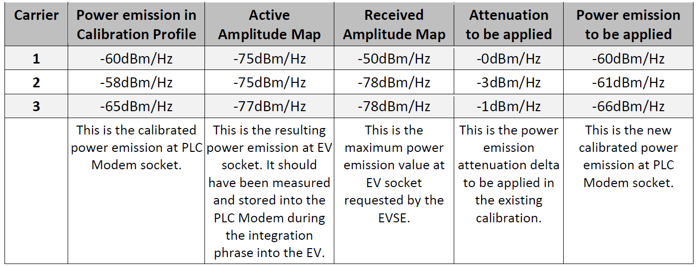

  - ##### [PLC-HWS-AMP-008a] 
    If the PLC Modem has received an Amplitude Map from the EVSE, it shall only use it for the current Communication Session with this EVSE.

### IEC 61851-1 Management

##### [PLC-HWS-IEC1-001a] 
The PLC Modem shall be able to perform BCB-Toggle using IEC1_BCB-TOGGLE.indication as defined in section 6.2.2.3.
- IEC1_BCB-TOGGLE.indication may be used for the Matching process or to wake-up of the EVSE PLC Modem counterpart.
- IEC1_CP-STATE.indication may be used instead of IEC1_BCB-TOGGLE.indication if this latter is not supported by the Charge System Manager.

##### [PLC-HWS-IEC1-002a] 
The PLC Modem shall be able to access the current authorised type of charge management (BC or HLC-C or both) using IEC1_CHARGE-TYPE.request as defined in section 6.2.2.4.

##### [PLC-HWS-IEC1-003a] 
In “Standalone” mode, the PLC Modem shall be able to access the current value of the Control Pilot State and the PWM value using IEC1_STATE.request as defined in section 6.2.2.1.

#### Control API

##### EC1_STATE.request

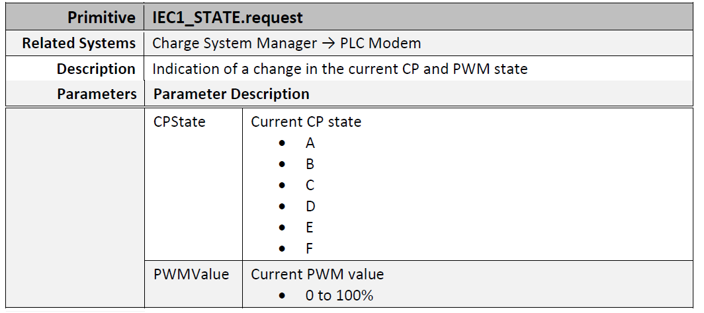

##### IEC1_CP-STATE.indication

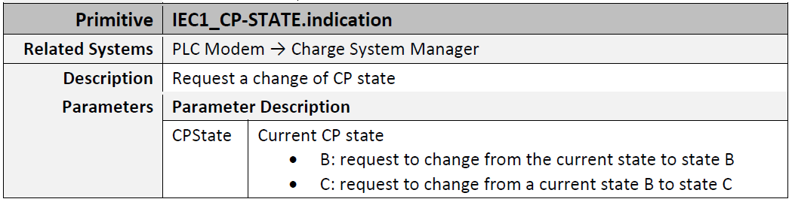

##### IEC1_BCB-TOGGLE.indication

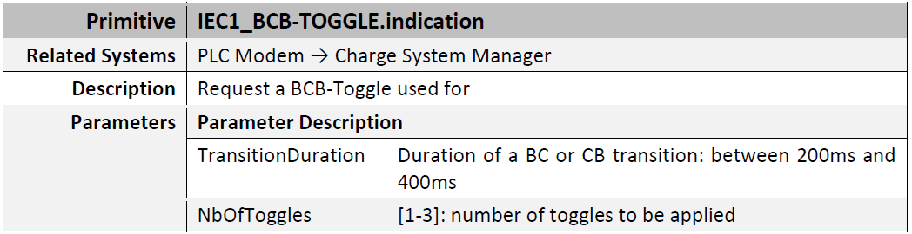

##### [PLC-HWS-IEC1-004a] 
The value of “TransitionDuration” in IEC1_BCB-TOGGLE.indication shall be strictly between 200ms and 400ms. See [ISO-3] – V2G3-M08-01

##### IEC1_CHARGE-TYPE.request

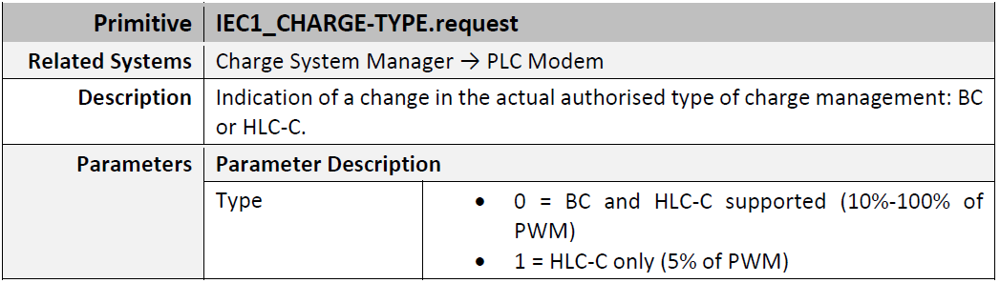

##### [PLC-HWS-IEC1-005a] 
When the value of “Type” in IEC1_CHARGE-TYPE.indication is “1 = HLC-C only”, the “Error Recovery” mode of the PLC Modem shall be changed to “HLC-C Priority”. See [ISO-3] - V2G3-M07-13..18

##### [PLC-HWS-IEC1-006a] 
When the value of “Type” in IEC1_CHARGE-TYPE.indication is “0 = BC and HLC-C supported”, the “Error Recovery” mode of the PLC Modem shall be set to the one specified in the specialised specification, or “BC Priority” by default.

##### [PLC-HWS-IEC1-007a] 
To recover from an error with a 5% duty cycle, the PLC Modem shall apply the “HLC-C Priority” mode, as defined by [ISO-3].

### PLC Link Status

The Link Status API defined in [ISO-2] and [ISO-3] includes the following service primitives:

- Error request (D-LINK_ERROR.request)
- Terminate request (D-LINK_TERMINATE.request)
- Pause request (D-LINK_PAUSE.request)
- Link status indication
  - Link establishment indication (D-LINK_READY, indication(DLINKSTATUS=Link established)
  - Missing link indication (D-LINK_READY.indication(DLINKSTATUS=No link))

These primitives are described in section 12.3, V2G3-A09-121 and V2G3-M07-19 of [ISO-3].

This specification adds three more Link Status primitive defined in the following sections:

- Matching request (MATCHING.request)
- Matching reset request (MATCHING_RESET.request)
- Matching state indication (MATCHING_STATE.indication)

#### Reception of a terminate request

The [ISO-3] defines a mechanism to pause and resume a Charging Session, mainly for power saving purpose, which implies for the PLC Modem to close the HLC and then to restart it using the same Logical Network parameters. Following the [ISO-3] requirements, the following requirements describe the behaviour of the PLC Modem when receiving a D-LINK_PAUSE.request.

- **Pause of a Communication Session**
  - ##### [PLC-HWS-PAUS-001a] 
    Whenever receiving a D-LINK_PAUSE.request, the PLC Modem shall first store the Logical Network parameters. See [ISO-3] - V2G3-M07-19
    - The Logical Network parameters are described in [ISO-3] and mainly concerns: MVFLength, PEV ID, PEV MAC, EVSE ID, EVSE MAC, RunID, NID and NMK.
  - ##### [PLC-HWS-DLINK-002a] 
    Whenever receiving a D-LINK_PAUSE.request, the PLC Modem shall leave the Logical Network and shall be ready to be unpowered within TP_match_leave. See [ISO-3] - V2G3-M07-19
    - As long as the Control Pilot State is kept nominal during the charging pause, the Matching state is conceptually kept to “Matched” as described in [ISO-3] Section 12.3.
    - According to [PLC-HWS-MAT-034a] a Control Pilot State of A, E or F will trigger a MATCHING_RESET.request and clear any stored Logical Network parameters as expected by [ISO-3] - V2G3-M09-19.
  - ##### [PLC-HWS-MAT-030a] 
    After a D-LINK_PAUSE.request, the PLC Modem shall wait a MATCHING.request to restart the HLC-C and resume the communication session.

- **Wake-up Management**
  - ##### [PLC-HWS-PAUS-002a] 
    Whenever receiving MATCHING.request, if the PLC Modem has stored Logical Network parameters, as soon as it detects a data link, it shall be configured to the last known Logical Network parameters and indicate a D-LINK_READY.indication(DLINKSTATUS=Link established). See [ISO-3] - V2G3-M07-21, V2G3-M07-29

  - ##### [PLC-HWS-PAUS-003a] 
  - In “Standalone” mode, at start-up, if the PLC Modem has stored Logical Network parameters, if it measures a CP state X1, the PLC Modem shall call IEC1_BCB-TOGGLE.indication(BCTransitionDuration=200, NbOfToggles=1) in order to wake up the EVSE. See [ISO-3] - V2G3-M07-28

#### Reception of an error request

As required by [ISO-3] and [HPGP], once receiving a D-LINK_ERROR.request, the PLC Modem will leave the Logical Network within TP_match_leave, reset all network and error recovery parameters and set its Matching state to “Unmatched”. As soon as the link with the EVSE PLC Modem counterpart is closed, the PLC Modem will indicate a D-LINK_READY.indication(DLINKSTATUS=No link).

##### [PLC-HWS-DLINK-003a] 
Whenever receiving a D-LINK_ERROR.request, the PLC Modem shall leave the Logical Network and shall be ready to be unpowered within TP_match_leave. See [ISO-3] - V2G3-A09-121

The error recovery process will depend of the PLC Modem “Error Recovery” mode.
- In “HLC-C Priority” mode, the Charge Service Manager will also finish the Charging Session, and the EV will wait a trigger from the EVSE to restart the HLC-C.
- In “BC Priority” mode, the Charge Service Manager will continue the Charging Session in BC, and the EV will try at least 3 times to restart the HLC-C.

##### [PLC-HWS-MAT-031a] 
In “BC Priority” mode, whenever receiving a D-LINK_ERROR.request, the PLC Modem shall increase C_CONN_RESETUP by one.

##### [PLC-HWS-MAT-032a] 
In “BC Priority” mode, when the C_CONN_RESETUP counter is increased by one, if C_CONN_RESETUP is still strictly less than 3, the PLC Modem shall start the T_CONN_RESETUP timer.

##### [PLC-HWS-MAT-033a] 
In “BC Priority” mode, when T_CONN_RESETUP timer expires, the PLC Modem shall internally trigger MATCHING.request.

#### Reception of a Matching request

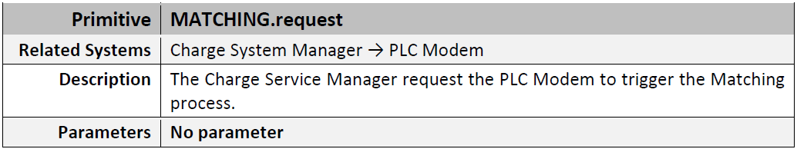

#### Reception of a Matching reset request

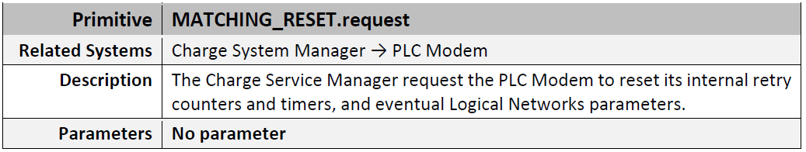

##### [PLC-HWS-MAT-034a] 
When receiving a MATCHING_RESET.request, the PLC Modem shall set C_MATCHING_FAILED to 0 and reset and stop the T_MATCHING_RETRY timer.

##### [PLC-HWS-MAT-035a] 
Whenever receiving MATCHING_RESET.request, the PLC Modem shall erase any stored Logical Network parameters.

##### [PLC-HWS-MAT-036a] 
Whenever receiving MATCHING_RESET.request, the PLC Modem shall set C_CONN_RESETUP to 0 and reset and stop T_CONN_RESETUP timer.

##### [PLC-HWS-MAT-037a] 
In “BC Priority” mode, at start-up, the PLC Modem shall set C_CONN_RESETUP to 0 and reset and stop T_CONN_RESETUP timer.

#### Indicating the Matching state

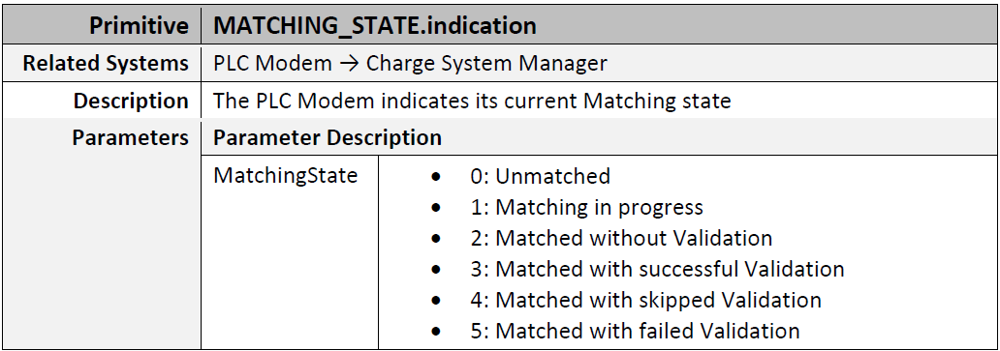

##### [PLC-HWS-DLINK-004a] 
Once the PLC Modem updates its Matching State, it shall indicate its new state with DLINK_MATCHING.indication to higher layers, including the Validation process result for the “Matched” state.

### MAC Address Management

##### [PLC-HWS-MAC-001a] 
The PLC Modem shall be configured with one public and unique MAC address for PLC communication usage.

### Non Functional Requirements

#### Timing and Constants

##### [PLC-HWS-DLINK-005a] 
The PLC Modem shall comply with timer and counter values defined in Figure 11. See [ISO-3] – V2G3-M08-01, V2G3-A08-01.

|Parameter|Value|Description|
|-|-|-|
|TT_matching_rate|Timer of 0.4s|Defined by [ISO-3] Time to wait for a repetition of the whole Matching process after a failed Matching process.|
|TT_matching_repetition|Timer of 10s|Defined by [ISO-3] Time duration for repetitions of the Matching process when an error occurs.|
|C_MATCHING_FAILED|Max 3|Counter of unsuccessful Matching process increased when the Matching state is changed to “Unmatched”.|
|_MATCHING_RETRY|Timer of 15s|Time to wait for a repetition of the whole Matching process after a failed Matching process when the Matching state is changed to “Unmatched”.|
|C_EVSE_MATCHING_RETRY|Max 3|Counter of Matching processes requested by the EVSE.|
|C_CONN_RESETUP|Max 3|Counter of errors which occurred during HLC-C.|
|T_CONN_RESETUP|Timer of 15s|Defined in [ISO-3] Time to wait for a repetition of the whole Matching process after an error occurred during HLC-C.|
|TP_match_leave|Timer of 1s|Defined by [ISO-3] Maximum time to leave the Logical Network.|
|TP_EV_SLAC_init|Timer of 10s|Defined in [ISO-3] Time for the PLC Modem to start the Matching process when it receives a MATCHING.request.|
|T_CONN_SETUP|Timer of 20s|Time when at start-up the PLC Modem does not have any stored Logical Network parameters, until it shall be ready for communication and indicate D-LINK_READY.indication(DLINKSTATUS=Link established).|
|T_CONN_RESUME|Timer of 6s|Defined in [ISO-3] Time when at start-up the PLC Modem has stored Logical Network parameters, until it shall be ready for communication and indicate D-LINK_READY.indication(DLINKSTATUS=Link established).|
|TT_match_response|Timer of 0.2s|Defined in [ISO-3] Generic time to wait a response from the EVSE|
|TP_amp_map_exchange|Timer of 0.2s|Defined in [ISO-3] Time for the PLC Modem to send an Amplitude Map request or to wait for an Amplitude Map request from the EVSE.|

Concerning the Matching process, these timers and counters imply several steps of retry mechanisms summarized below:
- During TT_matching_repetition (i.e. 10s), in case of unsuccessful Matching process, the PLC Modem will retry the Matching process with a waiting interval of TT_matching_rate (i.e. 0.4s) without leaving the Matching state “Matching”.
- After an unsuccessful Matching process, when the Matching state is changed to “Unmatched”, the PLC Modem will retry the Matching process C_MATCHING_FAILED times (i.e. 3 times) with a waiting interval of T_MATCHING_RETRY (15s).
- In “Standalone” mode, the PLC Modem will allow the EVSE to trigger the retry of the Matching process C_EVSE_MATCHING_RETRY times (i.e. 3 times) when detecting a PWM transition from E to X1/X2.
- In case an error occurs during the HLC-C, when the Logical Network is closed and the Matching state is changed to “Unmatched”:
  - In “BC Priority” mode, the PLC Modem will retry the Matching process C_CONN_RESETUP times (i.e. 3 times) with a waiting interval of T_CONN_RESETUP (15s).
  - In “HLC-C Priority” mode, the PLC Modem will wait a trigger from the EVSE to restart the HLC-C, which leads to the previous point.

### Performance

Related requirements in [ISO-3] are: V2G3-M08-01, V2G3-A08-01 and V2G3-M07-23.

##### [PLC-HWS-PERF-001a] 
At start-up, when receiving MATCHING.request, if the PLC Modem has stored Logical Network parameters, it shall indicate D-LINK_READY.indication(DLINKSTATUS=Link established) in a maximum of T_CONN_RESUME (6s). See [ISO-3] - V2G3-M07-23

##### [PLC-HWS-PERF-002a] 
At start-up, when receiving MATCHING.request, if the PLC Modem does not have any stored Logical Network parameters, the PLC Modem shall finish the Matching process and change its Matching state to “Matched” or “Unmatched” in a maximum of T_CONN_SETUP (20s).

### Debug Modes

In order to integrate the PLC Modem into the EV architecture, Renault requires Debug modes, disabled by default, to repeat received Ethernet PDUs and by-pass of force the Validation process.

##### [PLC-HWS-DEB-001b] 
The PLC Modem shall provide a “Mirroring” mode, if enabled, in which, after the PLC link detection, the EV PLC Modem shall send back to the EVSE PLC Modem, immediately and in the same order, all PDU it is receiving in its Ethernet layer in at least 50ms since the reception of the PDU.
- The “Mirroring” mode only applies on the IP Ethernet frames (Ethertype = 0x86DD) et not the MME ones (Ethertype = 0x88E1). In order to exchange valid message, the EV PLC Modem shall adapt the message source and destination MAC and IP addresses, and therefore recompute related checksum.
- In “Mirroring” mode the EV PLC Modem shall still be able to receive a DEBUG_MODE.request requesting to end the “Mirroring” mode.
- The “Mirroring” mode is used during the integration phase to configure power emission on all carriers. Random data has to be sent continuously to be sure to use all carriers.

##### [PLC-HWS-DEB-002b] 
The PLC Modem shall provide a “By-pass validation” mode, if enabled, in which it interprets the Matching state “EVSE potentially found” as “EVSE found” to by-pass any Validation process.

##### [PLC-HWS-DEB-003b] 
The PLC Modem shall provide a “Force validation” mode, if enabled, in which it interprets the Matching state “EVSE found” as “EVSE potentially found” to force the launch of the Validation process.

##### [PLC-HWS-DEB-004a] 
“By-pass validation” and “Force validation” modes are exclusive and cannot be applied at the same time.

##### [PLC-HWS-DEB-005a] 
The PLC Modem shall disable any “Mirroring”, “By-pass validation“, “Force validation” or “Power emission measurement” modes when unpowered.

##### [PLC-HWS-DEB-006a] 
“Mirroring” and “Power emission measurement” modes are exclusive and cannot be applied at the same time.

##### [PLC-HWS-DEB-007a] 
The PLC Modem shall provide a “Power emission measurement” mode, if enabled, in which it shall start sending in loop “CM_START_ATTEN_CHAR.IND” following by the “CM_MNBC_SOUND.IND” sequence, as long as this mode is active.
- In “Power emission measurement” mode, the EV PLC Modem shall follow [V2G3-A09-27], [V2G3-A09-28] and [V2G3-A09-29] timing and sequence requirements of [ISO-3]. This mainly implies to send sequence of 10 CM_MNBC_SOUND.IND” with an interval of maximum 50ms between each message.
- The “Power emission measurement” mode is used during the integration phase to configure power emission on all carriers. It is use as an alternative of the “Mirroring” mode.

##### [PLC-HWS-DEB-008a] 
The “Mirroring”, “By-pass validation”, “Force validation” and “Power emission measurement” modes of the PLC Modem shall be disabled in inhibited after manufacturing milestones.