# The Most Complex System In Modern Cars

## Introduction

If two cars collide head-on each moving at just 24km/h or about 15m/h a speed just 2/3 that of an Olympic sprinter somewhere around 25G's of deceleration force will be experienced by both drivers in the front-end collision given that they're both wearing seat belts, assuming 80kg or 176LBS drivers their seat belts would have reduced the average force experienced by their bodies to around 27,000N or the equivalent of around 6,000LBS of mass being pressed against the drivers.

While traumatic these forces are generally not deadly and are a directly result of seat belts spreading the decelearation of their bodies overtime.

Without the force reducing effect of seat belts, the drivers would have experienced an average force almost 4-5 times higher as their bodies decelerate upon impact with the vehicle;s interior.

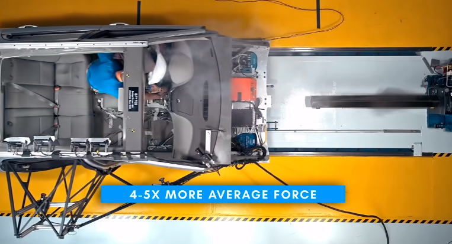

With the threshold for traumatic brain injury being just 50 G's, it becomes clear how even extremely low speed unprotected collisions can become catastrophic.

Seat belts work by increasing the time it takes the occupant to reduce their speed from the vehicle's impact velocity down to zero in a collision. All while spreading it along the most robust parts of the human body.

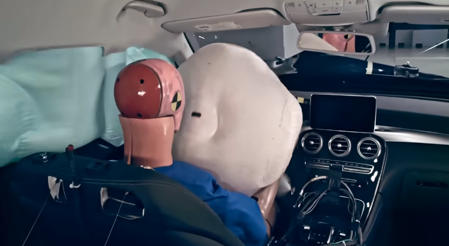

This effectively reduces the average deceleration force experienced by the occupant. While seat belts are highly effective, they are limited by the amount of stretch they can safely provide.

Since the exception of the mass-produced automobile, the concept for a device that could further enhance the amount of force reducing effect produced by restraints have existed.

However it would take a combination of the semiconductor revolution mixed with a byproduct technology of the Space Race to bring the long sought after idea into frution with the commercial Advent of the airbag.

An airbag and its most elemental form is an automotive safety restaint system designed to inflate a cushioning bag extremely quickly then rapidly deflate it in a controlled manner during a collision.

They are considered a passive restraint system because unlike seat belts require no interaction by the occupant for their operation.

Much like seat belts also lower the exposure to injury by increasing the interval of time. The occupant is exposed to deceleration and by spreading the force over a large area of the body.

However they offer this protection to the occupants in regions of the interior that are beyond the reach of traditional seat belts. They can prevent the occupant from striking interior objects such as the steering wheel or window and from various angles of impact.

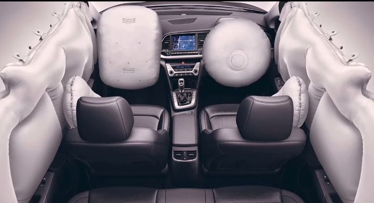

An airbag system is fundamentally composed of one or more inflation mechanisms located primarily within the steering wheel for the driver and the upper dashboard for the front passenger.

Additional mechanisms may also be embedded within the lower dashboard doors pillars, the roof structure, the seats and even the seat belts.

These mechanism are concealed within the vehicle's trim behind plastic flat panels that are designed to tear open under the force of the bag's inflation.

These inflation mechanisms are controlled by a centralized system that continously monitors for impact events using as little as one to dozens of sensors depending on the system's sophistication.

Once the system detects an impact, one or several inflation mechanisms are pyrotechnically triggered by an eletrical signal, causing a gas generating propellant to be ignited, rapidly inflating a bag that is folded within inflation mechanis.

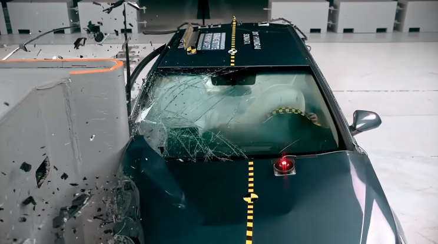

As the occupant collides with the bag, the gas escapes in a controlled manner through small vent holes cushioning their decleration.

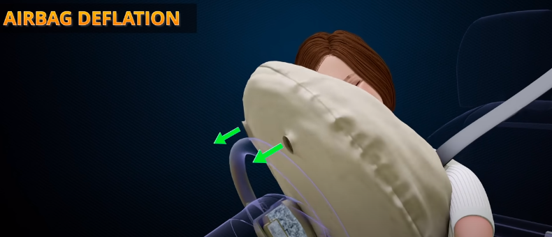

The airbag's volume in the size of the vents are specifically designed provide the largest increase in declearation time possible for that specfic vehicle and its location within it.

While simple in the concept, the different between an airbag's deployment protecting an occupant and causing traumatic or even deadly injuries comes down to precise millisecond timing of its operation.

Most two vehicle collisions are between 70 to 150 milliseconds in duraition, and can be divided into three stages.

- First comes initial contact wher ethe vechiels first touch each other.
- Next comes maximum engagement where the peak deformation and intrusion of the vehicles occur.
- Finally separation occurs as the vehicle pull away from each other and come to rest.

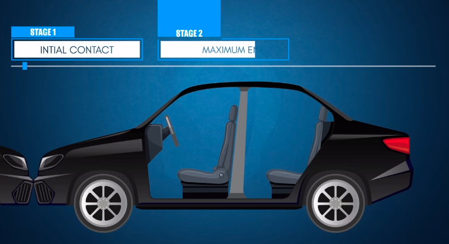
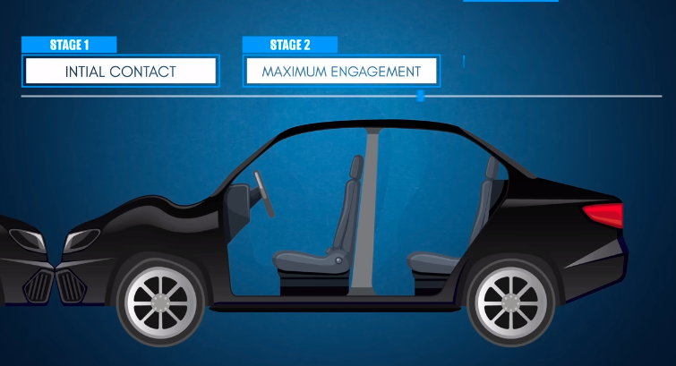
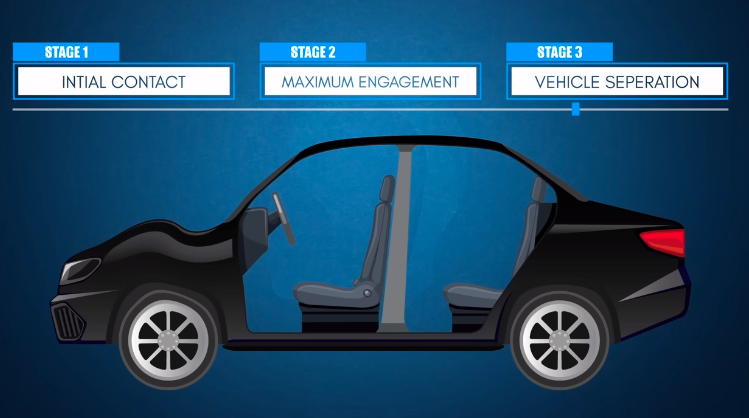

For an airbag system to not just be effective but also not cause more harm, its control system must evalute all forces in play and initiate a deployment strategy well before the maximum engagement statge occurs.

This is typically accomplished within 15ms to 50ms from detection of initial contact.

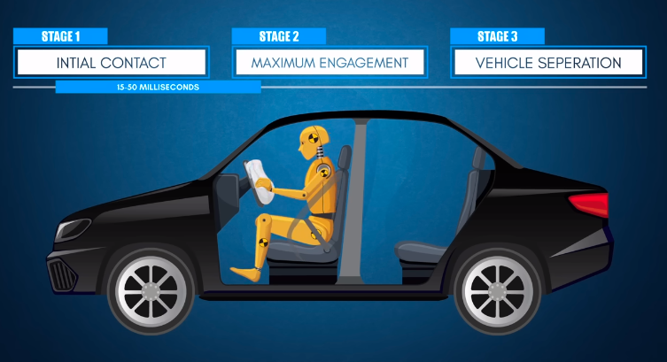

This is increadibly narrow window to act within the first 1/3 of the entire collision duration, is due to the airbags needing to deploy before the occupant contacts any portion of the vehicle's interior as it crushes and before the limits of the seat belt stretch are reached.

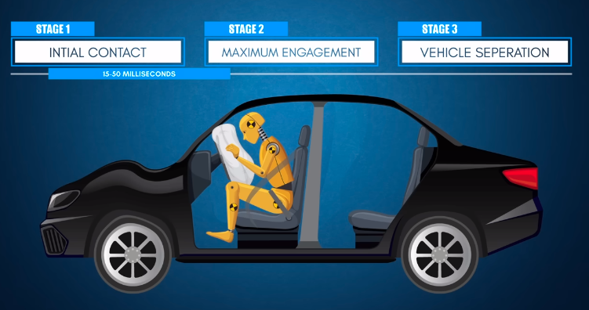

The airbag's inflation must also be timed so that it's fully inflated before the occupant engages with it to minimize Trauma from the inflation process itself.

While the idea for using an air filled cushion for vehicle and Aviation safety dates back to 1920s.

The first patents for a system that automatically inflates as a result of sudden decelartion where independently issued just 3 months apart in 1953 ot American John W Hetrick and German engineer Walter Linder, both systems are based on a stored of compressed air that would inflate the airbag using the mechanical trigger valves.

Hetrix system could be triggered in one of 3 ways:

- by a bumper contact valve
- by a mass spring deceleration detecting valve
- manually by the driver

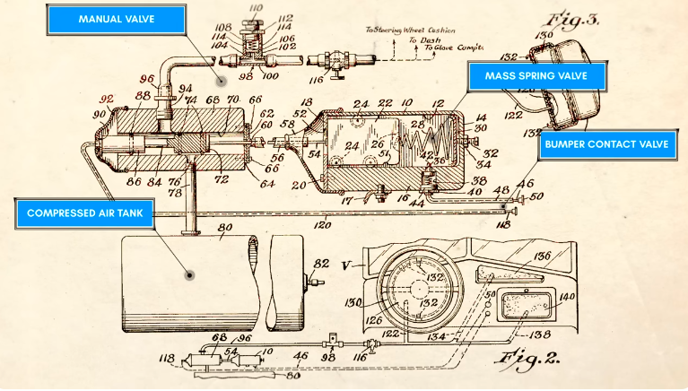

By the 1960s, practical airbag systems for vehicles were being explored by the major manufacturers, and from this decade of research, it was determined that compressed air systems were far too slow reacting to be effective.Furthermore the mass spring valve proved to be dangerously inaccurate for detecting collisions.

These flaws made the mechanical compressed airbag system completely unsuitable for commercial adoption. In 1967, Alan K. Breed would make a breakthrough that finally made airbags commercially viable with the development of the ball and Tube electromechanical crash detection sensor.

Breed's sensor worked by holding a steel ball in a restng posisiton using a magnet.

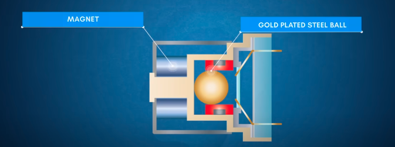

When a collision occurs, the ball is separated from the magnet moving forward to electrical contacts and closing the trigger circuit.

Because this ball required a significant change in acceleration to break away from the magnet when compared to just a change in velocity with a mass spring.

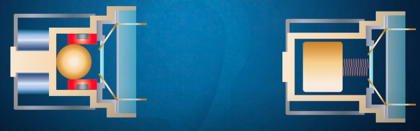

The ball and tube sensor is far more accurate in detecting a collision, the entire action of the trigger mechanism is also sealed, self-contained and can activate in under 15ms. Makin it an ideal candidate for commercial use.

In addition to crash sensing, Breed pionered the use of a gas generator as a method for rapidly inflating an airbag, a gas generator creates gas by a chemical reaction either from a solid or liquid source, and it's ideal for when storing a pressurized gas is impractical.

Gas generators are derived from the devices used in Rockets to generate a large quantities of gas to power the turbo pumps within their engines. The areas of packaging and simplicity would make them ideal for other airspace and military applications, such as aircraft emergency power sources jet engine start systems and even as torpedo power sources.

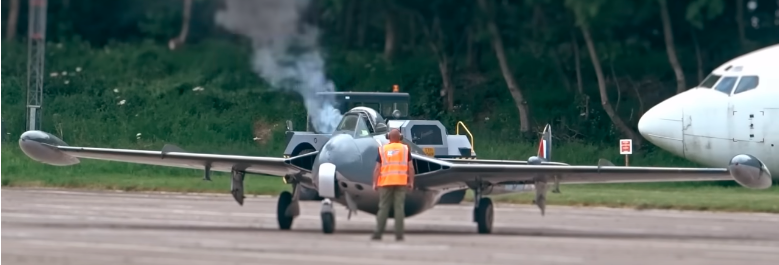

From this Breed devives an inflation mechanism that used just 30g to 150g of the solid fuel - sodium azide as a gas generating agent for airbags. Packaged behind a folded neoprene coated nylon bag.

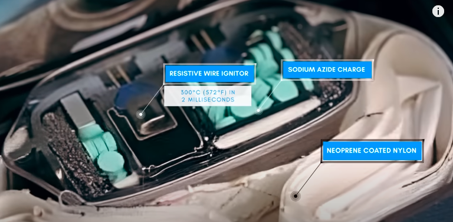

The sodium azide charged would be ignited by a resistive wire that would heat up to over 300 degres Celsius or about 572 degrees Fahrenheit wihtin 2ms when a current was applied to it.

The sodium azide would then exothermically decompose rapidly to sodium and nitrogen fully inflating the airbag with the resultant gas within just 60ms to 80ms while nitrogen produced is inert the resultant sodium metals within the generated gas proved to be hazardous and inheritant so additional additives such as potassium nitrate and silica would be
