# Electric Powertrain Architecture

## Basic of automobile

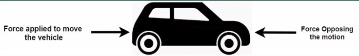

- Force opposing motion = Frictional force + Aerodynamic drag + Force due to gradient
- Force opposing motion = a + bV + c(V\*V) + Force due to gradient

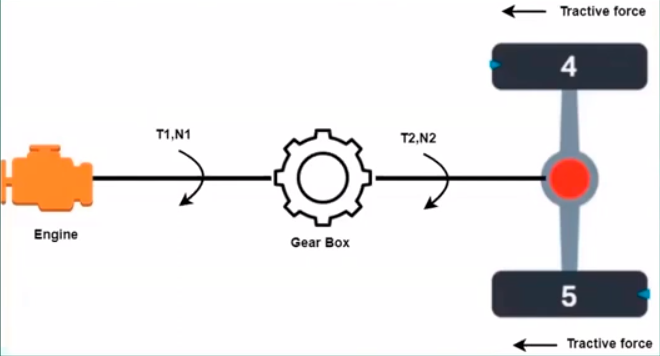

- Tractive force = T2/(Radius of Tyre)
- Tractive force = opposing force = M\*a

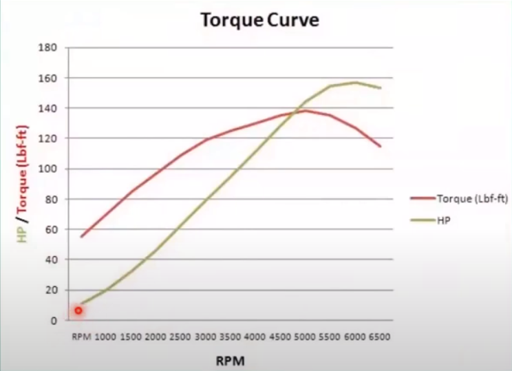

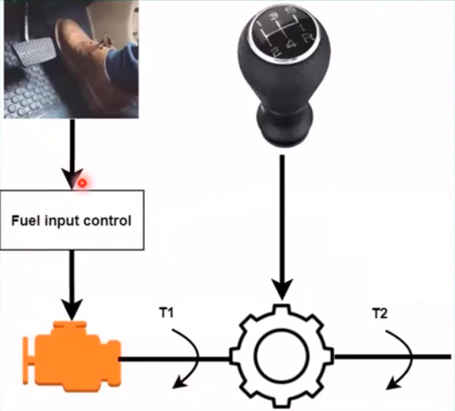

## Powertrain architecture of electric vehicle

- Components of Electric Powertrain
  - HV Battery
  - E Compressor
  - Vacuum Pump
  - Heater
  - Onboard Charger
  - E driver
  - DCDC converter
  - Traction and battery coolant pumps
  - Power Distribution Box b

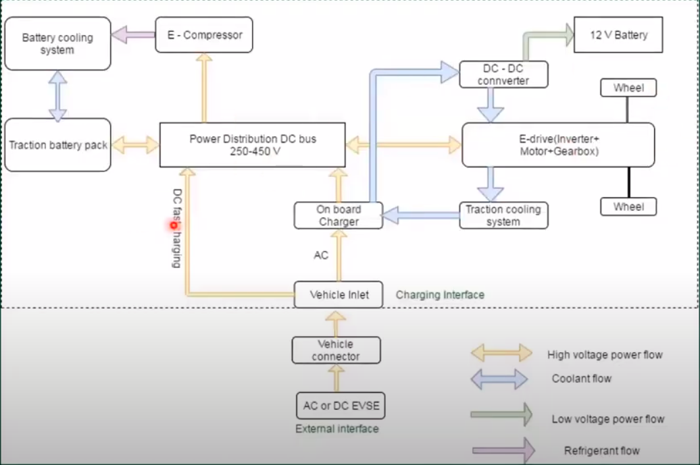

## Need for high voltage

- P = VI

  - P = Rated power of the system
  - V = Rated voltage of the system
  - I = Rated current of the system

- T$\alpha\phi_{1}\phi_{1}$

  - $\phi_{1}$ = Stator flux density vector
  - $\phi_{2}$ = Rotor flux density vector

- I = (V - E)/R
  - V = Terminal voltage of the motor
  - R = Resistance of the winding

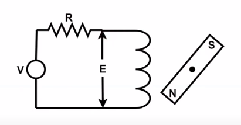

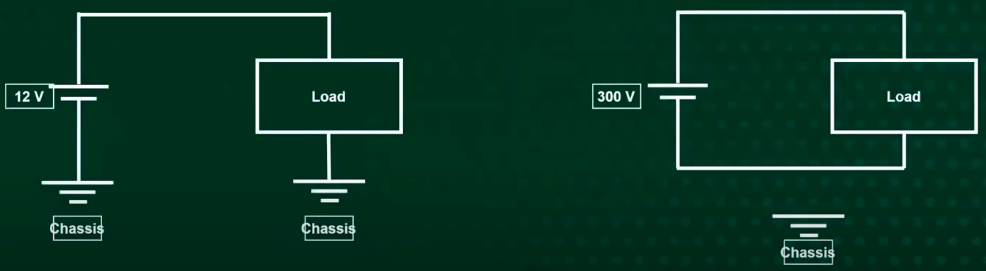

- The 12V system (low voltage)

  - Is done to save the copper which will use the chassis as a return path.
  - The post will be supplied by the separate copper cable.
  - If there is any short circuit that means the short speed of pulse to negative of the 12 volts battery that is not severe in if the voltage is less than 60 volts.
  - If the short-circuit causes in the chassis, it will affect to the battery.

- The 300V system (high voltage)
  - If the short-circuit causes in the chassis, it will **NOT** affect to the battery.
  - We don't want a single isolation failure to cause a short circuit, that's why in case of high voltage systems both positive amd negative are isolated from the chassis.

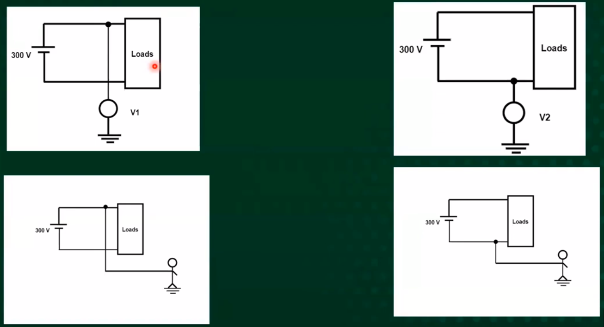

Whatever the person touches the positive or negative port of the battery pack, he/she will get shock, therefore the the high voltage system must be isolated with the chassis.

## Insulation monitoring

### Insulation monitoring - Scenario 1

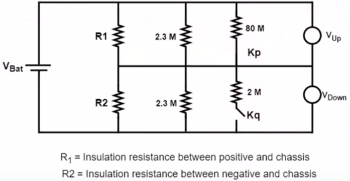

- The switch **Kp** is closed and switch **Kq** is open
- By applying voltage divider rule the circuit equations are as follows

Vup = (Vbat \* (R1 || 2.3M || 800M)) / ((R1 || 2.3M + 800M) + (R2 || 2.3M))

Vdown = (Vbat \* (R2 || 2.3M)) / ((R1 || 2.3M || 800M) + (R2 || 2.3M))

Vup / Vdown = (R1 || 2.3M || 800M) / (R2 || 2.3M) --- Equation (1)

### Insulation monitoring - Scenario 2

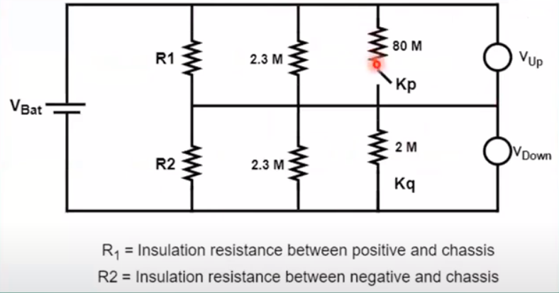

- The switch **Kp** is open and switch **Kq** is close
- By applying voltage divider rule the circuit equations are as follows

Vup = (Vbat \* (R1 || 2.3M)) / ((R1 || 2.3M) + (R2 || 2.3M || 2M))

Vdown = (Vbat \* (R2 || 2.3M || 2M)) / ((R1 || 2.3M) + (R2 || 2.3M || 2M))

Vup / Vdown = (R1 || 2.3M) / (R2 || 2.3M || 2M) --- Equation (2)

quation (1) and equation (2) are linear equations with two unknowns and solving them will give R1 and R2, i.e., insulation resistance of the system.

## Precharging of DC link

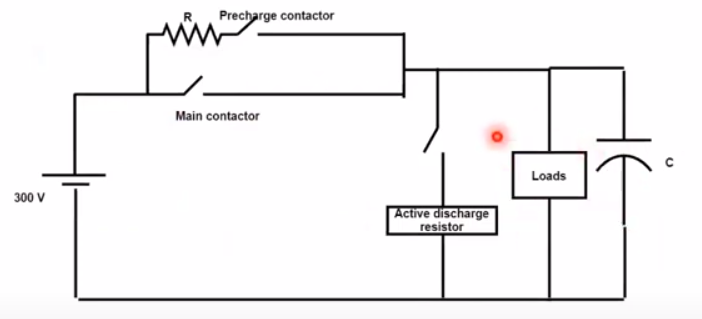

- I = C(dV/dt)
  -
- This high current (2000 to 6000 Amps) causes blowing of the fuese
- This high current causes welding of contactors

## Charging architecture

## Different charging protocols
