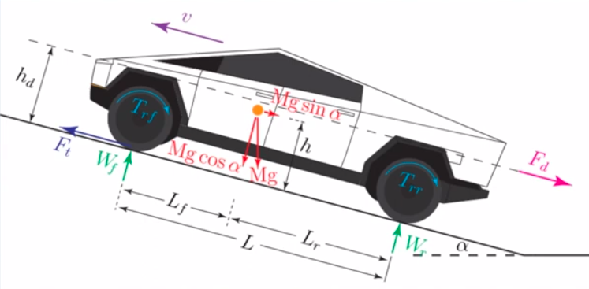

# Eletric Vehicle Modelling

## 1 Forces on Vehicles

### 1.1 Overview

- Tractive forces

  - F$_{T}$: Tractive force

- Reistive forces (road load)
  - F$_{d}$: Aerodynmaic drag
  - F$_{r}$: Rolling resistance
  - F$_{g}$(F$\alpha$): grade resistance

### 1.2 Aerodynmaic Drag

The larger the cross-sectional area of vehicle that faces the wind because that's the main thing that causes areodynmaic drag. The smaller the cross-sectional area is the lower drag.

- Internal(10%)

  - Ventilation
    - AIC, heating, etc

- External(90%)

  - air flow around the vehicle
    - 90% -> normal resistance
    - 10% -> skin friction

- Approximate drag by external componnet. Mathematically:
   
  F$_{d}$ = (1/2)pA$_{f}$C$_{d}$(v-v$_{w}$)$^{2}$sgn(v-v$_{w}$) [N]

  - p: air density, 1.225(kg/m$^{3}$)
  - A$_{f}$: cross-section area of the vehicle [m$^{2}$]
    - For vehicles weighing 800 - 2000kg: A$_{f} \simeq$ 1.6 + 0.00056(M - 765)
    - M: vehicle mass in Kg
  - C$_{d}$: drag coefficient
  - v: vehicle speed
  - v$_{w}$: wind speed, in the direction of motion
  - sgn: sign function
    - sgn(x) = -1, x < 0
    - sgn(x) = 1, x > 0

- Atmospheric conditions effect on F$_{d}$:
  - Increase temperature by 40% -> decrease F$_{d}$ by 14%
  - Increase altitude by 1200m -> reduce F$_{d}$ by 17%
  - Standard Test Conditions (STC): 15$^{\circ}$C & 101.3kPa

### 1.3 Rolling Resistance

**F$_{r}$ = M$_{g}$cos$\alpha$(C$_{0}$ + C$_{1}$v$^{2}$)sgn(v)**

- C$_{r} \triangleq$ (C$_{0}$ + C$_{1}$v$^{2}$): rolling resistance coefficent

  - C$_{0}$: 0.004 $\leq$ C$_{0}$ $\leq$ 0.02
  - C$_{1}$: 1.6$\cdot$10$^{-6}$ $\leq$ C$_{1}$ $\leq$ 1.6$\cdot$10$^{-6}$ [s$^{2}$/m$^{2}$]

- cos$\alpha \simeq$ 1

**F$_{r}$ denponds on:**

- vehicle speed
- tire material & structure
- temperature
- tire air pressure
- road material & structure

### 1.4 Grade Resistance

- F$_{g}$ = M$_{g}$sin$\alpha$
- Grade, G $\triangleq$ tan$\alpha$
  - Increase in hight for every 100m travelled
  - G = 0.1
  - %G $\triangleq$ 100tan$\alpha$ = 100(h/x)

**Grade ability:** Max grade climbable at 0 accelearation

- ignoring F$_{r}$, F$_{d}$, dv/dt
- F$_{T}$ \simeq$ F${_g}$
- F$_{T}$ = Mgsin$\alpha$
- tan$\alpha$ = sin$\alpha$ / cos$\alpha$
  - sin$\alpha$ = tan$\alpha$cos$\alpha$ = G(1 - sin$^{2}/alpha$)$^{1/2}$
- F$_{T}$ = Mg$\cdot$G$\cdot$(1 - sin$^{2}/alpha$)$^{1/2}$ = G$\cdot$((Mg)$^{2}$ - (Mgsin$/alpha$)$^{2}$)$^{1/2}$

- G' = F$_{T}$ / ((Mg)$^{2}$ - (F$_{T}$)$_{2}$)$^{1/2}$

### 1.5 Summay of Road Load

**Road load: aka road resistance or resistive forces**

F$_{R}$ = F$_{d}$ + F$_{T} \pm$ F$_{g}$

- +: uphill movement
- -: downhill movement

## 2 Equations of Motion

### 2.1 Newton's 2nd Law

**Me(dv/dt) = F$_{T}$ - F$_{R}$**

- Me $\triangleq$ = $\vartheta$M
  - $\vartheta$ means mass factor
  - 1.01 $\leq$ $\vartheta$ $\leq$ 1.4
- F$_{T}$: Tractive force
- F$_{R}$: Road load

### 2.2 Accleration Time

**$Me(dv/dt) = F_{T} - F_{R}$**
  = $F_{T} - F_{r} - F_{d}$
  = $F_{T} - M_{g}cos\alpha(C_{0} + C_{1}v^{2}) - (1/over{2})pA_{f}C_{d}(v-v_{w})^{2}$
  = $F_{T} - M_{g}(C_{0} + C_{1}v^{2}) - (1/2)pA_{f}C_{d}v^{2}$ [in simplest case]

**dv/dt = ((F$_{T}$/$\vartheta$M) - (gC$_{0}$/$\vartheta$)) - ((gC$_{1}$)/$\vartheta$ + (pA$_{f}$C$_{d}$)/2$\vartheta$M)v$^{2}$**

- K$_{1}$ = ((F$_{T}$/$\vartheta$M) - (gC$_{0}$/$\vartheta$))
- K$_{2}$ = ((gC$_{1}$)/$\vartheta$ + (pA$_{f}$C$_{d}$)/2$\vartheta$M)

**Constant F$_{T} = $dv/dt = K$_{1}$ - K$_{2}$v$^{2}$**

$\int_0^v {d\vartheta \over K_{1} - K_{2}\vartheta^{2}} = \int_0^t dt$

$v(t) = \sqrt{K_{1} \over K{2}} \tanh (\sqrt{K_{1} \over K{2}})t$
  => $t = {1\over\sqrt{K_{1}K{2}}} \tanh^{-1} (\sqrt{K_{1} \over K{2}}v)$

### 2.3 Maxium Speed

- y = v(t)
- x = t

If a vehicle starts from this point 0, the longer you drive, you kind of hit some speed at some point and it becomes difficult to drive pass that.

### 2.4 Steady State Speed

If $F_{T}$ is constant, steady state speed:

$v_{f} = \lim_{t \to +\infty} \sqrt{K_{1} \over K{2}} \tanh (\sqrt{K_{1} \over K{2}})t = \sqrt{K_{1} \over K{2}}$

## 3 Torque-Speed Characteristic of Vehicles

### 3.1 Introdution

We understand that vehicles should be able to overcome the rolling resistance, areodynamic drag, force of gravity, if there's an uphill situation, internal losses due to friction of motion and so on.

As well as one thing we haven't touched on but is fairly obvious is that the vehicle itself should offer a reasonable acceleration and top speed. That means if your vehicle is capable of overcoming rolling resistance and all that's all the resistive forces, let's say it's not sufficient, so it should be able to also accelerate at a certain rate and it should be able to reach at maximum speed.

So in the U.S. they have what they call the U.S. partnership for a new generation of vehicles, let's call it **US PNGV**. The Partnership for a New Generation of Vehicles (PNGV) is a 10-year collaboration between the U.S. government and three automakers to develop new automotive technology that reduces air pollution.

### 3.2 Requirements of US PNGV

| Req          | Data                                                           |
| ------------ | -------------------------------------------------------------- |
| acceleration | 0-96km/h in 12s   64-96km/h in 5.3s   0-136km/h in 23.4s |
| max speed    | 136 km/h level road   88 km/h on 6.5% grade                 |
|              |                                                                |

### 3.3 Force Equation

**$\vartheta M(dv/dt) = F_{T} - F_{R}$**
  = $F_{T} - F_{r} - F_{d}$
  = $F_{T} - M_{g}(C_{0} + C_{1}v^{2}) - (1/2)pA_{f}C_{d}v^{2}$

**Uphill Motion**

**$F\_{T} = Me {dv \over dt} + Mg(C_{0} \cos \alpha + \sin \alpha) + (MgC_{1}\cos \alpha + {1 \over 2}pA_{p}C_{d})v^{2}$**

- Speed independent: $Me {dv \over dt} + Mg(C_{0} \cos \alpha + \sin \alpha)$
- Speed dependent: $(MgC_{1}\cos \alpha + {1 \over 2}pA_{p}C_{d})$
  - This term tells us we need more force, how do we produce a large force? We need a large power.

### 3.4 Speed Dependent

**Power Equation**

$P_{T} = F_{T} \cdot v = Me \cdot v{dv \over dt} + Mg(C_{0} \cos \alpha + \sin \alpha)\cdot v + (MgC_{1}\cos \alpha + {1 \over 2}pA_{p}C_{d})v^{3}$

**Speed Dependent:**
**$Mg(C_{0} \cos \alpha + \sin \alpha)\cdot v + (MgC_{1}\cos \alpha + {1 \over 2}pA_{p}C_{d})v^{3}$**

- low speed & $\alpha = 0$ -> focus on $dv \over dt$
- 2-region Torque-speed (Force-speed) characteristic

### 3.5 The Curve & Constant Power Region

Base Speed: $\omega_{B}(v_{B})$

$P_{Tmax} = T_{Tmax}\omega_{B} = F_{Tmax}\cdot v_{B}$

This is the profile that basically every vehicle operates under, and what it does is it allows us to better utilize the power that we have available to us.

We actually have two different ways of utilizing the engine or the motor, or approaching the propulsion.

- First just the standard way.
- The second way is using this profile, which is a much more effective way of approaching propulsion.
