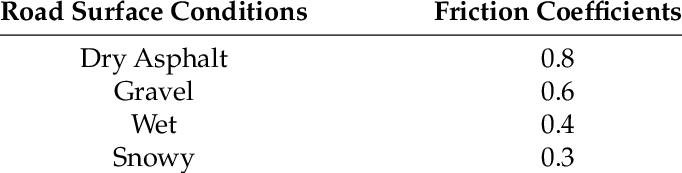

# Eletric Vehicle Modelling

## 1 Forces on Vehicles

### 1.1 Overview

- Tractive forces

  - $F_{T}$: Tractive force

- Reistive forces (road load)
  - $F_{d}$: Aerodynmaic drag
  - $F_{r}$: Rolling resistance
  - $F_{g}$($F\alpha$): grade resistance

### 1.2 Aerodynmaic Drag

The larger the cross-sectional area of vehicle that faces the wind because that's the main thing that causes areodynmaic drag. The smaller the cross-sectional area is the lower drag.

- Internal(10%)

  - Ventilation
    - AIC, heating, etc

- External(90%)

  - air flow around the vehicle
    - 90% -> normal resistance
    - 10% -> skin friction

- Approximate drag by external componnet. Mathematically:
   

  $F_{d} = {1 \over 2}pA_{f}C_{d}{(v-v_{w})_{2}}sgn(v-v_{w})  [N]$

  - p: air density, 1.225(kg/m$^{3}$)
  - A$_{f}$: cross-section area of the vehicle [m$^{2}$]
    - For vehicles weighing 800 - 2000kg: A$_{f} \simeq$ 1.6 + 0.00056(M - 765)
    - M: vehicle mass in Kg
  - C$_{d}$: drag coefficient
  - v: vehicle speed
  - v$_{w}$: wind speed, in the direction of motion
  - sgn: sign function
    - sgn(x) = -1, x < 0
    - sgn(x) = 1, x > 0

- Atmospheric conditions effect on F$_{d}$:
  - Increase temperature by 40% -> decrease F$_{d}$ by 14%
  - Increase altitude by 1200m -> reduce F$_{d}$ by 17%
  - Standard Test Conditions (STC): 15$^{\circ}$C & 101.3kPa

### 1.3 Rolling Resistance

<!-- **F$_{r}$ = M$_{g}$cos$\alpha$(C$_{0}$ + C$_{1}$v$^{2}$)sgn(v)** -->

**$F{r} = Mg\cos\alpha (C_{0} + C_{1}v^{2})sgn(v)$**

- C$_{r} \triangleq$ (C$_{0}$ + C$_{1}$v$^{2}$): rolling resistance coefficent

  - C$_{0}$: 0.004 $\leq$ C$_{0}$ $\leq$ 0.02
  - C$_{1}$: 1.6$\cdot$10$^{-6}$ $\leq$ C$_{1}$ $\leq$ 1.6$\cdot$10$^{-6}$ [s$^{2}$/m$^{2}$]

- cos$\alpha \simeq$ 1

**F$_{r}$ denponds on:**

- vehicle speed
- tire material & structure
- temperature
- tire air pressure
- road material & structure

### 1.4 Grade Resistance

<!-- - F$_{g}$ = M$_{g}$sin$\alpha$ -->

- $F_{g} = Mg \sin\alpha$
<!-- - Grade, G $\triangleq$ tan$\alpha$ -->
- Grade, $G \triangleq \tan\alpha$
  - Increase in hight for every 100m travelled
  - G = 0.1
  - $\%G \triangleq 100\tan\alpha$ = 100(h/x)

**Grade ability:** Max grade climbable at 0 accelearation

- ignoring F$_{r}$, F$_{d}$, dv/dt
<!-- - F$_{T}$ \simeq$ F${_g}$ -->
- $F_{T} \simeq F_{g}$
<!-- - F$_{T}$ = Mgsin$\alpha$ -->
- $F_{T} = Mg \sin\alpha$
<!-- - tan$\alpha$ = sin$\alpha$ / cos$\alpha$ -->
- $\tan\alpha = {\sin\alpha \over \cos\alpha}$
    <!-- - sin$\alpha$ = tan$\alpha$cos$\alpha$ = G(1 - sin$^{2}/alpha$)$^{1/2}$ -->
  - $\sin\alpha = \tan\alpha\cos\alpha = {G(1 - \sin^{2}\alpha)^{1 \over 2}}$
  <!-- - F$_{T}$ = Mg$\cdot$G$\cdot$(1 - sin$^{2}/alpha$)$^{1/2}$ = G$\cdot$((Mg)$^{2}$ - (Mgsin$/alpha$)$^{2}$)$^{1/2}$ -->
- $F_{T} = Mg\cdot G \cdot {(1 - \sin^{2}\alpha)^{1 \over 2}} = G{(\cdot{(Mg)^{2}} - {(Mg\sin\alpha)^{2}})}^{1 \over 2}$

<!-- - G' = F$_{T}$ / ((Mg)$^{2}$ - (F$_{T}$)$_{2}$)$^{1/2}$ -->

- $G' = {F_{T} \over {((Mg)^{2} - (F_{T}^2))}^{1 \over 2}}$

### 1.5 Summay of Road Load

**Road load: aka road resistance or resistive forces**

F$_{R}$ = F$_{d}$ + F$_{T} \pm$ F$_{g}$

- +: uphill movement
- -: downhill movement

## 2 Equations of Motion

### 2.1 Newton's 2nd Law

**Me(dv/dt) = F$_{T}$ - F$_{R}$**

- Me $\triangleq$ = $\vartheta$M
  - $\vartheta$ means mass factor
  - 1.01 $\leq$ $\vartheta$ $\leq$ 1.4
- F$_{T}$: Tractive force
- F$_{R}$: Road load

### 2.2 Accleration Time

**$Me(dv/dt) = F_{T} - F_{R}$**
  = $F_{T} - F_{r} - F_{d}$
  = $F_{T} - M_{g}cos\alpha(C_{0} + C_{1}v^{2}) - (1/over{2})pA_{f}C_{d}(v-v_{w})^{2}$
  = $F_{T} - M_{g}(C_{0} + C_{1}v^{2}) - (1/2)pA_{f}C_{d}v^{2}$ [in simplest case]

**dv/dt = ((F$_{T}$/$\vartheta$M) - (gC$_{0}$/$\vartheta$)) - ((gC$_{1}$)/$\vartheta$ + (pA$_{f}$C$_{d}$)/2$\vartheta$M)v$^{2}$**

- K$_{1}$ = ((F$_{T}$/$\vartheta$M) - (gC$_{0}$/$\vartheta$))
- K$_{2}$ = ((gC$_{1}$)/$\vartheta$ + (pA$_{f}$C$_{d}$)/2$\vartheta$M)

**Constant F$_{T} = $dv/dt = K$_{1}$ - K$_{2}$v$^{2}$**

$\int_0^v {d\vartheta \over K_{1} - K_{2}\vartheta^{2}} = \int_0^t dt$

$v(t) = \sqrt{K_{1} \over K{2}} \tanh (\sqrt{K_{1} \over K{2}})t$
  => $t = {1\over\sqrt{K_{1}K{2}}} \tanh^{-1} (\sqrt{K_{1} \over K{2}}v)$

### 2.3 Maxium Speed

- y = v(t)
- x = t

If a vehicle starts from this point 0, the longer you drive, you kind of hit some speed at some point and it becomes difficult to drive pass that.

### 2.4 Steady State Speed

If $F_{T}$ is constant, steady state speed:

$v_{f} = \lim_{t \to +\infty} \sqrt{K_{1} \over K{2}} \tanh (\sqrt{K_{1} \over K{2}})t = \sqrt{K_{1} \over K{2}}$

## 3 Torque-Speed Characteristic of Vehicles

### 3.1 Introdution

We understand that vehicles should be able to overcome the rolling resistance, areodynamic drag, force of gravity, if there's an uphill situation, internal losses due to friction of motion and so on.

As well as one thing we haven't touched on but is fairly obvious is that the vehicle itself should offer a reasonable acceleration and top speed. That means if your vehicle is capable of overcoming rolling resistance and all that's all the resistive forces, let's say it's not sufficient, so it should be able to also accelerate at a certain rate and it should be able to reach at maximum speed.

So in the U.S. they have what they call the U.S. partnership for a new generation of vehicles, let's call it **US PNGV**. The Partnership for a New Generation of Vehicles (PNGV) is a 10-year collaboration between the U.S. government and three automakers to develop new automotive technology that reduces air pollution.

### 3.2 Requirements of US PNGV

| Req          | Data                                                           |
| ------------ | -------------------------------------------------------------- |
| acceleration | 0-96km/h in 12s   64-96km/h in 5.3s   0-136km/h in 23.4s |
| max speed    | 136 km/h level road   88 km/h on 6.5% grade                 |
|              |                                                                |

### 3.3 Force Equation

**$\vartheta M(dv/dt) = F_{T} - F_{R}$**
  = $F_{T} - F_{r} - F_{d}$
  = $F_{T} - M_{g}(C_{0} + C_{1}v^{2}) - (1/2)pA_{f}C_{d}v^{2}$

**Uphill Motion**

**$F\_{T} = Me {dv \over dt} + Mg(C_{0} \cos \alpha + \sin \alpha) + (MgC_{1}\cos \alpha + {1 \over 2}pA_{p}C_{d})v^{2}$**

- Speed independent: $Me {dv \over dt} + Mg(C_{0} \cos \alpha + \sin \alpha)$
- Speed dependent: $(MgC_{1}\cos \alpha + {1 \over 2}pA_{p}C_{d})$
  - This term tells us we need more force, how do we produce a large force? We need a large power.

### 3.4 Speed Dependent

**Power Equation**

$P_{T} = F_{T} \cdot v = Me \cdot v{dv \over dt} + Mg(C_{0} \cos \alpha + \sin \alpha)\cdot v + (MgC_{1}\cos \alpha + {1 \over 2}pA_{p}C_{d})v^{3}$

**Speed Dependent:**
**$Mg(C_{0} \cos \alpha + \sin \alpha)\cdot v + (MgC_{1}\cos \alpha + {1 \over 2}pA_{p}C_{d})v^{3}$**

- low speed & $\alpha = 0$ -> focus on $dv \over dt$
- 2-region Torque-speed (Force-speed) characteristic

### 3.5 The Curve & Constant Power Region

Base Speed: $\omega_{B}(v_{B})$

$P_{Tmax} = T_{Tmax}\omega_{B} = F_{Tmax}\cdot v_{B}$

This is the profile that basically every vehicle operates under, and what it does is it allows us to better utilize the power that we have available to us.

We actually have two different ways of utilizing the engine or the motor, or approaching the propulsion.

- First just the standard way.
- The second way is using this profile, which is a much more effective way of approaching propulsion.

## 4 Power Plant Sizing

### 4.1 The Requirements of The Power Plant

Assuming that we're operating with this type of method, we want to be able to understand:

- how much power do we need?
- how do we determine that?
- what are these quantities based on?

### 4.2 Attractive Force

**$F_{T}$ =**

- $P_{Tmax}/v_{B}$, $v \leq v_{B}$ <-> $F_{Tmax}$
- $P_{Tmax}/v$, $v_{B} \leq v \leq v_{max}$

When we drive vehicle or we operate vehicles, we become an extension of the control. There is an internal control that controls the speed, the mount of power, the force, we dont sit there when we're driving a vehicle and say exert this much force.

For this duration of time we sit there and we kind of press the gas and we have this low resolution feedback where it just feels like we're fast enough and there's usually speedmeters all that kind of stuff that tell you when you're fast enough or not. But for a lot of people they are also able to understand when they're going too fast.

### 4.3 The Motion of The Vehicle

$\vartheta M{du\over{dt}} = F_{T} - F_{R}$

$F_{R} = \beta_{1} + \beta_{2}v^{2}$

Notice that the $\beta_{1}$ and $\beta_{2}$ are the $K_{1}$ and $K_{2}$ in [2.4 Steady State Speed](#24-steady-state-speed).

Separate these two to get the acttractive force. Because the acttractive is not a constant throughout the entire region as above.

What we are interested in is how long it takes the vehicle to start from 0 to start from steady or stand still, and to reach some steady state speed $v_{f}$.

$\vartheta M \int_0^{v_{f}} {dv \over {F_{T}-\beta_{1}-\beta_{2}v^{2}}} = \int_0^{t_{f}}dt$ ---> (0 to $v_{f}$)m/s in $t_{f}$ seconds

$t_{f}$ and $v{f}$ are again these steady state type of parameters, so in most cases we say that steady state is 100km/h. We go with that because that's usually a good measure of a sufficient large speed starting from 0.

But now $F{T}$ has two different conditions, so in one case it's a constant in the other case it depends on speed. So we can go take this integral one step further, and we can substitude that into there:

$\vartheta M \int_0^{v_{B}} {dv \over {{P_{Tmax} \over v_{B}}-\beta_{1}-\beta_{2}v^{2}}} + \int_0^{v_{f}}{dt \over {{P_{Tmax} \over v} - \beta_{1}-\beta_{2}v^{2}}} = t_{f}$

### 4.4 The Equation of $P_{Tmax}$

This is a challenging integral to solve, $\vartheta M \int_0^{v_{B}} {dv \over {{P_{Tmax} \over v_{B}}-\beta_{1}-\beta_{2}v^{2}}}$ is still quite lengthy but you can still solve it because this term is constant and this is $v^{2}$ so you can have trigonometric subsitution there.

But $\int_0^{v*{f}}{dt \over {{P_{Tmax} \over v} - \beta_{1}-\beta_{2}v^{2}}}$ has no real convenient anlytic expression for this, so what you can do some numerical analysis, or you can do some series representation and solve it that way.

But rather than do that what we're going to do is going to make some simplification.

- $P_{Tmax} \over v_{B}$ ---> CF region (constant)
- $P_{Tmax} \over v$ ---> CP region, which is also evident based on the integral limits
- $\beta_{1}+\beta_{2}v^{2}$ ---> road load

So we can do is to consider an ideal case, let's there is no road load. What are the requirements our vehicle then? The reason we want to do that because these integrals are difficult to solve. They don't give much insight into what's going on.

Remember that the $F_{R}$ depends on $v^{2}$ as well as $\beta_{1}$, $\beta_{1}$ is usually small compared to everything else, and $\beta_{2}v^{2}$ because $v^{2}$ is going to be zero or close to zero, this term is going to be very small. It's OK if we neglect it.

$t_{f} \vartheta M \int_0^{v_{B}} {v_{B}dv \over P_{Tmax}} + \int_{v_{b}}^{v_{f}} {vdv \over P_{Tmax}}$

$t_{f} = {\vartheta M \over {2P_{Tmax}}}(v_{f}^{2} + v_{B}^{2}) \rightarrow P_{Tmax} = {\vartheta M \over 2t_{f}}(v_{f}^{2} + v_{B}^{2})$

It tells us that the maximum tract of power is dependent directly on the steady state speed, you're trying to achieve as well as the base speed of your motor or engine, it tells you it's also inversely proportional to the amount of time you take.

So the amount of power needed will decrease as the amount of time you have to readch a steady state increases, remember that we had some requirments from **US PN GV** or something like that, and there were certain acceleration times.

- **$P_{Tmax1}$:** Let's say we want to achieve 100km/h which is a reasonable $v_{f}$, we want to do it in 10s -> $t_{f}$, that will give you a certian $P_{Tmax}$.

- **$P_{Tmax2}$:** Let's say we want to achieve 100km/h in 20s -> $t_{f}$.

It's very clear that **$P_{Tmax2}$** is smaller than **$P_{Tmax1}$**. So this is the insight that this equation for $P_{Tmax}$ and it allows us to determone the power plant requirements based on the desired acceleration time.

### 4.5 Considering the Road Load

**$P_{Tmax} = {\vartheta M \over 2t_{f}}(v_{f}^{2} + v_{B}^{2}) + {Mg(C_{0} + C_{1}v_{f}^{2})v_{f}} + {{1 \over 2}pA_{f}C_{d}v_{f}^{3}}$**

- ${Mg(C_{0} + C_{1}v_{f}^{2})v_{f}} + {{1 \over 2}pA_{f}C_{d}v_{f}^{3}}$: Power loss @ $v = v_{f}$

If you want to rate this motor for a steady state speed $v_{f}$, let's call it that's what we've that's the whole purpose of $v_{f}$ is that it's a steady state speed, then we can say we mean it's not we can say it's obvious that the paremeters of the road load or the resistive forces the resistive forces that are speed dependent terms, which in the case of power losses it's all speed dependent, you can say those losses will be the largest at the highest speed.

These losses will only be smaller than ${Mg(C_{0} + C_{1}v_{f}^{2})v_{f}} + {{1 \over 2}pA_{f}C_{d}v_{f}^{3}}$ for lower speed, meaning if I can design my motor/engine for providing this maximum attractive power, then I should be able to deal with anything less than this too. Because this is the worst case scenario.

## 5 Maximum Tolerable Tractive Force

Essentially there's a limit on the tractive force that you can exert the wheels on the surface and beyond that limit you start to skid.

You'll probably have noticed that if it's been raining and you are at a traffic light, and all of a sudden, you floor your gas pedal you'll probably notice that your vehicle skids a bit, it's definitely skids in the winter if there's snow on the ground.

- **$F_{T} \leq \mu W_{f}$** ---> for front wheel drive
- **$F_{T} \leq \mu W_{r}$** ---> for rear wheel drive

  - **$W_{f}$** is the weight on the front axle.
  - **$\mu$** is the coefficient of friction.
    - 
  - The 4-wheel drive has some variation of the two, which needs to consider the combination of two depending on how they're distributed.

- $W_{f} = {Lr \over L}W - {h \over L}(F_{T} - F_{r})$
- $W_{r} = {Lr \over L}W + {h \over L}(F_{T} - F_{r})$

  - Rolling resistance, $F_{r} = C_{r} \cdot Mg$

- FRONT WHEEL DRIVE: $F_{T} \leq {\mu W(L_{r} + hC_{r}) \over {L + \mu h}}$
- REAR WHEEL DRIVE: $F_{T} \leq {\mu W(L_{r} - hC_{r}) \over {L + \mu h}}$

**Example**

Let's say you have a vehicle

- front wheel drive
- on dry asphalt -> $\mu = 0.9$
- $L_{f} = {1 \over 3}L$, $L_{f} = {2 \over 3}L$, $L = 2.75m$
- $h = 0.75m$
- $C_{r} = 0.01$
- $W = 1500 \cdot 9.81 = 14715N$

$F_{T} \leq {0.9 \cdot 14715({{2 \over 3} \cdot 2.75} + {0.75 \over 0.01}) \over {2.75 + 0.9 \cdot 0.75}}$

**$F_{T} \leq 7117[N]$**

What that means is if you apply any force greater than 7117[N] of force, so basically if you have an initial accelerating force that is less than there won't be any skdding.

## 5 Vehicle Block Model

### 5.1 Control Model

$\vartheta M {dv \over dt} = F_{T} - F_{R}$

### 5.2 Simplified Model

Based on the exact same type of logic.

How do I convert v into a torque? So if I want to convert from v (linear velocity) to an angular velocity. I can use the radius of the wheels because that's where the tractive force is acting in this case.

The torque on the shaft (tractive torque) is not the same as the one that the motor outputs, because there's usually a gear box between these things. And what the gearbox does is it either increases or decreases the speed or the torque. Which means there's always an objective of the gearbox in order to adjust these ratios bascially.

So in order to account for that, the difference between the motor torque and the actual torque on the shaft, is simply a factor of **GR(Gear Ratio)**.

How does all of this tie together? Because now you have the $\omega_{M}$ and you pass the $\omega_{M}$ back into **when we say machine we say this torque speed characteristic**, because that's what governs how the torque speed characteristic or how the vehicle operates.

So that produces the torque on the machine side multiplied by the **GR(Gear Ratio)** and then you get your torque on the actual on hte wheels and themselves that gives you the tractive and so on. And you can sort of closed loop where there's usually an external observer which is giving the command for $P_{Tmax}$.

- Grade: $G' = **{F_{T} \over {((Mg)^{2} - (F_{T}^2))}^{1 \over 2}}$\*\*
- Aerodynmaic Drag: **$F_{d} = {1 \over 2}pA_{f}C_{d}{(v-v_{w})_{2}}sgn(v-v_{w})  [N]$**
- Rolling Resistance: **$F{r} = Mg\cos\alpha (C_{0} + C_{1}v^{2})sgn(v)$**

$T_{M}$

- $x_{\theta M} {P_{Tmax} \over \omega_{B}}$ --- $\omega_{M} \leq \omega_{B}$
- $x_{\theta M} {P_{Tmax} \over \omega_{M}}$ --- $\omega_{M} \geq \omega_{B}$
- $-1 \leq x_{\theta M} \leq 1$

You can image is your foot on the accelerator, what does the $x_{\theta M}$ is it controls the torque of motor/machine is producing. So by doing that you can control the speed of the vehicle.

## 6 The Gear Ratio

### 6.1 Basic Concept

The purpose of a grear box, or the gear in general, is essentially it's a torque multiplier, or it's a speed reducer I guess you can say you can increase you can adjust the torque from a source to an output.

So you give some torque to the input of the gearbox and some speed to the input of the gearbox. And the torque and speed on the outside of the gearbox will be different.

### 6.2 Ideal Model

Gear box assumption:

- 100% efficiency
- perfectly rigid - otherwise we get into the a whole mess of other calculations
- No space between teeth of the gear

  - That's how they kind of push on one another or connect to one another

- Tangential velocity: $v$
- Angular velocity: $\omega$
- $v = r\omega$
- $v_{in} = v_{out}$ => $r_{in}\omega_{in} = r_{out}\omega_{out}$
- => ${\omega_{in} \over \omega_{out}} = {r_{out} \over r_{in}} = GR$

- $P_{out} = P_{in}$ <--- No loss, 100% efficiency
- => **$GR = {T_{out} \over T_{in}} = {\omega_{in} \over \omega_{out}}$**

When we have a condition at the roadside, if we say that the vehicle is travelling 10m/s, that's the condition on the wheel - on the road side, so then you have to convert this 10m/s to some torque using the radius of the wheel. Then you'll have the output as tractive torque or shaft torque.

In order to convert the trative torque to the motor side, you have to have the gear box.

## 7 Toqure-Speed Characteristic Examples

### 7.1 Example 1

Assume $Me = 1000kg$ & an acceleration time of 10s from standstil to a speed of 25m/s. Ignoring forms of resistance, determine the power requirements of the motor for:

- (a) Constant-force accelearation
  - During acceleration: ${dv \over dt} = {{25 - 0} \over 10} = 2.5[m/s^{2}]$
  - Newton's law: $F_{T} = Me\cdot{dv \over dt} = 1000 \cdot 2.5 = 2500[N]$
  - $P_{T} = 2500 \cdot v$ => $P_{Tmax} = 2500 \cdot (25) = 62.5[kW]$
  - Deceleartion is the same, needs the force in the opposite direction for deceleration

- (b) Constant-force / constant-power accelearation $\omega$ -> $F{T} = 3625[N]$ and $v_{B} = 10[m/s]$
  - For 10 to 10m/s:
    - $F_{T} = 3625[N] \rightarrow 1000{dv \over dt} = 3625$
    - $dv/dt = 3.625[m/s^{2}]$
    - $\int_{0}^{10} dv = 3.625\int_{0}^{t_{1}}dt \rightarrow t_{1} = 2.76s$
  - For 0 to 25m/s:
    - $P_{T} = 36.25kW = F_{T}\cdot v \rightarrow F_{T} = 36250/v$
    - $\int_{10}^{25}v\cdot dv = \int_{0}^{t2}dt \rightarrow t_{2} = 10[s]$
  - $F_{T_{SteadyState}} = F_{T}|_{v=25} = 35250/25 = 1450[N]$

### 7.2 Example 2

Determine the power rating of an inductive motor for an all electric vehicle $\omega$ -> the following parameters:

- $M = 1500Kg$
- $\vartheta = 1$
- $C_{d} = 0.26$
- $C_{0} = 0.01$
- $C_{1} = 0$
- $A_{f} = 2.16m^{2}$
- $v_{max} = 1600km/h$
- $v_{f} = 100kw/h$
- $g = 9.81 m/s^{2}$
- $\varrho = 1.204kg/m^{3}$
- $t_{f} = 10s$
- $\alpha = 0$
- $v_{B} = 40km/h = 11.1m/s$

->

$P_{Tmax} = {\vartheta \over 2t\varrho}(v_{f}^{2} + v_{B}^{2}) + Mg(C_{0} + C_{1}v\varrho^{2})v_{f} + {1 \over 2}\varrho A_{f}C_{d}v_{f}^3$

$P_{Tmax} = 78463[W]$

$F\_{T} = $

- $78463/1.1 - v \leq 11.1$
- $78463/v - 11.1 \leq v \leq 44.4(160km/h)$

$F_{R} = 147 + 0.338v^{2}$

**Balance of $F_{1}P_{1}{dv \over dt}$ @ v:**

| $v[m/s]$ | $F_{T}[N]$ | $F_{R}$[N] | $P_{T}[W]$   | $P_{R}[W]$ | ${dv\over dt}[m/s^{2}]$ |
| -------- | ---------- | ---------- | ------------ | ---------- | ----------------------- |
| 11.1     | 7,069      | 189        | 78,464       | 2,098      | 4.59                    |
| 27.8     | 2,824      | 408        | $\downarrow$ | 11,342     | 1.62                    |
| 44.4     | 1,767      | 813        | $\downarrow$ | 36,097     | 0.64                    |
| $v_{ss}$ | 1,328      | 1,328      | $\downarrow$ | 78,463     | 0                       |

$v_{ss}$: $v=v_{ss}, {dv \over dt} = 0, F_{R} = F_{T}, F_{R} = 147 + 0.338v_{ss} = 78463/v_{ss}$
-> $v_{ss} = 59.1[m/s] = 212.7[km/h]$

This is very clearly larger than our maximum speed, we are never going to reach this if our vehicle operates as intended. But htis is the speed that it would settle at if the tractive power was kept constant at 78.4kW rougly.

So the vehicle would speed up to this speed, we're not going to let that happen, but it would. So at that point we would expect then the tractive power, the attractive force, and the resistive forces to become equal.

Look at some simulation result:

It meets the 10s requirement that we had, and something we should be mindful of is that the steady state speed as we showed as above, is greater than the maximum speed, that we want to allow the vehicle to operate at, what that means is once our vehcle reaches our maximum speed (160km/h in 25s), we should decrease our attractive force.

So we need to add some strategy like this:

## 8 DC Machines - Circuit Model

### 8.1 Circuit Model

$e_{a} = K\Phi \omega m$

- $K\Phi$ - flux constant [$v\cdots$ or $\omega m \over A$]
- $\omega m$ - shaft speed [rad/s]

### 8.2 Armature Circuit

-> $v_{a} = i_{a}R_{a} + L_{a}{di_{a} \over dt} + K\Phi \omega m$  
-> $P_{in} = v_{a}\cdot i_{a} = ia^{2}R_{a} + {d \over dt}({1 \over 2} L_{a}i_{a}^{2}) + K\Phi \omega mi_{a}$

- $ia^{2}R_{a}$ - Power loss in $R_{a}$
- ${d \over dt}({1 \over 2} L_{a}i_{a}^{2})$ - power exchanged with $L_{a}$
  - $({1 \over 2} L_{a}i_{a}^{2})$ - energy stored in $L_{a}$
- $K\Phi \omega mi_{a}$ - $P_{M}$: developed mechanical power

### 8.3 DC Machines

 -> $P_{M} \triangleq K\Phi \omega mi_{a}$
 -> $P_{M} = T_{M}\cdot \omega$ ($T_{M}$: mechanical torque)
 -> $T_{M}\omega = K\Phi \omega mi_{a}$
 -> $T_{M} = K\Phi \omega i_{a}$

### 8.4 Field Circuit

$v_{f} = R_{f}i_{f + {d\lambda f \over dt}}$

- ${d\lambda f \over dt}$ - Fraday's law
- $lambda f$ - flux linkcd by field winding

Whatever flux is linkde the filed winding will appear in the filed voltage here.

$\phi = B \cdot A$
$\phi \propto \lambda f$ -> $\phi = K^{'}\lambda f$

If we make sure that we never exceed the linear region, you can make an approximation of a straight line. In this case, we assume that in our magnetizaiton curve,

### 8.5 Summary

**Steady State:**

- $v_{a} = i_{a}R_{a} + K\phi \omega_{M} \cong K\phi \omega_{M}$
- $v_{f} = i_{f}R_{f}$
- $T_{M} = K\phi i_{a}$
