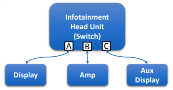
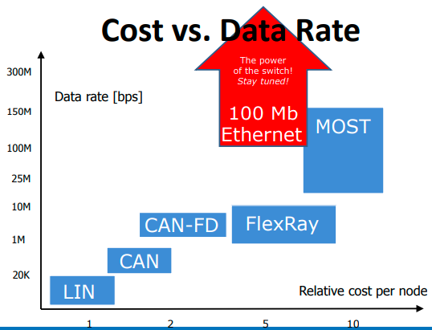
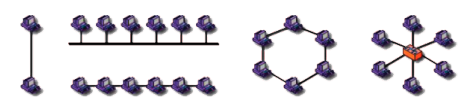
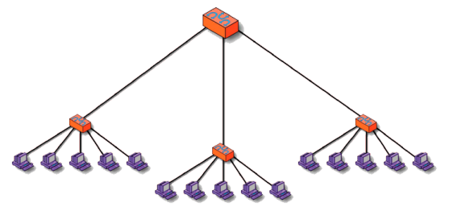

# The Definitive Guide

## Automotive Etherneet (100BASE-T1/1000BASE-T1)

Automotive ethernet or normal ethnert is not a bus technology, it's findamentally different than a bus technology.

Ethernet in all modern forms currently available is essentially just a point-to-point network. If you want multiple nodes more than two to communicate to each other. We have to introduce what's call **switch** into the equation and the **switch** enables multiple ECU's to each other, and a switch routes traffic to differnet nodes with a network based on their physical address that's the primary use of a switch.

But in the current forms of automoative ehternet commercially available today, we call them **100BASET1** and **1000BASET1**. **100BASE** meaning 100M bits/s, **1000BASE** meaning 1000M bits/s or 1G bits/s.

- Pros

  - Up to 1000 Mb/s (each direction and each leg)
  - Widely used technology (much support)
  - Good clock synchronization technology available (based on IEEE 1588)
  - History of adapation to solve new problems

- Cons

  - Requires a switch
  - Not possible to add or remove nodes unless the switch has spare ports
  - Tools cannot just connect and sniff the bus

## Cost vs. Data Rate

When we say automotive Ethernet that base transmission rate let's say 100M bits/s or 1G bits/s, it does not mean that the aggregate amount of data on the network is limited to 100M or 1G bits, and that's another benefit of automotive Ethernet.

When we talk about CAN, flex ray, or any other bus technology, when you transmitting data on the bus, you're consuming the entire bandwidth of the bus. It's 100% bus load. In Ethernet, it doesn't work that way, and therefore when we say 100M bit Ethernet and from an aggregate standpoint that we can transmit more than 100M bits of data on a network.

## Networking Topologies

- Define how devices are connected together
- Determine network characteristics
- Simple topologies:
  - Point-to-point (or port)
  - Bus (chained or attached) - like BUS and LIN
  - Ring
  - Star
- Complex topologies combine these

**Fundamental Feature of Switch: Hierarchical Star Topology**

- Also "tree topology" or "star of stars"
- Multiple levels can be created

