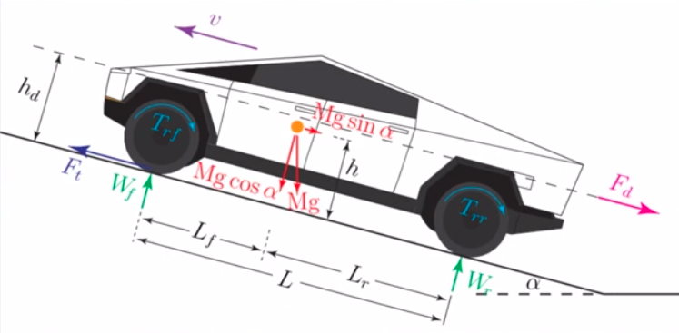

# Eletric Vehicle Modelling: Forces on Vehicles

## Overview

- Tractive forces

  - F$_{T}$: Tractive force

- Reistive forces (road load)
  - F$_{d}$: Aerodynmaic drag
  - F$_{r}$: Rolling resistance
  - F$_{g}$(F$\alpha$): grade resistance

## Aerodynmaic drag

The larger the cross-sectional area of vehicle that faces the wind because that's the main thing that causes areodynmaic drag. The smaller the cross-sectional area is the lower drag.

- Internal(10%)

  - Ventilation
    - AIC, heating, etc

- External(90%)

  - air flow around the vehicle
    - 90% -> normal resistance
    - 10% -> skin friction

- Approximate drag by external componnet. Mathematically:
   
  F$_{d}$ = (1/2)pA$_{f}$C$_{d}$(v-v$_{w}$)$^{2}$sgn(v-v$_{w}$) [N]

  - p: air density, 1.225(kg/m$^{3}$)
  - A$_{f}$: cross-section area of the vehicle [m$^{2}$]
    - For vehicles weighing 800 - 2000kg: A$_{f} \simeq$ 1.6 + 0.00056(M - 765)
    - M: vehicle mass in Kg
  - C$_{d}$: drag coefficient
  - v: vehicle speed
  - v$_{w}$: wind speed, in the direction of motion
  - sgn: sign function
    - sgn(x) = -1, x < 0
    - sgn(x) = 1, x > 0

- Atmospheric conditions effect on F$_{d}$:
  - Increase temperature by 40% -> decrease F$_{d}$ by 14%
  - Increase altitude by 1200m -> reduce F$_{d}$ by 17%
  - Standard Test Conditions (STC): 15$^{\circ}$C & 101.3kPa

## Rolling resistance

**F$_{r}$ = M$_{g}$cos$\alpha$(C$_{0}$ + C$_{1}$v$^{2}$)sgn(v)**

- C$_{r} \triangleq$ (C$_{0}$ + C$_{1}$v$^{2}$): rolling resistance coefficent

  - C$_{0}$: 0.004 $\leq$ C$_{0}$ $\leq$ 0.02
  - C$_{1}$: 1.6$\cdot$10$^{-6}$ $\leq$ C$_{1}$ $\leq$ 1.6$\cdot$10$^{-6}$ [s$^{2}$/m$^{2}$]

- cos$\alpha \simeq$ 1

**F$_{r}$ denponds on:**

- vehicle speed
- tire material & structure
- temperature
- tire air pressure
- road material & structure

## Grade resistance

- F$_{g}$ = M$_{g}$sin$\alpha$
- Grade, G $\triangleq$ tan$\alpha$
  - Increase in hight for every 100m travelled
  - G = 0.1
  - %G $\triangleq$ 100tan$\alpha$ = 100(h/x)

**Grade ability:** Max grade climbable at 0 accelearation

- ignoring F$_{r}$, F$_{d}$, dv/dt
- F$_{T}$ \simeq$ F${_g}$
- F$_{T}$ = Mgsin$\alpha$
- tan$\alpha$ = sin$\alpha$ / cos$\alpha$
  - sin$\alpha$ = tan$\alpha$cos$\alpha$ = G(1 - sin$^{2}/alpha$)$^{1/2}$
- F$_{T}$ = Mg$\cdot$G$\cdot$(1 - sin$^{2}/alpha$)$^{1/2}$ = G$\cdot$((Mg)$^{2}$ - (Mgsin$/alpha$)$^{2}$)$^{1/2}$

- G' = F$_{T}$ / ((Mg)$^{2}$ - (F$_{T}$)$_{2}$)$^{1/2}$

## Summay of road load

**Road load: aka road resistance or resistive forces**

F$_{R}$ = F$_{d}$ + F$_{T} \pm$ F$_{g}$

- +: uphill movement
- : downhill movement
