# O51 Process - Ensure the Electrical Electronic Product Process Feature convergence

## 1 Introduction

### 1.1 What is EE Architecture
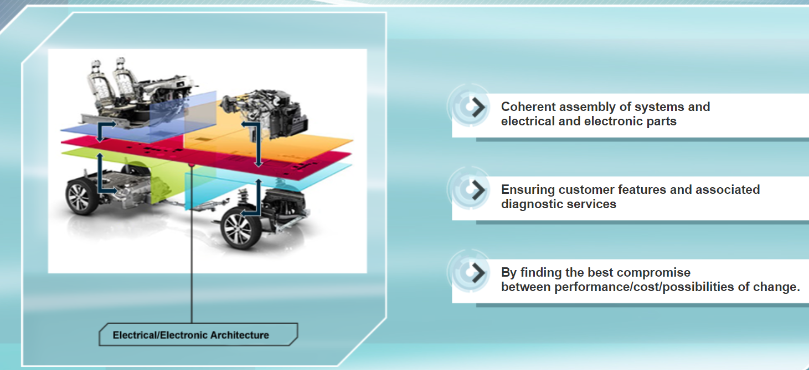

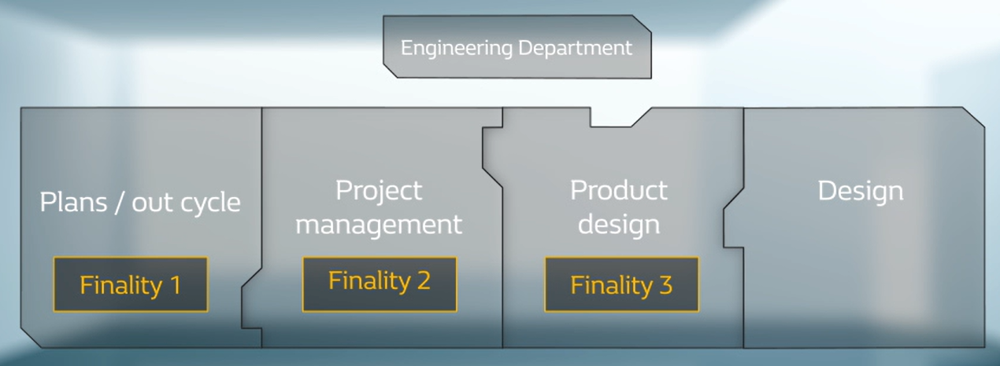

O51 Process, “Ensure the Electrical Electronic Product Process Feature convergence”, is part of the finality three of the quality management system of engineering, i.e.: “provide the plant with components to manufacture a car which is compliant, which can be sold and which can be repaired during After-Sales”.

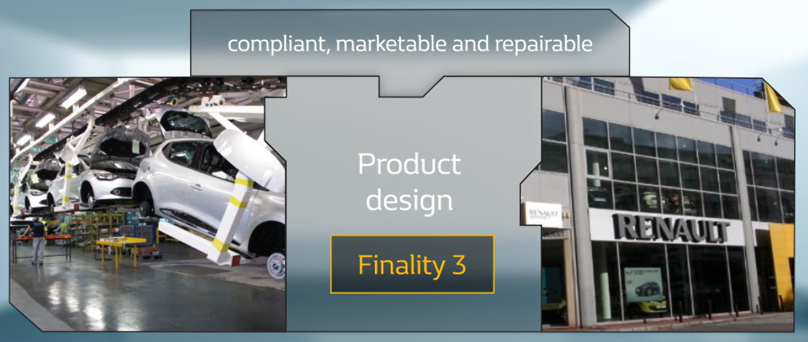

Federative O51 process, “Ensure the Electrical Electronic Product Process Feature convergence”, interacts with a number of other federative processes.

Among the most important, we can mention, among others:

- For powertrain, the process O32 “Design the powertrain calibrated control system”, for example, using which the interface contracts between engine development and vehicle development are contractualised.

- For the vehicle: The process O54 "Design and validate the vehicle parts in development and during life cycle", which provides, for example, the ECUs for the EIPF, and O55 “Ensure the convergence of Product Process service convergence for diagnosis” which will define the diagnostic bases, in particular.

- Then the processes common to powertrain and vehicle: O52 “Design and validate the embedded software” with which we ensure the convergence of software development, and O53 “Design and validate systems”, which for example delivers the system design document.

### 1.2 Basic Concepts

- **O51 Process in V3P logic**

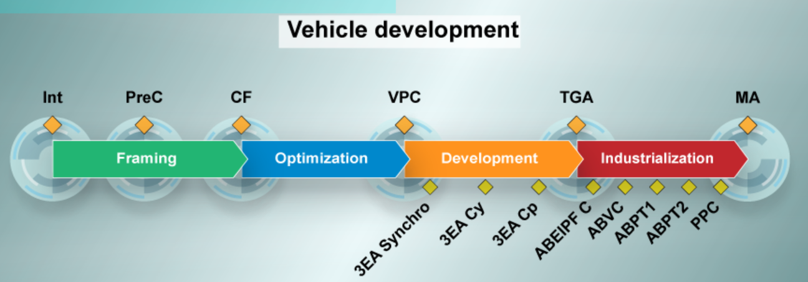

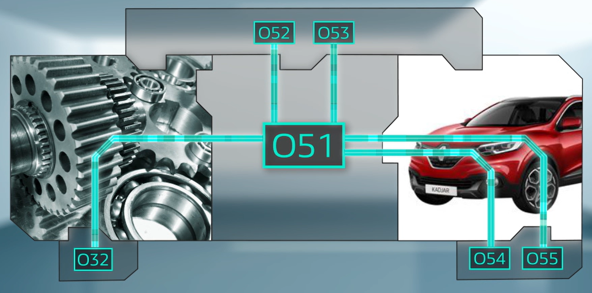

- **Positioning in V Model**

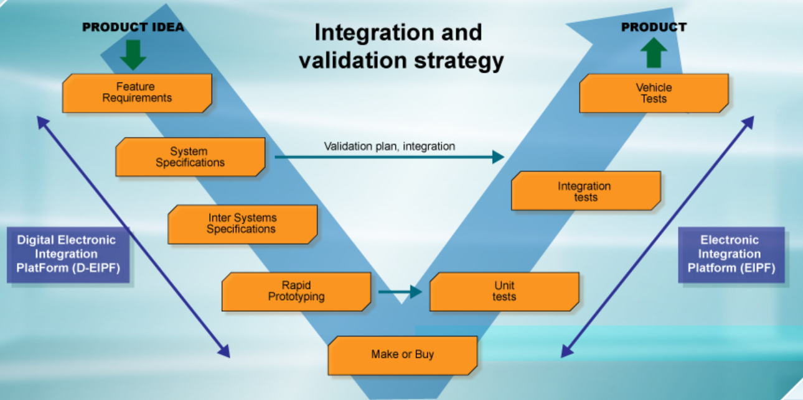

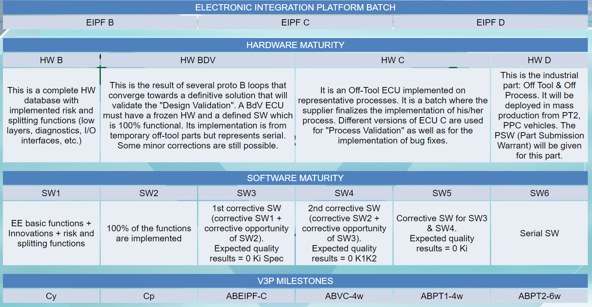

- **Eletronic Integration Platform**

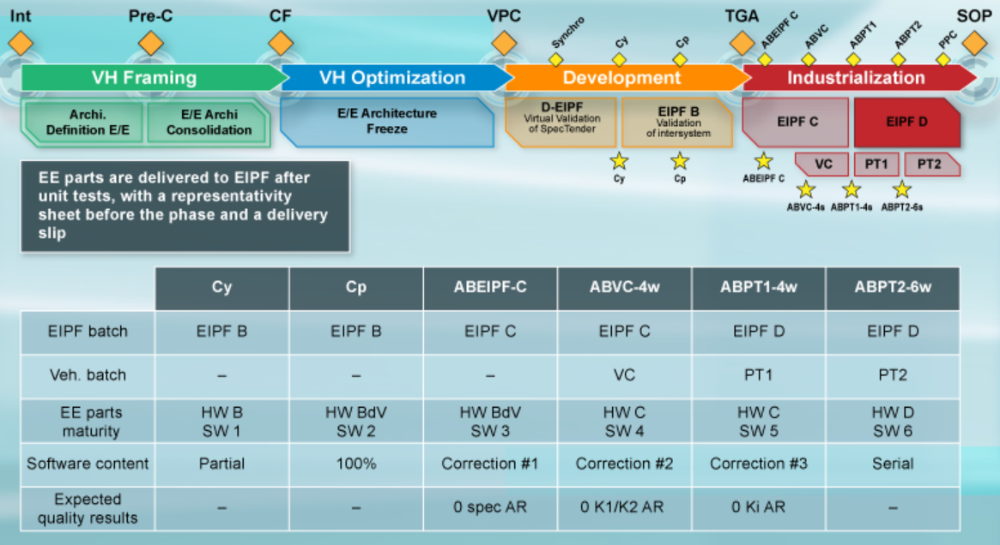

- **Major Deliverables**
    - **EFGL: Eletrconic Feature Generic List**
        - This list is created from Product Definition (technical description of the vehicle according to the countries and options, range levels/countries, climb rate, projected volumes, etc.).
        - Each line is allocated to a pilot, who is in charge of creating the EE archi form.
        - These forms are validated and used by the EE architect of the vehicle for the EE verification of the vehicle.
        - The forms are distributed across the various system meshes.
        - E/Electronic Features Engineering Leader (EFGL Leader) is responsible for this activity.

    - **FA: Architecture Form**
        - In the FA of each feature we find:Network and wire-based Inter System Requests, network messages, ECUs, sensors, actuators, power supply levels of the EE parts, as well as the description of the EE feature. The FA is an inter system electronic synthesis of EE feature.

    - **ISR: Inter System Request**
        - An ISR corresponding to one single inter system requirements.
        - An ISR is an inter-system exchanges requirements  wire-based or multi-network (CAN, LIN, Eth, etc).

    - **Embedded Network Message Set**
        - Message Set defines the exchanges over the Embedded Networks that connect the ECUs.
        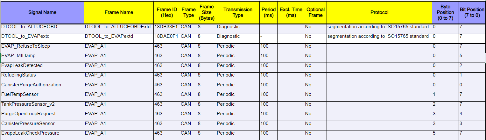

    - **Archi synoptic: Architecture Synoptic - Architecture Summary Diagram**
        - The architecture synoptic is the representation of the EE architecture of a project.
        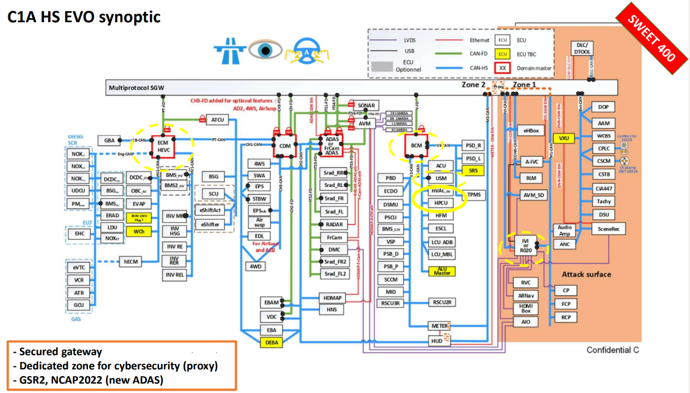

    - **Topology: Network Topology**
        - The definition of the main network branch
        - The position of the termination impedances
        - The length of the secondary branches
        - The position of the connectors
        - The position of the splices
        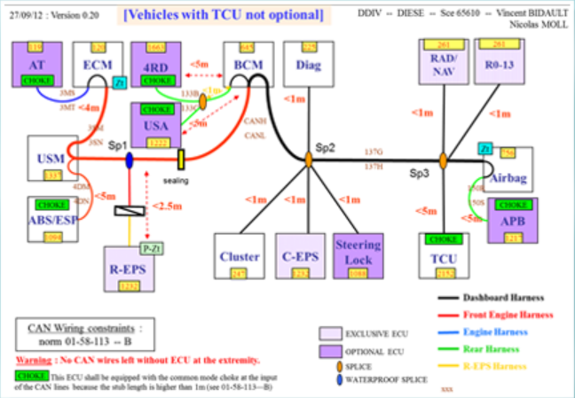

    - **SFA: Applicative Functional Diagram, Le Schéma Fonctionnel Applicatif d'architecture**
        - "Function or systems" SFAs that describe the electrical connections between the different EE components of a function. These SFAs are of responsibility by System Electrical Electronic Architect (AEES).
        - "Architecture or vehicle" SFAs created from "function" SFAs and enriched with connection codes of the electrical power supplies of the electric ground and CAN or LIN network. These SFAs are created by the electrical diagram designer.
        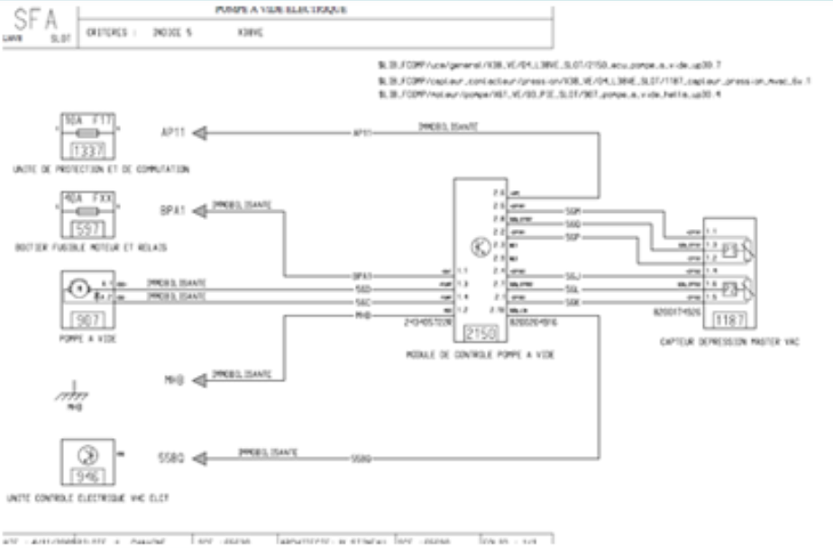

    - **SDE: Electric Distribution Diagram, Système de Distribution Electrique**
        - fuses to protect the harness
        - relays for switching loads or actuators
        - the wires for connecting the EE part to the vehicle's 14V on-board network
        - the physical installation of fuse boxes and relays
        - the availability of features
        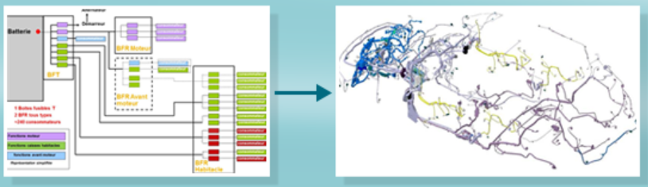

    - **SDM: Ground Distribution Diagram, Système de Distribution des Masses (SDM)**
        - specifies how the ground of each electrical device is connected: by means of a dedicated wire on the battery or on the body by means of a ground point. The body is itself connected to the ground battery.
        - physically describes where the ground points in the vehicle are located. A ground point is an electrical connection of a wire on the vehicle body.
        - indicates the grouping of ground points for several devices. There is one ground point per devices.

### 1.3 Quiz

- **EIPF is a federative tool for EE development**
TRUE - The EIPF ensures the timing of the O51 process and represents a federative tool to pull the global convergence of the Electrical/Electronic parts

- **The SW can be delivered as and when on EIPF, each with its development constraints (eg schedule set by the supplier)**
FALSE - All SWs must be delivered synchronously. It is a major constraint to arrive at a coherent engming/to develop different electronic integration loops in a coherent manner. Note: all SW must be sent to the EIPF before getting deployed at the plant.

- **Features integrated into the SW can happen throughout the vehicle development**
FALSE - All features must be integrated for SW2 (Cy milestone). It is a major constraint to achieve to develop different electronic integration loops in a consistent manner. The SW coming in after SW2 are only corrective SW.

- **EFGL is the list of electronic ECUs of the vehicle**
FALSE- EFGL is the Electronic Feature Generic List. It describes all the Electrical/Electronic features for a given vehicle.

- **The architecture synoptic describes the communication networks used**
TRUE - The architecture synoptic is the representation of the EE architecture of a project with the various communication networks present in the vehicle, as well as all the electronic ECUs connected to these networks

- **For ABVC there must be no K1 and K2**
TRUE - This objective is necessary to ensure the quality and representativity of VCs and to prepare future PT1 and PT2. Without this, the vehicles produced cannot be used as they should be.

## 2 Framing Phase

### 2.1 Steps & Main Actors

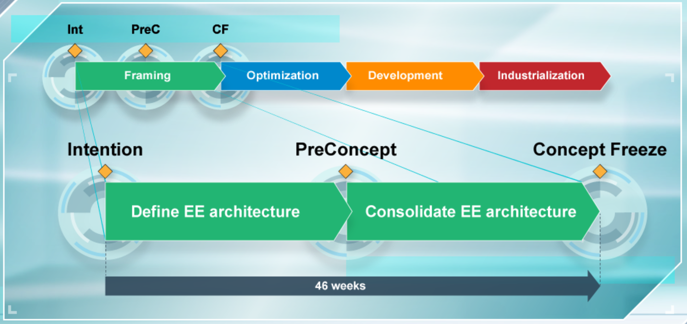

In this phase, the **EFGL Leader** creates the eletronic feature generic list (EFGL) framing the project. 

The **AEEA (Upstream Electrical Electronic Architect)** creates the architecture forms of the selected features.

The **Network and Communication Specialist** sizes the message set starting message set from the previous project and architecture form.

Finally, the **Electrical Diagram Designer** drafts the architecture SFAs based on the SFA Function provided by the AEES, and consolidates the SDE and SDA.

### 2.2 Input Data, Deliverables and Expectations

**Input Data:**
- product definition 
- potential USP "unique selling points"
- SDD(System Design Document) and the specifications
- Message set from previous projects and architecture forms
- FIE(Fiche d'Interface Electrique, Electrical Interface Sheet)
- Function SFA

**Deliverables:**

- **EFGL**
    - It is created from the product definition and the potential USP, submitted by the Product department.
    - Creation of this list makes it possible to identify the electronic feature Ki when the feature is not defined or badly defined, or if the feature has a strong QCDP impact on the EE architecture.
    - These Ki are developed in collaboration with the System Architects.
- **Architecture forms**. They are created from SDD and STR from the process O53.
    - These forms themselves constitute important input data from the **EE architecture file** for the Concept Freeze milestone.
- **Message Set**. They are sized by starting message set from the previous project and draft architecture forms.
    - This allows to integrate in the parts RFQ the dimensioning constraints on the hardware and software interfaces of ECU.
- The architecture **SFAs**, the **SDE** and the **SDM**. They are created from the FIE – that describe the electrical environment of the electronic components, and function SFAs is provided by the AEES.

In brief, at the end of the framing phase, the expected ones are:

- The EFGL is defined and all the innovations to be integrated must be decided.
- All feature are described in the electronic feature generic list and architecture forms.
- The functional and physical EE architecture is defined, i.e. we know the hardware elements such as electrical boxes, ECUs and connector.
- The architecture SFAs, the SDE and the SDM are drafted and completed.
- There is no more K1 feature: all essential feature for the project have a defined and achievable specification.

**Note:**
- K1 - Safety issue or blocking point
- K2 - Anomally very disturbing, lot of customer complaint
- K3 - Small anomally, client impact but not a big issue
- K4 - Without client impact

## 3 Optimization Phase

### 3.1 Steps & Main Actors

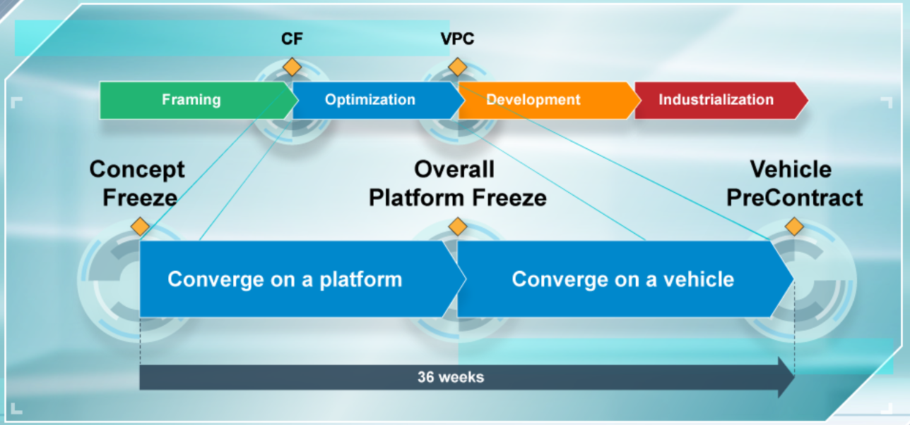

**AEEV**
- Updates the **FA** and gathers the EE architecture files.
    In this phase the **AEEV(Vehicle Electrical Electronic Architect)** updates the **FA(Architecture Forms)** and put together the **EE architecture file** for the VPC milestone.

**D-EIPF LI**
- Ensures the integration of ECU specifications
    D-EIPF Engineering Leader ensures the integration of coded ECU specifications in the form of digital models – Full Model. 
- Rolls out the inter systems verificiation plan
    In the D-EIPF simulator and rolls out an inter system verification plan of ECUs modeled and virtually connected to each other.
- Drafts the Anomaly Report (AR)
    He/she drafts the anomaly reports which describe the possible failures encountered during these simulations.

**Network and Communication Specialist**
- Creates the first message set and Embedded Network topology
    The Network and Communication Specialist creates the first message set and Embedded Network topology which specifies the connection method of ECUs connected to the Embedded Networks.

**Electrical Diagram Designer**
- Drafts the architecture SFA
    In this phase, the Electrical Diagram Designer drafts the architecture SFA that will serve as a reference for the physical implementation of electrical harness. Used for the first integration loop of the electronic integration platform, called EIPF B.

**Wattman - Electrical Consumption Synthesis System Engineering Leader**
- Deliver the systhesis of electrical consumption
- Gives his/her opions on the power distribution report
Wattman delivers the synthesis of the electrical consumptions of the parts and gives his/her opinion on the power supply report.

**Dependability Pilot**

- Creates first version of the compliance matrix
- Establishes the critical wiring connection table
Finally, the Dependability pilot creates the first version of the compliance matrix with inter system functional safety requirements and establishes the critical harness connections table.

### 3.2 Input Data, Deliverables and Expectations

**Input Data:**
- System Design Document and STRs
- Full Model ST1
- Architecture forms
- vehicle harness architecture
- FIE and function SFA
- Consumption commitment
- Safety concepts
- EE architecture file
- ECU reactivity table
    Reactivity tables are used to predict how an inter system failure is likely to spread through the ECUs of a vehicle and analyze what could be the combined effects of this failure.

**Deliverables:**
- **FA(Architecture Forms) and architecture files** 
    They are updated for the VPC milestone based on SDD, STRs and ISRs from process O53.
    The EE architecture file consists of all the technical documents that characterize the EE architecture, in particular:
    - the document justifying the selection of the EE architecture
    - the EE architecture synoptic
    - the details of the vehicle conditions
    - power supplies wake up and sleep strategies
    - architecture forms validated by the main pilots
    - etc...

- **The AR(anomaly reports) of step 1**
    - They describe the possible failures encountered during the simulations of ECUs applicative behaviours performed on the DEIPF(Digital Electronic Integration PlatForm).
    - They are issued after rolling out an inter system verification plan of ECUs modeled and virtually connected to each other, for the features with priority one – innovative, safe and regulatory features.

- **The first Embedded Network message set**
    - It constitutes of first level message set representing the definitive EE architecture.
    - At this point, the Embedded Network topology, which specifies the connection method of the ECUs connected to the network, is also achieved.
    - These deliverables are based on ISRs and architecture forms.

- **The architecture SFA**
    - The architecture SFA will serve as a reference for the physical implementation of electrical harness used for the first integration loop of the EIPF.
    - They are created from the SFAs called "function" elaborated by various System Electrical Electronic Architects (AEES).
- **Synthesis of electrical consumption of parts and opinion on the power report**
    - The Wattman (electrical consumption synthesis System Engineering Leader) of parts and opinion on the power report.
    - They are created based on the electrical consumption commitments from the process O54.

- **The first version of the compliance matrix of inter-systems functional safety requirements**
    It is drafted based on, among other things, Safety concepts, Electrical/Electronic architecture file and reactivity tables of ECUs.

In brief, following are the main expectations of the optimization phase:

- 100% of the EE features are specified and there is no more EE features K2.
- The requirements of all the features requested by the project are defined and achievable.
- All the features are described in the requirements. 
- They are all integrated into the EE architecture.
- The SDE and the SDM are specified and integrated into the EIPF B.
- The diagrams of the connections and the power supplies are available in the functional definition.
- And finally, the EE architecture is defined. It is no longer possible to modify the architecture without risk of quality/cost/time.

## 4 Development Phase

### 4.1 Steps & Main Actors

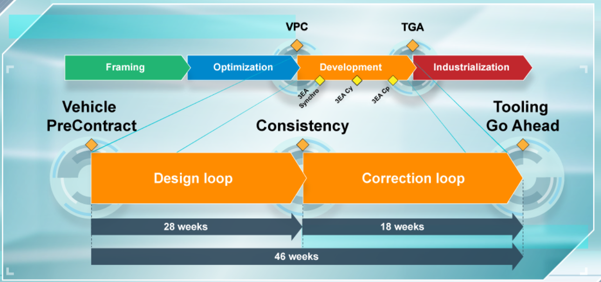

**D-EIPF Engineering Leader**
- Complete the inter system specification verifications
    He/she completes inter system specification verifications integrated into the models for priority 2 features, corresponding to 100% features.

**Electrical Diagram Designer**
- Updates the architecture SFAs, SDE and SDM
    He/she updates the architecture SFAs, the SDE (Electric Distribution Diagram) and the SDM (Ground Distribution Diagram) by taking into account all the diversity due to the options.

**EIPF Engineering Leader**
- Checks the integration of EE parts
    He/she checks the integration of Electrical/Electronic parts having, at this stage, partial representativity.

**Wattman - Electrical Consumption Synthesis System Engineering Leader**
- Updates the synthesis of electrical consumptions
    He/she updates the synthesis of the electrical consumption and gives his/her opinion.

**Dependability Pilot**
- Updates the compliance matrices
- Provides the validation results commited on EIPF
    He/she updates the compliance matrix and provides the validation results committed on EIPF.

### 4.2 Input Data, Deliverables and Expectations

**Input Data:**

- Full Model ST2
- FIE and function SFA
- Parts B with SW 1
- BdV parts with SW 2
- Consumption commitment
- Completed and defined reactivity tables
- E/E architecture file
- E/E integration plan

**Deliverables:**

- **ST2 checked on D-EIPF, AR ST2**
    - The models corresponding to priority 2 features which are integrated into the D-EIPF for validation.
    - They are subjected to – ST2 AR– anomaly report management which describes the possible failures encountered during simulations.
    - 100% of the specifications checked on D-EIPF are then sent to the suppliers to complete the coding of all software packages.

- **EE architecture verification, EIPF anomaly report**
    - The electronic control unit in HW B and SW1 definition, are provided by the electronic development pilots to be tested on the EIPF B.
    - Note that EIPF B is successively fitted with HW B in SW 1 and then HW BdV in SW 2.
    - The SW1 consists primarily of the basic functions 
        - wake up, sleep, reset, diagnosis, ...
        - innovations
        - the most complex functions.
        It comes from the first message set of the project and corresponds to the coding of the first batch of specifications verified on D-EIPF in the previous phase. 
    - The SW2 is the SW integrating 100% of the functions.

- **Archi SFA, SDE, SDM EIPF C**
    - The architecture SFAs, the SDE and the SDM are updated based from the FIEs and function SFAs.
    - They are used for QCDP assessment within the scope of wiring and for the implementation of electrical harness that will start the EIPF C.
    - Note that EIPF C is successively fitted with HW BdV in SW3 and HW C in SW4. These SW are the corrective SW of SW1 and SW2.

- **Synthesis and opinion on electrical consumption**
    - The synthesis of electrical consumption is updated based on the electrical consumption commitments from the O54 process.

- **Update of the compliance matrixes**
    - The update of the compliance matrixes and the Inter-Systems Functional Safety Validation Plan. Lastly, the latest deliverables consist of the first validation results on EIPF B.

In brief, following are the main expectations at the end of the development phase:

- Provision of electronic ECUs in BdV Hardware definition at the end of development phase 
- 100% of the features are integrated into the SW
- These SDE/SDM in serial definition will be applied on the EIPF C
- The EE architecture is defined and there is no more features Ki
- All the features requested by the project have an integration solution

## 5 Industrialization Phase

### 5.1 Steps & Main Actors

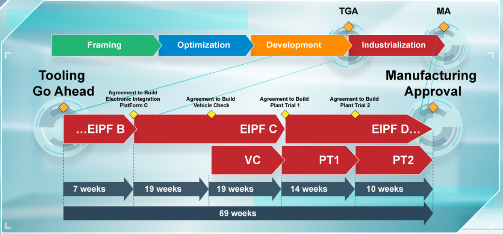

**EIPF Engineering Leader**
- Rolls out the test plan to complete the EIPF validations
    - These validations are performed with Electrical/Electronic parts representing the hardware and software as per the considered milestones.

**Vehicle Validation Engineering Leader**
-  Checks the EE architecture on prototype vehicles (VC, PT1 and PT2) from ABVC to Product Process Certification.

**Wattman - Electrical Consumption Synthesis System Engineering Leader**
-  Checks the compliance of the electrical consumption commitments

**Dependability Pilot**
- Checks the compliance with ISFS requirements by rolling out his/her validation plan on EIPF and on a vehicle

### 5.2 Input Data, Deliverables and Expectations

**Input Data**

- BdV
- C and D parts
- SW2, SW3, SW4, SW5 and SW6
- Prototype vehicles
- Consumption commitment
- Electrical/Electronic integration plan

**Deliverables**

- **The verification of the EE architecture in 3 EIPF loops and associated AR**
    - The end of the EIPF B – validations between the completion and ABEIPF C milestones
        - Which are carried out with parts representing the BdV hardware. 
        - They represent serial and are candidates for the validation design. 
        - These parts are programmed in SW 2, i.e with 100% of implemented EE features and 100% functional.

    - The following EIPF validation loop, called EIPF C intervenes between the ABEIPF C and ABPT1 milestones. 
        - It is performed with EE parts representing the BdV HW and then with parts representing the HW C. 
        - These parts represent serial and definitive off-tool parts. 
        - These are the candidate parts for the validation process.
        - These parts are programmed in SW 3 and 4 respectively, which are the first 2 corrective software.

    -  The last validation loop EIPF D begins 4 weeks before the milestone ABPT1 and continues post SOP.
        - The validated EE parts represent hardware C, then represents hardware D, which are the definitive off-tool parts and definitive process.
        - The software used are serial software integrating all the corrections made. 

- **The verification of EE architecture on vehicles**

- **The verification of electrical consumption commitments**

- **The verification of Inter-Systems Functional Safety requirements**

The main expectations of this phase, and therefore of the process O51, are as follows:

- The features, systems and parts are integrated into a robust EE architecture that complies with the quality/cost/time objectives of the project.

- Electrical/Electronic architecture is 100% tested and validated with 0 Ki.

- All anomaly reports are closed and 100% of the solutions are specified.

- And finally, the status of 3EA TOP SERIE is given, and the EE architecture file is delivered to the bodywork assembly plant.

### 5.3 3EA TOP SERIE

The development of the Electrical/Electronic product process features is completed. From the point of view of the EE architecture, ECUs – hard, soft, calibration, configuration – comply with the serial definition.

All identified problems have an accepted solution for SOP.

In the end, the conformity is reached or, in all cases, the customer is protected 100%.

## 6 Conclusion 

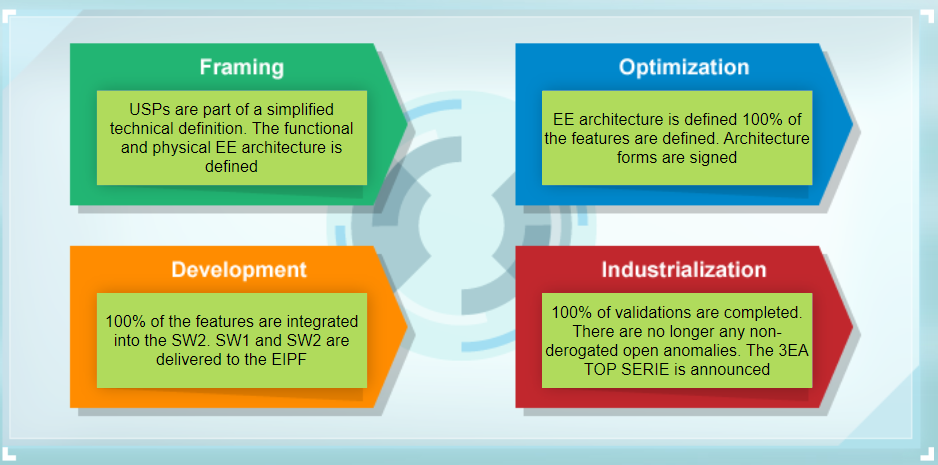

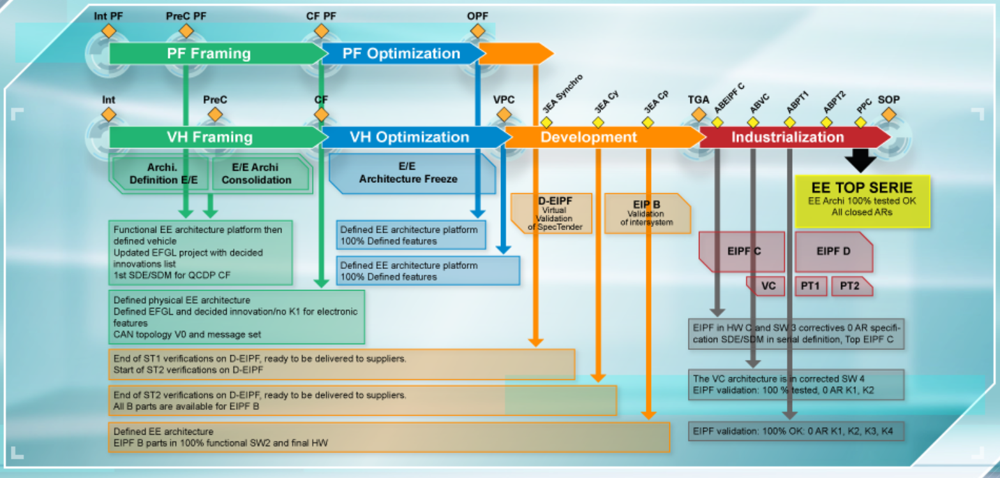

**To remember:**

- O51 Process interacts with the following processes:
    - O52 – Design and validate the embedded software
    - O53 – Design and validate systems
    - O54 – Design and validate vehicles parts in development and during life cycle
    - O55 – Ensure the convergence of product process service convergence for diagnosis
    - O32 – Design the powertrain calibrated control system

- O51 Process begins as soon as the Intention milestone to ensure a robust framing of the EE architecture.

- At the CF milestone, the list of features must be defined and the innovations must be decided (0 K1 related to the integration of electronic features). Any post-CF modification impacting the EE architecture must be accepted through the Change Request process.

- At the VPC milestone, the EE architecture is defined. It is no longer possible to modify the architecture without QCD risk.

- The EIPF ensures the timing of the O51 process and represents a federative tool to pull the convergence of the EE parts. It implies that these parts are delivered on time and with the right level of hardware and software representativity for each integration loop.

- No SW can be deployed at the plant without being tested first on EIPF.

- The Vehicle EE Architect is the operationnal leader of the O51 process in project phase.