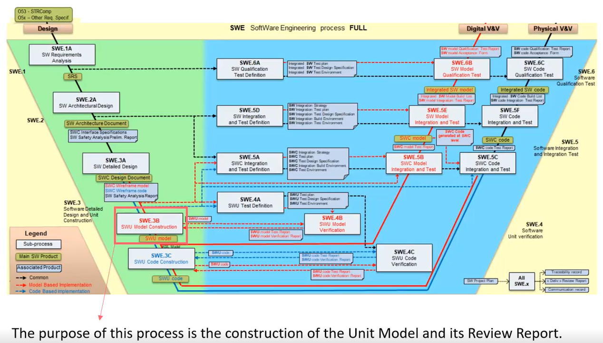
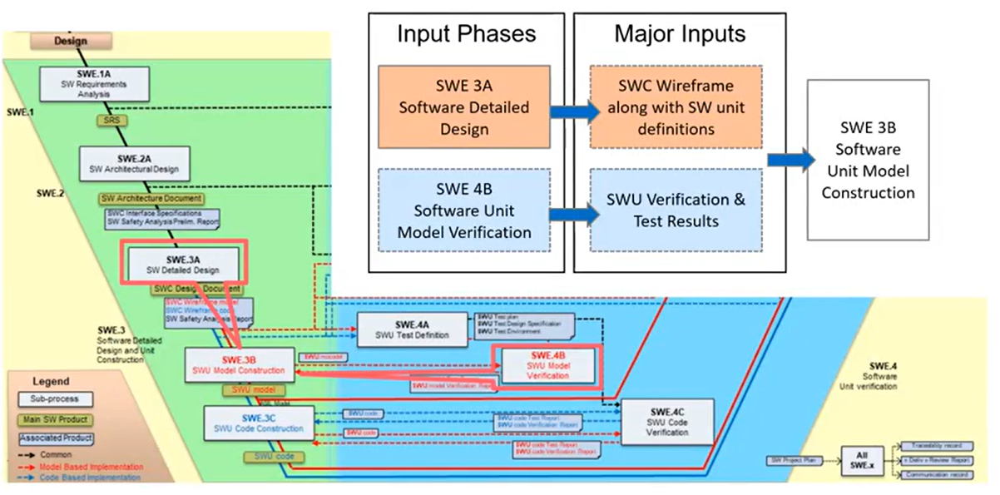
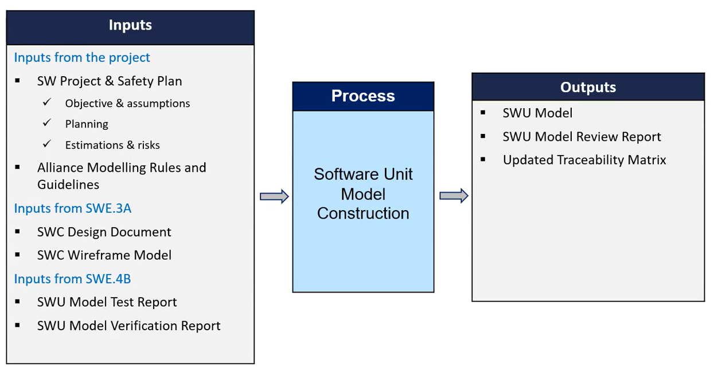

# ASWP - SW4 - Software Unit Model Constructionx

**Reference Documents of ASWP**
AWP-B-00xx F SUP.2 Review Report Template 
AWP-B-20115 F SWE.3B SWU Model Review Checklist 

## 1 Introdution to Software Unit Model Construction

### 1.1 Sofware Engineering Process 

### 1.2 Key Inputs to SW Unit Model Construction

=> The main product is the SWU model.

### 1.3 SW Unit Model COnstruction overview 1/2

THe process SWE.3B is divided in two activities, that contain tasks:

1. Design and Review
- SWU MOdelling
- SWU Review

2. Publish
- SWU Model Publish

## 2 Design and Review

## 3 Publish

## 4 Outputs

## 5 Summary and Outcome 