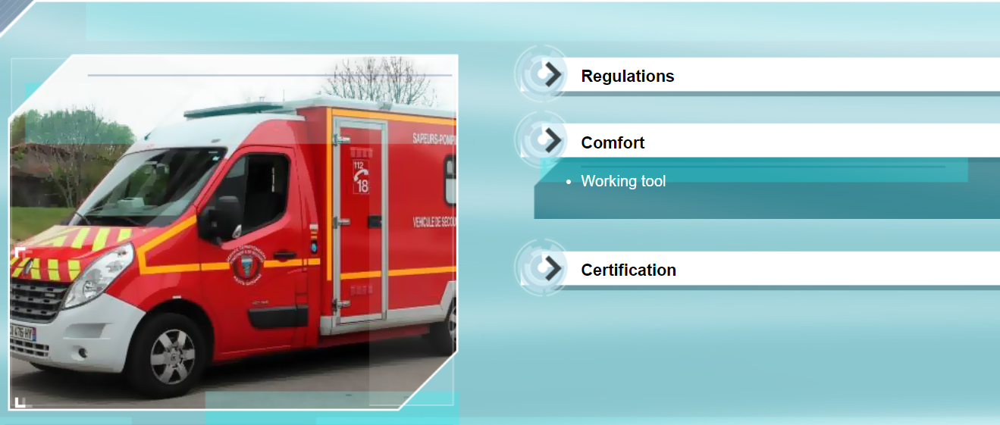
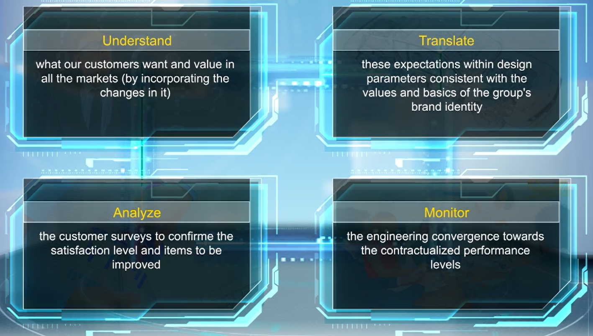
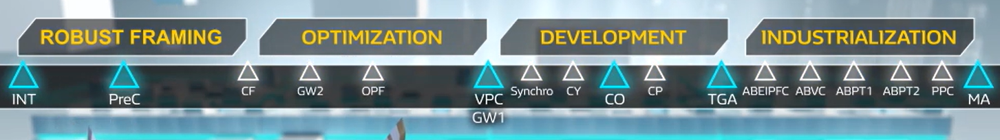
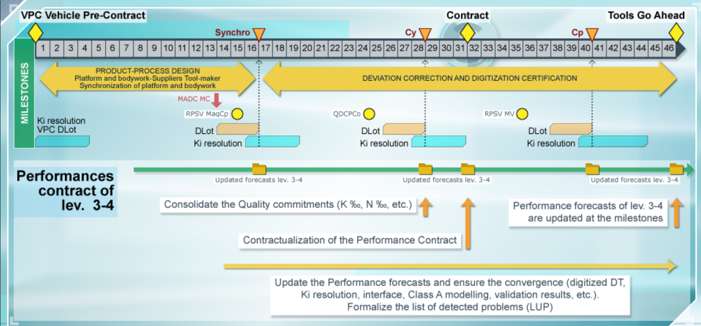

# Process O24: Customer performances: framing, optimization, development and industrialization

## 1 Performance

### 1.1 Basics

The definition of performance, a combination of:

- what a person expects from a car
- what the person feels while looking at or using a vehicle
- what the person says about it, good or bad

**Passenger car customer performances**

- **On-board conditions**
    - Air-conditioning
    - Acoustics
    - Ergonomics
    - Child safety and equipment
    - Storage areas
    - Modularity
    - Interior space
    - Multimedia and Connectivity
    - Ambient lighting
    - ...

- **Driving pleasure**
    - Behavior
    - Performance
    - Consumption/autonomy
    - Comfort
    - ...

- **Attract, convince, seduce**
    - External and internal perceived quality
    - Paint appearance
    - Styling
    - Equipment
    - ...

- **Safety**
    - Braking
    - Roadholding
    - Drive assistance
    - Shock resistance
    - Airbags
    - ...

- **Mobility**
    - Starting at -20°C
    - Thermal comfort
    - Driving aids
    - Lighting and signalling
    - Ground clearance
    - ...

- **Environmental compliance**
    - "Green" car
    - Bonus on the purchase
    - ...

- **Operating cost**
    - Kilometers and maintenance
    - Reliability and durability
    - Repairs
    - ...

**Light commercial vehicles customer performances**

Light commercial vehicle performances are specific. Their main mission is to meet the requirements and expectations of business customers which are different from those of the customers of passenger cars.

The business customers of light commercial vehicles can be classified into three categories which reflect their activity:

- delivery staff, to transport equipment, packages
- site personnel, to transport equipment, aggregates and people
- artisans, who also use their vehicle as an office

These specificities are not always easy to reconcile when developing a product.

### 1.2 Organization Distribution

**Customer Performance Department**

### 1.3 The 4 Major Aeras of Focus

To successfully complete its mission, the DEATP relies on **four major areas of focus**:
- understand 
- translate
- monitor 
- analyze

They **ensure that the customer expectations are taken into account** and applied during the framing and development of the vehicle projects.

This is done **in compliance with** 
- the basics of the group’s brand identity
- standardization recommendations by modules
- QCDP objectives.

These four major areas of focus are as follows:

- **Understanding** what our customers want and value in all the markets where Groupe Renault sells vehicles, especially through knowledge of the competition.

- **Translating** these performances into requirement levels which can be used by the design engineers of parts and systems.

- **Monitoring** the convergence of engineering to the contractualized performance levels.

- **Analyzing** the customer satisfaction survey results and management, with the Quality Department, and their improvement.

**Challenges**
- **Contribution to the appeal**
    - The achievement of these four areas of focus enables contribution to the appeal

- **Contribute to customer satisfaction**
    - Achievement of customers satisfaction level, which is compliant with our brand identity targets, their expectations, and Product Department targets.

- **Contribute to the OverAll Opinion**
    - They must contribute to the OverAll Opinion, in collaboration with the Quality Department.

### 1.4 Performance Contract

- **Performance contract between INT and CF**
 
From the Intention milestone to the concept-freeze or CF milestone, it is the support used to manage the definition of performance targets and formalize the potential for achievement of these targets by the different vehicle concepts.

- **Performance contract between CF and VPC**
 
From the concept-freeze to the pre-contract vehicle, or VPC, it is the support used to manage the convergence of performances, with regard to the technical definition.

- **Performance contract at the VPC milestone**
 
The pre-contract vehicle milestone formalizes the performance contract. It corresponds to the pre-commitment of all the project participants on the car which will be developed later and the level of performances to be achieved.

It's signed by:
- Program Director
- Product Director
- Chief Engineer
- Director of Customer Performances Engineering

- **Performance contract between VPC and MA**

For each milestone and from the latest update of the DTVH, the forecast of each performance sector are incorporated into the performance contract.

## 2 Specificties of Processes

### 2.1 Mapping

The main interactions are carried out with the following processes:

- For the powertrain, with process **O14**, Manage the powertrain or GMP performances convergence

- For the vehicle, there are four processes: 
    - **O20**, Frame the vehicle projects
    - **O26**, Arbitrate and manage the projects under development, including derivative versions
    - **O50**, Manage the Product/Process/Performance/Stying convergence geometry, and perceived quality of the vehicle
    - **O54**, Design and validate the vehicle parts under development and during life cycle

- The processes common to the powertrain and the vehicles:
    - **O34**, Develop and maintain the test facilities, perform the tests
    - **O53**, Design and validate the systems
    - **O83**, Manage and provide the digital mock-ups and simulation models

### 2.2 V3P Logic

Process O24 covers the entire development schedule of new vehicles, from the Intention to the MA. How the scope of process O24 is included in the V3P development logic through the following phases:

- **Robust Framework: define the performance target**
    - For the robust framework, the main input data are:
        - product intention
        - customer surveys
        - CAC, analysis of the competition
        - métier data
        - project QCDP objectives

    - Based on this data, the first phase – robust framework – can start. It involves defining the performance targets through the following activities:
        - setting the performance targets
        - formalizing the specifications
        - defining the validation plan

    - The expected results are as follows:
        - performance contract, levels two, three and four, framed
        - validation plan defined
        - CDCPF, levels five and six circulated
            - CDCPF: Cahier Des Charges Prestations Functionneles, Functional Services Specifications

- **Optimization: Optimize the DT to meet the target performance**
    - The second phase is used to optimize the technical definition, to achieve the performance targets, in the QCDP package, through the following activities:
        - confirm that the platform is adapted
        - refine the requirements
        - define the prototype needs
        - identify the list of kits
    - The expected results are as follows:
        - performance contract, levels two, three and four, signed
        - formalized validation plan, REVS
        - functional performances specification, levels five and six frozen, RFQ function by lot

- **Development and industrialization: Access and monitor the performance convergence**
    - The third and fourth phases – development and industrialization – enable assessment and monitoring of the convergence of performances through the following activities:
        - analyze the results of the defined validation plan
        - assess the compliance of the specification, levels five and six, and on the performance contract level three
        - define and apply the kits, all versions, few versions or optional
        - ormalizes the milestone performances forecasts
    - The expected results are as follows:
        - For the Contract and TGA milestones: 
            - performances forecast 
            - validation plan applied
            - specified kits
        - Then for the milestones between TGA and MA:
            - performances forecast and validation plan applied
            - Then, at the MA milestone: performances status and improvement of customer satisfaction

## 3 Design V

## 4 Participants

### 4.1 PPC：Customer Performance Pilot

He/she represents his/her performance métier within the project and carries out the following important missions:

- For application of the design V: 
    - defines the performance targets
    - deploys the functional and technical performance specifications
    - validates the fulfillment of the functional performance specification
    - analyzes the customer feedback
- To apply the process within the project framework:
    - describes the logic of the study and validation of his/her performance applied on the project
    - monitors the field performance reviews to achieve the performance objectives
- For reporting:
    - presents the forecast, or status, of his/her performance at the milestones
    - fulfills the performance contract

### 4.2 SMP: Performance Métier Specialist

To enable the Customer Performance Pilot to provide information on the project, he/she relies on his/her métier, mainly on the Performance Métier Specialist.

- The main missions of the Performance Métier Specialist are as follows:
    - For the application of design V: 
        - improves the métier on his/her performance (technical, digital tool, database)
        - defines the cross-functional policy for his/her performance
        - analyzes the competition
        - innovates

    - Project support:
        - defines the generic validation plan
        - provides métier support to the Customer Performance Pilot
        - builds knowledge

### 4.3 Marketability PPC: arketability Customer Performance Pilot

Among the Customer Performance Pilots, there is one pilot who has a role which is a little more specific. This is the Marketability Customer Performance Pilot because he/she represents the end customer.

He/she is charged with carrying out a full assessment of the vehicle and thus clearing all the critical points, by organizing them in a hierarchy if many performances are incompatible.

- His/her role stands out due to his/her missions which are as follows:
    - represents the customer’s opinion while setting the targets and during vehicle assessments
    - organizes and carries out the subjective assessment of vehicle marketability according to the standard rating grid, at levels three and four
    - develops Marketability forecasts and statuses on the usage performance
    - highlights the contradictions between the technical definition and performance contract and creates arbitrations, including inter-performances
    - manages the dynamic AVES convergence: 
        - plant quality standardization
        - dynamic AVES committee coordination, for action plans on the performances and forecast
    - assesses the customer effect of any change in technical definition

### 4.4 Upstream PSE: Performance Synthesis Engineer

The Performance Synthesis Engineer upstream up to the CF, then downstream, is the representative of the customer performances sectors for the project.

- The missions of the Upstream Performance Synthesis Engineer, are as follows:
    - monitors the upstream PPC and Marketability to set the targets
        -  in particular with the product, and to ensure their achievement via the performances forecasts
        - covers the entire scope of the customer performances on his/her project, from project kick-off until the concept freeze
        -  is the project representative for the performances
            -  In this capacity, he/she consolidates the deliverables, carries out the arbitrations required and provides the EQM
        - incorporates the input data related to the customer surveys, into the competitors’ vehicle assessments, knowledge of markets and trends
        - monitors the construction of the performances validation plan, by taking into account the project deadlines

### 4.5 PSE

As a logical continuation of the Upstream Performance Synthesis Engineer, the Performance Synthesis Engineer is the representative of the customer performances sectors for the project.

He/she monitors the PPC to ensure the convergence of performances in order to achieve the MA, contractualized targets, and relies on the Marketability PPC to arbitrate the inter-performance and get the customer’s opinion.

- provides a robust VPC by ensuring the consistency of the performance contract, CDCPF, product request, DT and QCDP
- ensures that the engineering process of the performances is implemented by the PPC
- manages the convergence of performances by keeping the performance contract up-to-date and developing and arbitrating the inter-performance contradictions, or QCDP, in IP5 - IP4P
- manages the construction of validation plans to deal with critical paths
- announces the performance opinion to cross the milestones, from PPC feedback, marketability and reliability opinions, by updating the project indicators. One voice prestation.
- makes the commitment on satisfaction targets and N per thousand of the project and ensures its compliance

## 5 Frame Phase - Main Deliverables and Framing Performances

### 5.2.1 Overview

### 5.2.2 Right Sizing

### 5.2.3 Performane contract of levels 3-4

### 5.2.4 Main Factors of the Performance

### 5.2.5 Prototype Plan

### 5.2.6 ATCE: Adequancy to Customer Expectations

## 6 Optimization Phase - Main Deliverables and Optimization Performance

### 6.1 Overview

### 6.2 Performance Contract of Levels 3-4

### 6.3 Specifications of Levels 5-6 - PPC-GFE Matrix

### 6.4 Prototype Needs

### 6.5 REVS Validation Plan

### 6.6 Quiz

When is the Performance Contract of levels 3 and 4 signed? -> VPC

Under which sectors is the Performance Contract of levels 3 and 4 signed? -> Product / Performances / Program / Project

## 7 Development Phase

### 7.1 Ovewview

### 7.2 DLot Phase

### 7.3 Performance Contract of Levels 3-4

### 7.4 Specifications of Levels 5-6 - PPC-GFE Matrix

### 7.5 Prototype Needs

### 7.6 REVS Validation Plan

To ensure the progress of the validation plan, all digital and physical validations, which are to be carried out, must be defined and included in REVS for the following milestones: Synchro, Consistency, Contract, Completion and TGA.

For the Consistency milestone, and based on the validations that have been carried out, the deviations with regard to the targets must be identified and an action plan must be suggested.

### 7.7 Quiz

In the Performance Contract of levels 3-4, at which milestone should the Quality commitments be consolidated (K‰, N‰, etc.)? -> Cy – Consistency

## 8 Industrialization Phase

### 8.1 Overview

### 8.2 Performance Contract of Levels 3-4

Throughout the industrialization phase, the customer satisfaction forecast must be updated at the following milestones: ABVC, ABPT1, ABPT2 and PPC-MA.

The validation forecasts for the ABVC, ABPT1 and ABPT2 milestones and validation status for the PPC-MA milestones must be updated in parallel.

### 8.3 Prototype Needs

The Prototype needs of the VC, PT and PP batches must be clarified between the TGA and DMJC milestones, around fifteen weeks before the ABVC milestone.

For the record, although the validation tests, physical and calculation, are carried out by
DEATV/DEATD, the final validation of the performance met is carried out by the DEATP through analysis of the result.

### 8.4 Validation Plan

After confirming the implementation of the validation plan, and following the implementation of the planned validations throughout the industrialization phase, it will be updated to include the test results.

### 8.5 Quiz

What are the 4 major areas of focus of Performance engineering? 
- **Understand** the customer
- **Translate** these expectations within design parameters
- **Monitor** the convergence towards the right level of performances
- **Analyze** the survey feedbacks

### 8.6 Major Aeras of Focus

The following are the 4 major areas of focus of performance engineering:

- Understanding the customers, especially, based upon right sizing, customer surveys of previous VH and the analysis of competition

- Translating these expectations to the level of performances which can be used by the parts and system design engineers, by developing specifications of levels 5 and 6

- Monitoring the engineering convergence towards performance levels, contractualized through the performance Contract which will change throughout the project

- Analyzing customer satisfaction survey results and managing their improvement with the Quality Department

The expectation of these 4 major areas of focus contributes to the attractiveness and satisfaction of our customers in order to have the best OverAll Opinion.