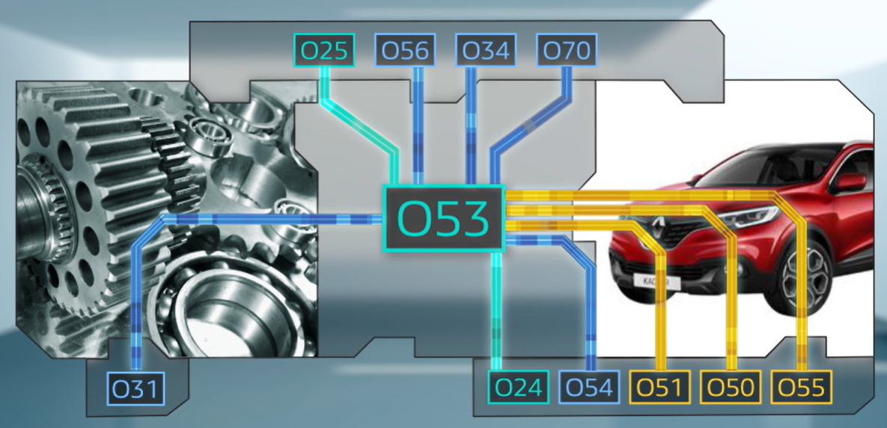
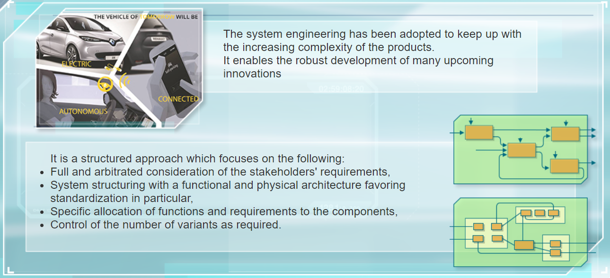
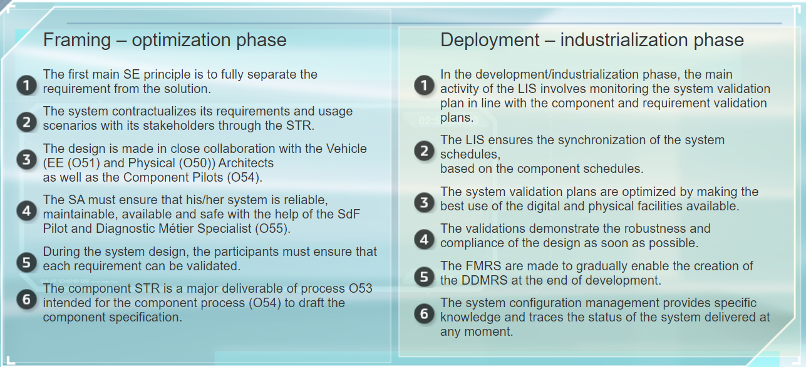

 # Process O53 - Design and validate the systems

## 1 General Points

### 1.1 SYSTEM AND SYSTEM ENGINEERING

#### 1.1.1 Definitions

**SYSTEM:** Elements in interaction organized to achieve one or more defined objectives.

The word system is used extensively and covers many sectors. In the automotive sector, and according to ISO standard 15288,
a system is a group of elements in interaction, organized to achieve one or more set objectives.

**System engineering:** Methodological, cooperative
and general interdisciplinary approach.

It encompasses all the activities related to design, develops and checks a system by providing an economical and effective solution to the requirements of a customer. It must simultaneously satisfy all the stakeholders.

#### 1.1.2 Some Examples

Here are some examples of the Renault Nissan Alliance systems:

- lighting system
- multimedia system
- four-wheel steering system
- convertible system
- access control system

#### 1.1.3 Alliance Systems

The Renault Nissan Alliance kept 43 systems, which are allocated by affinity to the three main Alliance Engineering Departments:

- System Engineering and Electrical Electronic Department
- Vehicle Component Engineering and Platform Department
- Powertrain Engineering Department

#### 1.1.4 Challenges of System Engineering

- **Complexity**

The number of functions, especially electrical-electronic,
on board our vehicles continues to increase. The customer requests more customization. It is bound to continue.

- **electrification of engines**

- **development of autonomous vehicles or connectivity**

Our activities are included in an Alliance and/or partnership framework, with standardization strategies of components or common elements. This requires the integration of the constraints of various customers.

- The relationship with suppliers.
- The relationship between maximum diversity and standardization is not simple.

#### 1.1.5 System Engineering Worldwide

System engineering first made its appearance in the 60s in the defence and space sectors. The first works began in 2000. The year 2006 marks the start of the system engineering deployment in Renault.

Today, the major industrial sectors, such as the aeronautic, rail and automotive sectors have also implemented system engineering which includes as many car manufacturers as it does equipment manufacturers have also implemented system engineering which includes as many car manufacturers as it does equipment manufacturers.

### 1.2 Mapping of Process O53 

#### 1.2.1 Finalities of O53

These system must clearly meet the requirements exposed by the stakeholders:

- Project
- customer requirement 
- general product reliability
- plant
- after-sales
- qualit-cost-delivery

#### 1.2.2 The 5 key procedures

The process to design and validate the systems involves five cross-functional procedures, which describe how to transform the requirement of the customers into a technical solution that can be industrialized. These procedures are as follows:

- **Design the systems**
- **Control the system dependability**
- **Integrate and validate the system**
- **Manage the system project**
- **Manage the system configuration**

#### 1.2.3 Purpose and Interactions

Process O53 is part of purpose three of the Engineering Department's quality management
system. This means providing the plants with the elements to manufacture a car which is compliant, ready for sale and can be repaired in after-sales. 

Given its activities, process O53 is at the center of the development of the product. Therefore, it interfaces with a large number of processes. The following are the main processes:

- **Input data suppliers**
- **Process O24**: frame, deploy and validate customer requirements
- **Process O25**: anticipate and apply the new regulations,
ensure regulatory compliance to enable registration.
- **Customers of deliverables**
- **Process O54**: design and validate the vehicle parts under development
- **Process O31**: define and validate the powertrain units and parts
- **Process O56**: create the technical documentation and product specification
- **Process O51**: ensure product, process, electrical and electronic
requirement convergence

Less strongly related to O53:
- **Process O50**: manage the product, process, styling requirement, geometry and perceived quality convergence of the vehicle
- **Process O55**: ensure the product/process convergence, diagnostic service
- **Process O34**: develop and maintain the test facilities, perform the tests
- **Process O70**: manage the configurations and modifications of the products

#### 1.2.4 Positioning in the V Design Cycle

## 2 Framing/Optimization Phase

### 2.1 Main Activities

#### 2.1.1 Identification and Summary of the Requirement

#### 2.1.2 Solution Design

### 2.2 Main Participants and Their Contributions

- **SA: System Architect** -> He/she is responsible for the development of his/her system, its diversity and quality-cost-delivery compromise.

- **PFS: System Function Pilot** -> He/she is the "armed wing" of the SA in the design of the system for its functions.

- **AEES: System Electrical Electronic Architect** -> Under the responsibility of the SA, he/she ensures the integration of the system in the electrical electronic architecture of the vehicle.

- **Dependability Pilot** -> He/she secures the system operations, monitors the dependability process to identify and control the risks to the system.

- **PPC: Customer Requirements Pilot, Pilote Prestation Client** -> He/she provides the specification of his/her requirement to the systems, integrating the usage scenarios and requirements.

- **Component Pilot or Electronic Development Pilot** -> He/she is the STRComp customer, from which he/she creates his/her component or ECU specification.

- **Architect: Vehicle Architect** -> He/she ensures the physical integration of the system in the vehicle.

- **SMD: Diagnostic Métier Specialist** -> He/she develops the diagnostic facilities of the system for the plant and after-sales.

### 2.3 Input Data, Activities and Deliverables

The design of a new system hardly ever starts from a blank page. There is almost always a knowledge-building file from a previous development which will be used as the basis of the new development:

- generic system file
- various collections of requirements (exposed by stakeholders)
    - customer requirements, which represent the customer, as well as after-sales, dependability, plant, regulations, project and other systems.

For the framing-optimization phase, the main activities of the process are as follows:

- Converge the requirements of the stakeholders
- Design the functional and organic architecture
- Secure the design (freeze)
- Allocate the requirements to the components, contributing systems and architecture (V3P)
- Analyse the consultation feedback of the system components
- Define the validation strategy and specify the validation plan
- Take into account the project-specific constraints such as costs

The main deliverables of this phase are:

- **STR** 
    - System Technical Requirements
    - It is the summary of the requirements which the system, a real contract with its stakeholders, must meet.

- **SDD, or DAS**
    - System Design Documentation
    - It contains the functional and physical architecture of the system
    - And the requirements and system functions allocated to the components

- **STRComp**
    - They contain the functions and requirements allocated to each component.
    - It is the input data which enables the Component Pilot
to draft his/her specification.

- **VPD: System Validation Plan**
    - Which defines the validation actions required to validate the system requirements.

### 2.4 Quiz

## 3 Development/Industrialization Phase

### 3.1 Main Activities

#### 3.1.1 Objectives

- Complete the product and process design of the system

- Be committed to the performance expected from the system

- Demonstrate control of the system-related safety risks

- Manage the progress of the validation and present the results at the milestones

- Control the delivered system configurations

#### 3.1.2 Activities

- **Management of the system validation plan**

As the system validation results are returned to him/her,
the LIS completes the compliance matrix and manages the possible non-compliances.

- **Management of the configuration of a system under development**

- **Documentation and delivery of FMRS sheets**

    - **FMRS**:  Safety Risk Control Sheet, Les Fiches de Maîtrise du Risque Sécuritaire
    - **SDP**: General Reliability Product
    - **DDMRS**: Le Dossier de Démonstration de la Maîtrise du Risque Sécuritaire, The Security Risk Management Demonstration File

### 3.2 Main Participants and Their Contributions

- **LIS: System Engineering Leader** -> He/she develops the technical solutions of the system, under the functional responsibility of the SA.

- **PSV: Validation Synthesis Pilot** -> He/she manages and optimizes the validation on his/her scope in terms of cost and delivery.

- **PComp/PDE: Component Pilot or Electronic Development Pilot** -> He/she creates the specification for the consultation with the suppliers and monitors the development of his/her component or ECU.

- **PPC: Customer Requirements Pilot, Pilote Prestation Client** -> He/she deploys and validates his/her requirements in the development and industrialization phase.

- **PConf: Configuration Pilot** -> He/she manages and provides the configuration of his/her technical scope.

### 3.3 Input Data, Activities and Deliverables

**For this phase, the input data are the:**

- **STR and SDD** for definition of the system

- **project schedule** to identify the milestones

- **component schedules** to enable implementation of the system component synchronization schedule

- **list of test facilities available**

- **validation plan** to be implemented

For the development and industrialization phases, the main activities of the process are as follows:

- **Implement the system validation plan**
    - As the system validation results are returned to him/her,the LIS completes the compliance matrix and manages the possible non-compliances.

- **ensure that the documentand/or physical configuration of the system is well known and defined**
    - With the Configuration Management Pilot
    - It is also used to track any modification to the specification and its impacts on the system operation.

- **Create and monitor the system/component**
    - Or system MRS, synchronization schedule

- **Make the safety risk control sheets**
    - Or FMRS, as the project progresses, based on the results of the dependability study

They allow the general product liability department, or SGP, to create the Safety Case, or DDMRS, delivered at the MA milestone for each vehicle.

The deliverables are the:

- **System/component synchronization schedule** 
- **Tracking table of validations**
- **System configuration tables**
- **System risk control sheets**

### 3.4 Quiz

## 4 Conclusion

### 4.1 Key Points 

### 4.2 Important

