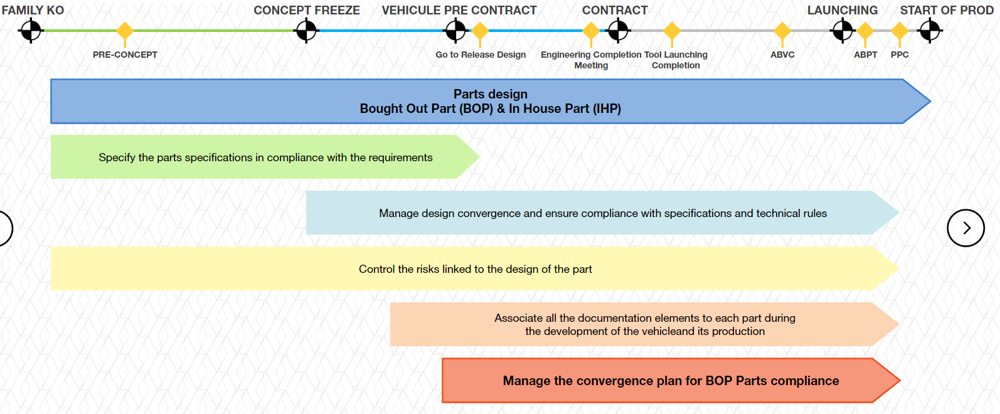
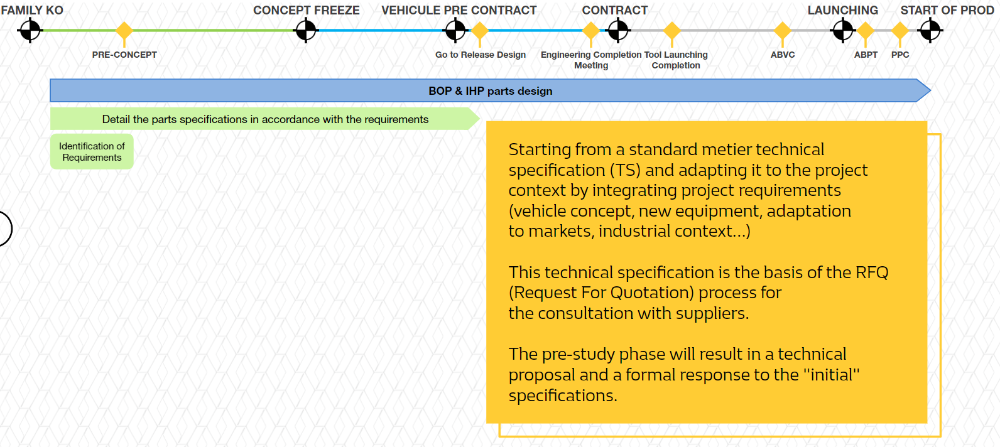
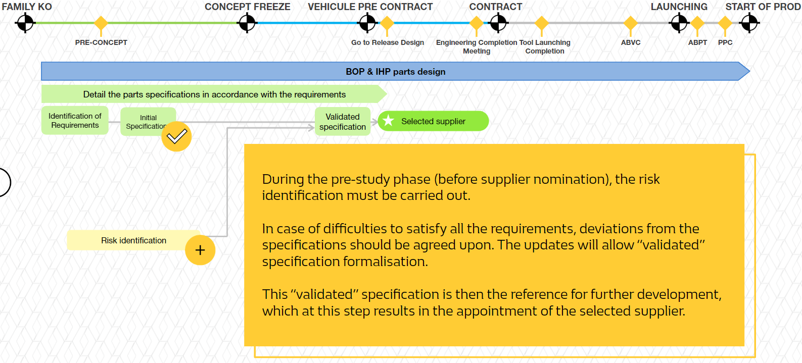
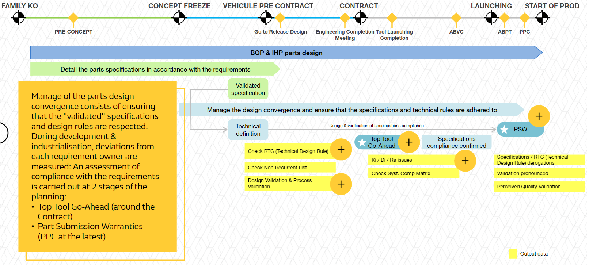
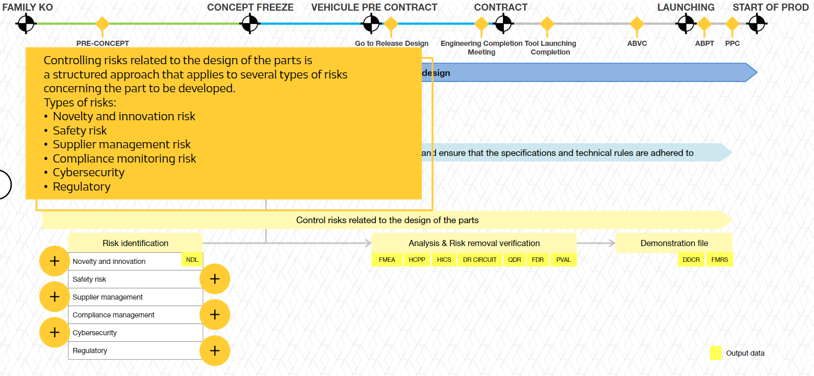
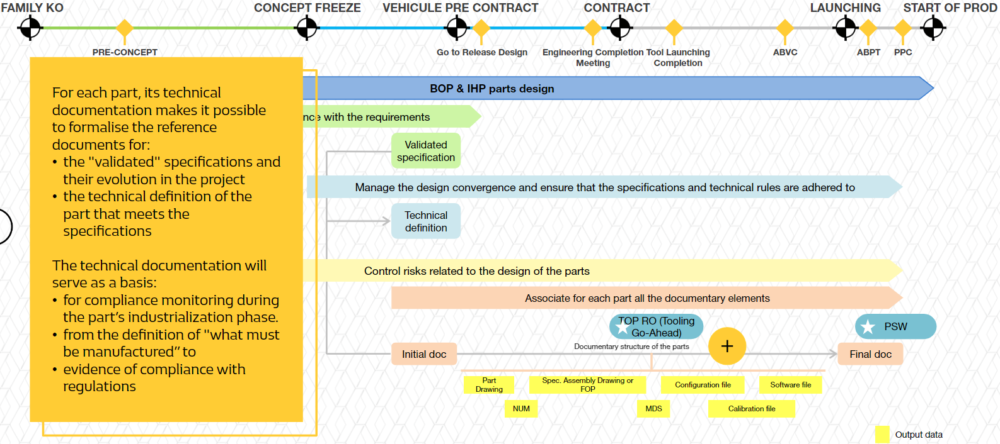
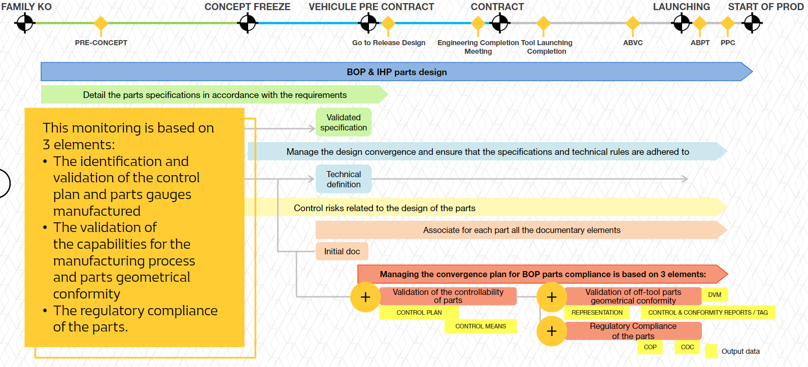
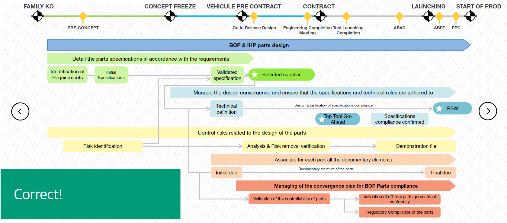

# O54 PROCESS ESSENTIALS

## 1 Introduction

### 1.1 Definition

The O54 process objective is to describe parts development, while respecting the application of design rules to a vehicle's different development scehedule milestones, except the Mechnical Engineering (engines, gearboxes and batteries).

### 1.2 What is a part?

**The concept of a part**
- A part is a physical component usually delivered to the **Body Assembly Plant (BAP)** which will assemble it
- It is listed in the **Vehicle's Bill Of Material**
- The part (within a Vehicle Engineering scope) can be purely mechanical or electrical and/or electronic (E/E)
- The part is designed with **product** and **process** requirements
    - **The product design engineer:**
        - is responsible for meeting the "customer's" needs
        - must respect the QCDP targets
        - must ensure consistency with industrial performance objectives
        - This part is fixed to the vehicle
            - To another part
            - By means of another part (e.g. screw)
            - By means of a welded or prressed bond, ...

    - **The process design engineer:**
        - is responsible for defining the manufacturing resources that meet the objectives of Quality, Compliance, Cost, Deadline, Volumes
        - **"BOP" Bought Out Part** means a part bought from suppliers not belonging to the RENUALT group
        - **"IHP" In House Part** of RENUALT factories

## 2 In Huose Part (IHP) / Bought Out Part (BOP) parts design

### 2.1 Detail the parts specifications in accordance with the requirements

**Base of Techinical Specification**
- System
- Service
- Physical Architecture
- Design
- Assembly Feasibility
- After-sales
- Diagnostic
- E/E Architecture
- Realiability/Durability
- Materials
- Regulation & Regulator COmpliance Monitoring
- Safety & Dependability
- Cybersecurity
- Tracebility

**Risk identification**
This apporach makes it possible to identify and then remove the design risks via several steps such as analysis and verification.
These risks can be related to novelty, innovation, safety, supplier managment, compliance, and Cybersecurity Regulatory. 

### 2.2 Manage the design convergence and ensure that the specifications and technical rules are adhered to

- **RTC (Technical Design Rule), NRL(Non Recurrent List)**
    - Gap to the **RTC** will have to be validated by formally accepted derogation, before the **TOP Tooling Go-Ahead**.
    - In addtion to the verification of the formal "RTC" rules, there is also the verification of compliance with the "NRL" rules, which are rules issued by the metier experts following relatively recent incidents that have not yet been capitalized on.

- **Electrical/Electroni Design Validation & Process Validation**
    - E/E components follow the hardare development timed by DV & PV.
    - Software convergence (O52-ASWP) is timed by **model validation (MIL)**, ECUs(HIL) as well as by **PIE(Platform for Electrical/Electroinc Integration)** deliveries.
    - The vehicle's E/E parts maturity evolution is traced during PIE validation and on prototypes.

- **Top Tool Go-Ahead**
    - At the end of the digital design and prototype validation phase of the part, i.e. at the tiem of the tooling launch: this is the **TOP Tool Go Ahead** which is schedulred around the **Contract milestome** and at the least at the **TLC(Tool Launching Completion)**.

- **Ki/Di/Ra**
    - Major issues throughout the project are tracked by **Ki**, by **Di**(Style and Perceived Quality) and by **Ra**(EE Anomaly Report).

- **PSW**
    - All parts are subject to a certificate of conformity, the **PSW(Part Submit Warrant)** agreement is planned at the end of the industrialisation phase.
    - The PSW is only pronounced when the Technical Specification requirements are confirmed. In case of non-convergence of the specification or RTC, deviations must be formalised.

### 2.3 Control risk related to the design of the parts

- **Novelty and innovation risk**
    - The **NDL**(**N**ew **D**rawing **L**ist) is used to establish the degree of novelty. For E/E parts, the NDL rating is analysed via the **Hardware Innovation Check Sheet** because the dimensions(MB size, computing power) take into account the innovations and services requested.
    - Risk removal plan progress is carried out by 3 tools or processes:
        - **AEDR(Advance Engineering Design Review)** on Upstream risk
        - **QDR(Quick Design Review)** = low NDL innovation ratings
        - **FDR(Full Design Review)** = high NDL innovation ratings

    The **QDR** & **FDR** are validated by expertise according to the defined process and/or component.

- **Safety risk**
    - Vehicle risk management is achieved by identifying the parts that contribute to **Potentially Undesirable Customer Safety Events (EICPS)**.
    - The validation of risk removal files for parts is done through the validation of **Safety Risk Control Sheets (FMRS)**.
    - This sheet provides a documented demonstration of EICPS control throughout the product life cycle.

- **Supplier management risk**
    - For the supplier's product, process and capacity risk levels, documentary proof of its activities is delivered via the ANPQP for inspection.
    - The BOP risk level in the development and the process risk level are identified through and ANPQP risk level determination grid (High, Medium, Low).

- **Compliance management risk**
    - The first step of characterization of the "process feasibility" risk will be carried out with the help of the **Product-Process Characteristics Classification**
    - This approach consists of crossing customer risk (customer severity class) with process risk (feasibility coefficient).
    - Each characteristic is classified as Critical, Major or Normal, necessary to initiate action.

- **Cybersecurity risk**
    - Applicable only to electrical/electronic, components risks are identified in the RFQ via a formal response from the supplier regarding the Cybersecurity standard.
    - This response is analysed by the Experts to address and reduce the threats and/or vulnerabilities.

- **Regulatory Risk(Regulatory Compliance Demonstration File)**
    - Regulatory compliance of the design must be demonstrated throughout the life cycle of the part.
    - Each metier documents a defined file. The evidence called by the DDCR(regulatory Compliance Demonstration File), including that of O54, comes from the metier operational processes.

### 2.4 Associate for each part all the document elements

- Each part has a document structure including drawing, 3D model, Material Data Sheets(MDS), mounting with assembly or welding drawings and Assembly Operation Sheets(FOP A).
- For SW and HW, the configuration folder, the programmable software file and the calibration file are added to its structure.
- The Tightening Operation and Priority Assembly Operation are specifified in The Supply Chain Management Software called **SIGNE**.
- The maturity of the document structure increases with each project milestone.
- The document has two key milestones: Tool Go-Ahead and PSW (for the completeness of the final document). This structure is specified in the company tools.

## 3 Manging Convergence Plan for BOP Parts Compliance

- **Validation of parts inspection**
    - Started at the beginning of the design process, the **HCPP(Prioritization of Product Process Characteristics)** approach allows for the identification and prioritization of the characteristics at risk for the Product - Process.
    - Each Product/Process characteristic will be in the Control Plan of the part associating to it all the control operations to be carried out to detect any variance generating non-compliances. It will be fixed before the PSW.
    - The validation and **designation of the inspection methods** are then necessary to demonstrate the ability of the process to control the Product and Process characteristics.

- **Validation of the process' ability to manufacture geometrically conform parts**
    - The representativeness of teh manufacturing process of the parts is monitored. The general expectation is to have 100% off-tool parts (from the final tooling) at ABVC and then OTOP(Off-Tool Off-Process) at ABPT.
    - Ability makes it possible to demonstrate, after manufacturing debugging, that the process is able for manufacturing at the target conformity level. The TAG(Graphical Aptitude Test) tool assists in the development and determination of process ability.

- **Regulatory Compliance of the BOP parts**
    - Some parts are subject to regulatory compliance
    - The supplier must deliver the documents relating to approval/certification on his own responsibility, which depends on hte marketing country.

## 4 Conclusion

**Key points to remember**
- The objective of the O54 Process is to describe the development of the parts, at the different milestones of vehicle development schedule, in compliance with agreed specifications and technical rules (out of scope: mechnical perimeter (engine, boxes, etc.))

- The design of BOP & IHP parts requires to:
    - specify the "validated" technical specifications allowing the designation of a supplier
    - manage the convergence of teh design ny ensuring compliance with the specifications, towards the Tool Go-Ahead and the PSW validations
    - manage the risk associated to the design of the parts, by identification, removal action plan and final demonstration files
    - associate and formalize the complete documentary structure for each part

- The management of the convergence plan for BOP Parts confirmity is based on 3 elements: validations of parts controllability, validation of off-tool parts geometrical conformity and validations of parts regulatory compliance.