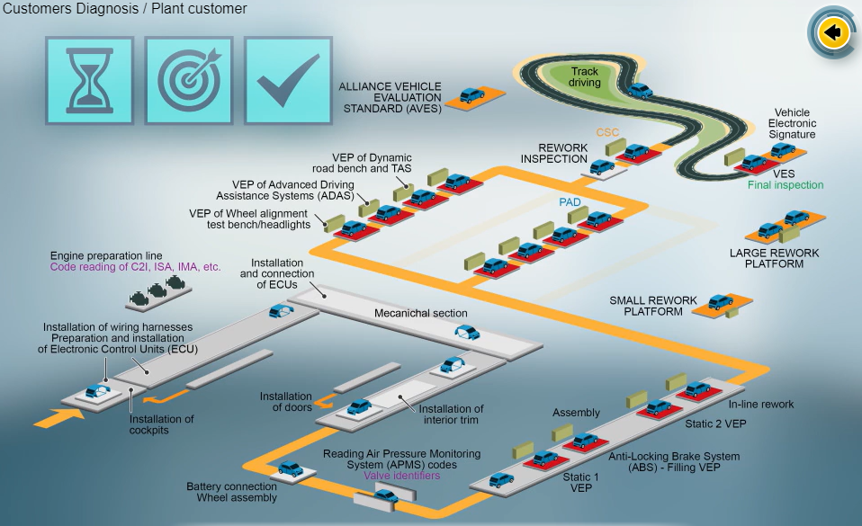
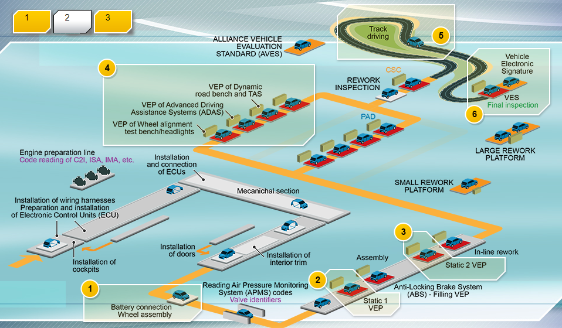
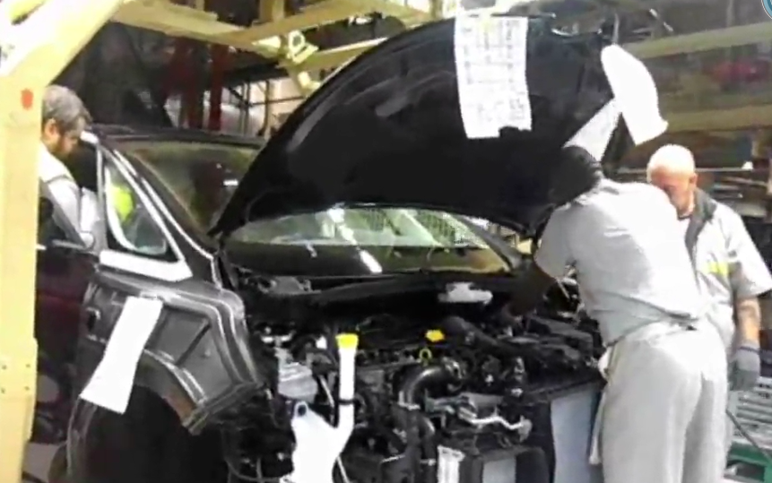

# O55- Ensure product/process/service convergence of the system diagnosis_V2

## 1 Introduction

### 1.1 Foreword

Diagnosis is a group of facilities and processes for the Engineering Department, plant and After-Sales. Its aim is to ensure that each mechatronic system works properly.

The Diagnosis uses the communication between the ECUs of the vehicle and the engineering Diagnosis tools of the plant and After-Sales
via a standardized protocol.

For each mechatronic system, in conclusion, the customers for the system Diagnosis are the plants and After-Sales.

### 1.2 Customer Diagnosis

#### 1.2.1 Plant Cusotmer

From the EE point-view, all "System Diagnosis" activities on the assembly line are known collectively as **VEP, Vehicle Electronic Process**.

At the plant, the VEP takes place throughout the assembly process between the battery connection and Vehicle Electronic Signature. This Vehicle Electronic Process ensures zero defect on 100% of the manufactured vehicles. The **transit time** in the VEP stations and the **quality** of the programs are the two priority objectives.

**The 6 steps of VEP**

- **Battery Connection**

Using the Diagnosis tools connected to the vehicle, we carry out key pairing.

Then, a series of actions is carried out such as checking the electrical and electronic compliance of the assembly and loading the calibrations and configurations of the ECUs.

The VEP ensures traceability of the Electrical/Electronic parts by checking the references of the ECUs in relation to the specifications in SIGNE.

## 2 Process O55

### 2.1 Introduction

### 2.2 Framing

### 2.3 Development

### 2.4 Industrialization

### 2.5 Virtual Parts

## 3 Summary and Conclusion