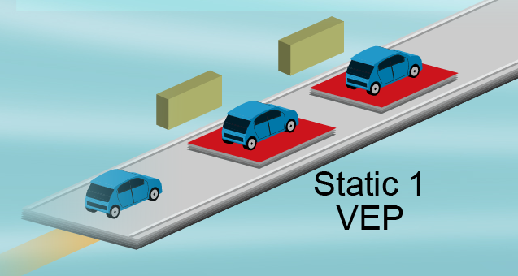

# O55 - Ensure product/process/service convergence of the system diagnosis_V2

## 1 Introduction

### 1.1 Foreword

Diagnosis is a group of facilities and processes for the Engineering Department, plant and After-Sales. Its aim is to ensure that each mechatronic system works properly.

The Diagnosis uses the communication between the ECUs of the vehicle and the engineering Diagnosis tools of the plant and After-Sales
via a standardized protocol.

For each mechatronic system, in conclusion, the customers for the system Diagnosis are the plants and After-Sales.

### 1.2 Customer Diagnosis

#### 1.2.1 Plant Cusotmer

From the EE point-view, all "System Diagnosis" activities on the assembly line are known collectively as **VEP, Vehicle Electronic Process**.

At the plant, the VEP takes place throughout the assembly process between the battery connection and Vehicle Electronic Signature. This Vehicle Electronic Process ensures zero defect on 100% of the manufactured vehicles. The **transit time** in the VEP stations and the **quality** of the programs are the two priority objectives.

**The 6 steps of VEP**

- **Battery Connection**

- **Static 1 VEP**

Using the Diagnosis tools connected to the vehicle, we carry out key pairing.

Then, a series of actions is carried out such as checking the electrical and electronic compliance of the assembly and loading the calibrations and configurations of the ECUs.

The VEP ensures traceability of the Electrical/Electronic parts by checking the references of the ECUs in relation to the specifications in SIGNE.

- **Static 2 VEP**

After having carried out the Filling step of the braking system and Anti-Locking Brake System (ABS) unit, we are now in the Static 2 VEP step.

In this step, we carry out inspection of the non-running motor vehicle, i.e.: failure reading and inspections of electrical connections in the plant using the dedicated tools of the VEP and operators' actions.

- **Dynmaic Calibrations**

Then, we move to the VEP step on the test benches during which several actions are carried out:
- Wheel alignment of the axles; Calibration of the steering wheel angle;
- Adjustment of headlights and Advanced Driving Assistance Systems (ADAS), camera and radar;
- Dynamic inspection of the vehicle on a chassis dynamometer, standard, compact and capacity-based solution;
- Compliance check of electrical and electronic parts, and failure reading.

- **Track Driving**

Then we reach the Track Driving step. All the vehicles are driven for a few hundred metres to ensure the overall good performance of the vehicle.

- **Vehicle Electronic Signature**

The final action of the Vehicle Electronic Process is to ensure the zero defect of each vehicle exiting the plant with the Vehicle Electronic Signature.

Once all these steps are crossed, the vehicle is ready to be sent to the dealership for delivery to the customer.

The Vehicle Electronic Process contributes to the plant performance by automating the inspections.

To do this, the self-diagnosis of the ECUs and operations with automatic reading of their operations are used to enable plant production rates up to 60 or 66 vehicles an hour.

Finally, the VEP also contributes to the plant performance by optimizing the time taken to put into service of vehicles. To do this, the engineering teams work upstream to optimize the configuration time (a few seconds) and calibration time (a few tens of seconds) as well as to define and integrate the DTC, Data Trouble Codes, for each ECU.

### 1.2.2 After-sale Customer

A customer comes following a malfunction, the After-Sales adviser initially targets the symptom using the customer effect.

Then the symptom is identified in the Renault databases. When the vehicle arrives to the after-sales workshop, the first action is to diagnose the defective mechatronic systems based on the analysis of symptoms and performance of guided methods.

The technician consults the Network Diagnosis Tool (CLIP) in order to use the guided diagnosis to determine the defective component(s).

The second action is to repair, inspect and re-enter the vehicle into service. This is done by replacing one or more physical or virtual parts,
such as reprogramming.

This is done by replacing one or more physical or virtual parts, such as reprogramming. 

Finally, the diagnostics contribute to the performance of the Renault Technical Expert (Co-Tech) in the workshop.

To do this, 80% of failures must be diagnosed in less than an hour and 95% in less than two hours before calling the Techline.

Process O55 is essential for each mechatronic system
to ensure customer satisfaction in both the plant and After-Sales.

## 2 Process O55

### 2.1 Introduction

Process O55 responds to the purpose 3
of the Engineering Department's Quality Management System. That is to provide the plants with the components to manufacture a compliant car, which can be sold and repaired in After-Sales.

The Purpose 3 of the synoptic is below. 
- Regarding mechanical division, there are two processes: O31 and O32.
- Regarding vehicle division, there are 4 processes: O50, O51, O54 and O55.
- Then there are the processes common to the mechanical and vehicle divisions: O53, O34, O56, O82, O83 and S08.

The O55 process interact with O32 Powertrain calibrated control system, O54 Design and validate vehicle parts in development and life cycle, O51 Ensure the Electrical Electronics Product Process Feature convergence, O53 Design and validate systems, and O56 Produce the technical documentation and the product specification (vehicle & Powertrain).

The expected result of process O55 is a consistent set
of on-board resources (parts and ECUs), and off-board resources (facilities and tools) providing the Diagnosis functions expected by the assembly plants and After-Sales network, this on all the mechatronic systems of the vehicle.

Let us see how the scope of process O55
falls within the V3P development logic through the following phases: "Framing", "Optimization", "Development" and "Industrialization".

We are going to describe them through their objectives and participants.

The upstream phase of the V3P logic is made up of two parts "Framing" and "Optimization".

### 2.2 Framing

**In this phase, here are the objectives:**

- Insert the diagnosis into the genes of the product, i.e. into the mechatronic systems, into the physical and electronic architecture and into the ECUs. 
- Insert the diagnosis of the mechatronic systems into the genes of the industrial system.

**The Diagnosis participants of this phase are: **

- Upstream CPAD: Upstream Diagnosis Application Project Manager
- SMD: Diagnosis Metier Specialist
- PDDS: System Diagnosis Definition Pilot

Their role is to integrate the Diagnosis requirements into the Technical Definitions of the systems and parts to launch the RFQs.

The other participant:

- The SA, Architect Systems, whose role is to determine the system malfunction and deploy the system Diagnosis requirements to the parts
- The AEES, Electrical Electronic System Architect, whose role is to define the system architecture.
- The Upstream PFI. His role is to take into account the plant constraints and Technical Definition for dimensioning the VEP facilities.

In the framing phase, the Diagnosis requirements and solutions are developed.

**The input data of this step are as follows:**

- list of requirements and innovations
- industrial sites
- Upstream guidelines project
- Diagnosis Requirement Specification
- Technical Definition of Electrical Electronic Architecture, systems and ECUs in draft version
- list of symptoms

**The output data of this step are as follows:**
- The D&D(Design & Development) framing for After-Sales and VEP
- Diagnosis Specification
- System Failure Tables (SFT) which contain system failures
- Diagnosis Operation Sheets (FOD) which specify the operations to be carried out on the ECU in the plant

At the end of this framing phase, the Diagnosis is framed for the plant and After-Sales in line with an Electrical Electronic Technical Definition, which is clearly identified and set, stemming from process O51. The Diagnosis requirements are available for the RFQs of parts.

### 2.3 Optimization

In this optimization phase, the objective is to get a commitment on the feasibility of the Diagnosis in response to the project and customer requirements at the Vehicle Pre-Contract (VPC) milestone.

Similarly to the Framing phase, we find the following Diagnosis participants:

- Upstream CPAD: Upstream Diagnosis Application Project Manager
- SMD: Diagnosis Metier Specialist
- PDDS: System Diagnosis Definition Pilot

whose role now is to get the feasibility of the on-board and off-board Diagnosis.

- The SA, Architect Systems, whose role is to determine the system malfunction and deploy the system Diagnosis requirements to the parts
- The AEES, Electrical Electronic System Architect, whose role is to define the system architecture.

Their role is to define the exhaustive list of system defects through the system Failure Modes and their Effects Analyses and to confirm the off-board diagnosis of systems following the RFQ feedback.

In this phase, there are new participants involved such as:

- EDPs, whose role is to confirm the on-board Diagnosis resources in the part following the RFQ feedback.
- PFE: Elementary Function Leader
- TDE: Engineering Documentation Technicican

Their role is to define the references and criteria applicable to the pysical and virtual parts.

Finally, the last Diagnosis participant of this phase: the Upstream PFI. The target is to estimate facility bench for VEP by confirming the compliance of the plant's stakeholders (plant's calibration and configuration time).

**Second optimization step: Converge on a vehicle.**

The input data of this new step are as follows:
- RFQ feedback of the Lot 2 parts
- Applied Functional Diagrams (SFA) of QCTW1(Quality Cost Time Weight 1)

The output data of this step are as follows:
- SFT and FOD for VPC
- Technical specification of the updated Diagnosis following the RFQ feedback
- The schedule of the Diagnosis deliverables: DUD, SOD, Diagnosis Data Tool (DDT) databases, Diagnosis Service Test (DST), Reprogramming Test Tool (RTT), CLIP deliverable
- Engineering Electrical Wiring Diagram and Configuration file, VEP section of the DIPV indus - pre-contract.
- The provisional list of connections not covered by the VEP Programs, opinion on installation of the Diagnosis socket and ampermetric clamp.

In conclusion : at the VPC milestone, the product process service definition of the Diagnosis is feasible and contractualized with all the stakeholders of the Systems Alliance Engineering Department (DEAS), Powertrain Alliance Engineering Department (DEAM) and customers.

### 2.4 Development

The aim of this Development phase is to make and validate the specification of the system Diagnosis.

In this phase, there are new participants involved such as:

- the CPAD: Diagnosis Application Project Manager
- the LI: Diagnosis Engineering Leader
- the Conceptors of Diagnosis and VEP

Their role is to manage the convergence of the on-board and off-board Diagnosis specifications.

hen we have the following participants: 

- the LIS, system engineering leader
- the AEES, Electrical Electronic System Architect, whose role is to define the system architecture.

Their role is to freeze the system Diagnosis methods required to make the off-board After-Sales and Plant Diagnosis.

- the PDE: Electronic Development Pilot

Their role is to freeze the on-board Diagnosis resources required to make the off-board After-Sales and Plant Diagnosis.

- the PFE: Elementary Function Leader
- the LI: Enigneering Leader
- the TDE: Engineering Documentation Technician

Their role is to formalize the Technical Definition of the virtual parts for their specification in SIGNE.

- the Wiring PFE (Elementary Function Leader)
- Engineering Electrical Conceptor

Their role is to create the SEE Engineering Wiring Electrical.

Finally, the last participants of this phase are: the PFI, whose role is to manage the development of the Plant's VEP facilities.

**Steps:**

- **Develop: VPC -> Cy**
    - In the Development phase, the aim of the Develop step is to produce the Diagnosis definition documents, in such a way as to be able to announce a freeze of the consistency milestone and make a list of the reservations to be dealt with for the freeze.
    - The input data for this step are as follows:
        - diversity of the ECUs and their Electrical Electronic process
        - specification criteria table for project documentation (TCS)
    - The output data for this step are as follows:
        - the expected frozen diagnosis definition of the PDE and LIS and wiring information
        - EIPF B Design Engineering Wiring Diagram
        - planning of reprogramming certification tests
        - Diagnosis assessment of the Electrical Electronic review at the Consistency milestone
        - Diagnosis contract, especially the VEP section of the DIPV's industrial contract

- **Complete: Cy -> Cp**
    - The aim of the Completion step of the Development phase is to complete these Diagnosis definition documents by exclusion of the reservations.
    - The input data of this Completion step are as follows:
        - assessment of the Electrical Electronic review at the consistency milestone from process O51, consolidated by software 1 deliveries and characterised by the design Ki to be lifted
        - FOP(Process Operation Sheet) Draft Consistency of process O60， proposed for validation from a plant process point of view
        - Analysis of the first versions of DUD, SOD and DDT databases

    - The output data of this step are as follows:
        - frozen SOD, frozen DUD, frozen DDT databases and formalized for production
        - frozen configuration file structures
        - approval for installation of the Diagnosis socket and clamp-on meter, approval for VEP-impacted FOP
        - design go-ahead of VEP programs for the VC milestone

- Confirm: Cp -> TGA
    - The Confirm step allows the treatment of the last discrepancies in order to confirm the Diagnosis métier quality commitment for the TGA.
    - The input data of this step are as follows:
        - EIPF B parts, 100% functional software, integrating the Diagnosis functions
        - Diagnosis representativeness sheets of process O51
        - design Ki from completion milestone
        - FOP Draft version of process O60 for Completion milestone, FOD
    - The output data for this step are as follows:
        - design Ki at the cleared consistency and completion milestones
        - VEP métier contract to launch the Vehicle Electronic Process facilities
        - Developement SEE - EIPF C
        - approval for VEP-impacted FOP

In conclusion, at the end of the "Development" phase, the system Diagnosis contents are specified. 

Therefore, we can proceed with the launch of the creation of the prototype VEP programs at the VC and PT1, and PT2 milestones, for which the virtual parts, configuration and calibration files must be diligently defined and specified.

This TGA milestone will mainly pertain to the implementation of the VEP through the VEP métier contract. It also guarantees overall control of the expected project results: resolution of the completion milestone Ki making it possible to launch the off-board productions without the risk of subsequent challenges, commitments of DST, RTT, and CLIP validations.

### 2.5 Industrialization

Industrialization Phase. Relating to O51, process O55 has added the Approval to Build Electrical Integration PlatForm C (ABEIPFC) milestone as quality milestone.

It ensures control of the maturity of the Electrical Electronic architecture in line with the definition of parts for the EIPF C.

The aim of this "Industrialization" phase is related to the following objectives:
- code the Diagnosis methods and plant programs
- implement the VEP facilities
- validate the on-board Diagnosis
- validate the VEP and After-Sales Diagnosis
- confirm the achievement of the contract objectives

The participants of this phase are: 
- CPAD: Diagnostic Application Project Manager
- Diagnosis LI: Diagnosis Engineering Leader
- After-Sales Diagnosis conceptor - After-Sales, VEP, Diagram and Integration Visu, integration. Their role is to industrialize the after-sales diagnosis and VEP.

Then we find the following participants: The LIS, The AEES.
Their role is to validate the compliance of the systems with Diagnosis requirements.

- the LIS, system engineering leader
- the AEES, Electrical Electronic System Architect, whose role is to define the system architecture.

Then we have the following participants: The PDE
Their role is to industrialize and validate the on-board Diagnosis resources.

- the PDE: Electronic Development Pilo

The other participants are the following: The PFE, the LI, the TDE.

- the PFE: Elementary Function Leader
- the LI: Enigneering Leader
- the TDE: Engineering Documentation Technician

We also have the following participants: the CPAD, the PPC. Their role is to define and deliver the FIB.

- CPAD: Diagnostic Application Project Manager
- PPC: Customer Performance Leader

Then: The Wiring PFE, the Engineering Electrical Conceptors.

- Wiring PFE: Wiring Elementary Function Leader
- Conceptor: Conceptor Electrical Engineering

Their role is to deliver the diagram Visu. CDs
in line with the SEE Wiring Engineering Electrical on all its diversity.

The other participants are: the PFI, the VEP Preparation Engineer. Their role is to install and validate the VEP facilities in the plant.

- PFI: Industrial Function Leader
- VEP Preparartion Engineer: Vehicle Electronic Process Preparation Engineer

Then we have the: The LI Diagnosis, the Diagnosis Conceptors.
Their role is to develop and validate the Diagnosis for the After-Sales

- Diagnosis LI: Diagnosis Engineering Leader
- Conceptor Diagnosis

Finally, we find the following participants: the Reprogramming Certification Design Engineers. Their role is to certify the reprogrammability of the ECUs for the plant and After-Sales.

- Conceptor Reprogramming Certification

**Steps:**

- **Doc and coding: TGA -> ABEIPFC**
    - During this step, "coding of the Diagnosis and document monitoring", Simultaneously with the coding of the Diagnosis process O55 monitors the specification in SIGNE related to the ECUs and associated virtual parts.
    - The input data of this step are as follows:
        - Electrical Electronic Technical Definition of process O51
        - delivery of EIPF C software 3
        - Diagnosis representativeness sheets
        - the specification path in SIGNE of the ECUs
        - configuration files and calibration files for the Production Go-Ahead
    - The output data of this step are as follows:
        - assessment of document consistency between physical and virtual parts for Announcement of the Production Go-Ahead
        - assessment of the first validation run of the low diagnostic layers
        - Finally with regard to the Plant facilities, signature of the VEP Metier contract 
        - putting the study of facilities on track
    - The 1st VEP is visible from the VCs because it is deployed to validate the ranges and facilities on the first vehicles.

### 2.6 Virtual Parts

All the mechatronic systems are made up of physical and virtual parts. The physical parts include the ECUs, sensors and actuators.

The virtual parts include the software, calibration files, or configuration files.

The virtual parts are just as important as the physical parts. They determine the smooth functioning of the system as well as its compliance. They determine the smooth functioning of the system as well as its compliance.

Let us illustrate the challenges of the virtual parts using a metaphor. Lamartine said: "You miss one person, and the whole world seems depopulated". Olivier France transforms this phrase for the virtual parts and says: "One bit is missing and the system crashes".

The quality of the virtual parts is essential. This requires strict monitoring during the development phase and the serial life.

Just like the physical part, a virtual part has special logistics. To start with, let us take the Renault Technocentre in Guyancourt as an example, where it is created by the PDE of the relevant ECU. 

Using the engineering tools, the PDE generates the virtual part, which is either a software, a calibration or a configuration file. It is stored in special databases, PUCE and SIREV, which are managed by the systems Diagnosis department of the DEA-SMD systems.

When the PDE validates the definition of the virtual part,
it is first inspected by the PUCE and SIREV teams.

When it is authorized to be circulated, a virtual part is provided to all the bodywork assembly plants and the entire After-Sales network.

Let us look at the application of a virtual part in the plant process of Palencia. The plant teams dedicated to the electrical and electronic systems receive and apply the specifications change files (DEVO) specified by the PDE and PFE.

The Industrial Logistics Department loads the references and files associated with the virtual parts in the plant's VEP facilities for all the E/E systems.

Loading the virtual parts in the vehicle's ECUs is an operation performed in static 1, using the VEP tools, enabling the vehicle compliance.

Likewise, the virtual parts are provided to the After-Sales network. Let us take the example of a Renault dealer in Sydney. A virtual part is provided so that the After-Sales Technician can update the software using the CLIP after-sales diagnosis tool, calibrations or configurations of our customers' vehicles
when changing the ECU or updating a software.

We truly perceive the importance of the virtual parts when there is awareness of its use, application and impact. For this reason that the process of creating and applying the virtual parts
must be rigorously applied. The purpose is to ensure the electronic production and repair of our customers' vehicles.

## 3 Summary and Conclusion

- **Process O55 starts from the Upstream phase** to ensure that the Diagnosis requirements are taken into account in the Requests For Quotation.

- **The selection of industrial sites directly involves process O55** for dimensioning the Vehicle Electronic Process facilities as well as the associated Engineering Entry Ticket budget.

- **At the Vehicle Pre-Contract milestone, the feasibility of the Diagnosis is obtained** provided that the commitments made in the upstream phase are met properly on the on-board Diagnosis: product definition, resources, configuration/calibration time.

- **The calibration or configuration files are an integral part of the system's parts (Virtual part concept)**

- The plant process of Electrical-Electronic parts (Vehicle Electronic Process ranges, reference of configuration files in the Integrated System of the Company's Range and Parts List, etc.) must be applied from Vehicle Checks by using the business tools to ensure maturity in plant.

- **Each Electronic Control Unit must be Certified** by Diagnosis Service Test/Reprogramming Test Tool. From Plant Trial 1, the references of all the Electrical-Electronic parts must be specified in the Integrated System of the Company's Range and Parts List and Programming of Electronic Control Units. This will enable use of the plant's facilities and Industrial Systems as decided by the project.

- **Diagnosis compliance is an expected result of the Customer Requirements Pilot milestone** for the Part Submission Warrant of ECUs, including on functions like reprogramming in After-Sales which are not visible in the plant. From the Customer Requirements Pilot, the history sheets are circulated for After-Sales.

- **Process O55 also covers the residual risks of differences in noise performance.** This paves the way to providing solutions in After-Sales for the customer.