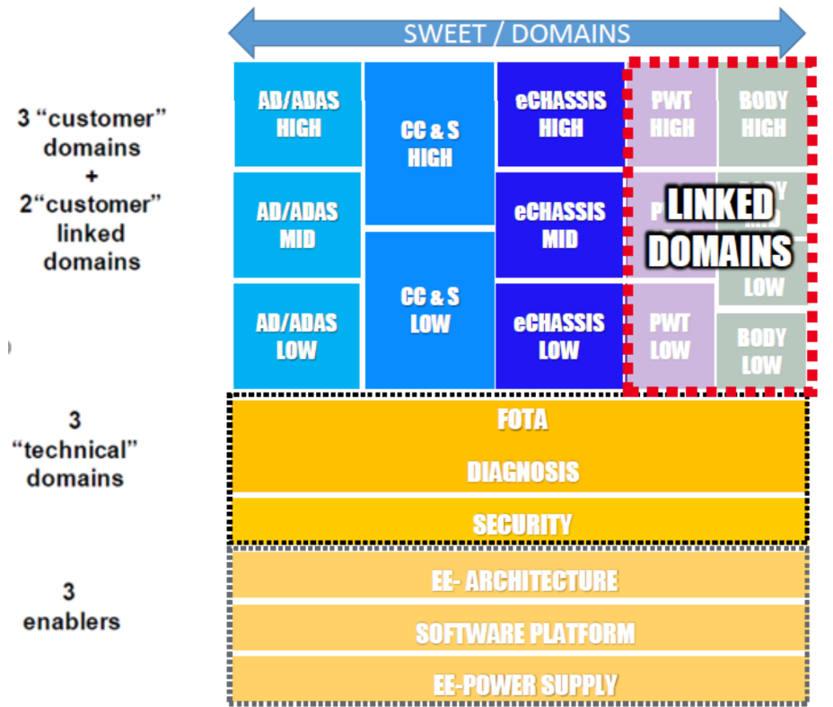
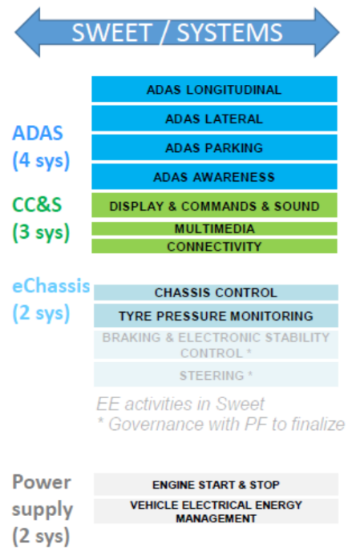
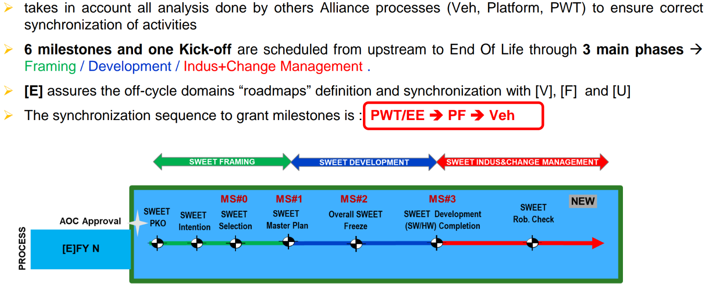
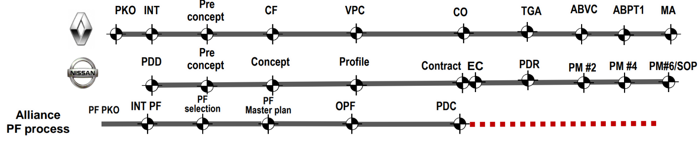
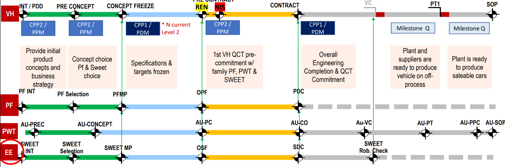
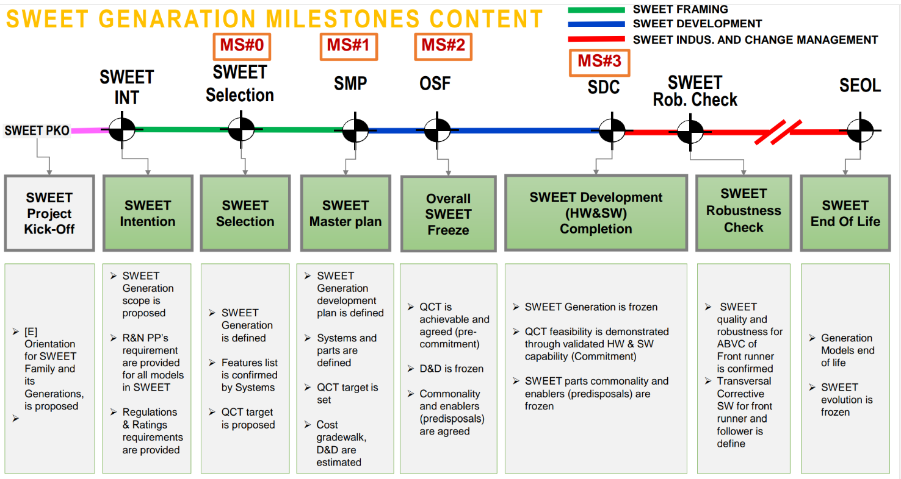
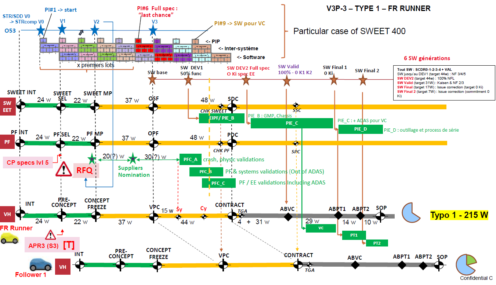

# SWEET

## SWEET MAIN PRINCIPLES

- **What does SWEET mean**
    - SWEET means **S**oft**W**are **E**lectric and **E**lectronic Technologies

- **What is SWEET?**
    - SWEET is a e-platform-like Program proposing solutions for a defined EE&SW perimeter, to be applied on a group of PF and Vehicles.

- **Why SWEET?**
    - New product increments and regulation severities forecasts for next years, show high needs of Electric Electronic and Software to be used in the vehicles.
    - The “platformization” answer brought by SWEET by providing higher transversality of Alliance EE&SW solutions will answer to this need, with the benefit to reduce Diversity, Cost and Entry Ticket, to improve systems interfaces and to obtain better quality.

- **What is the SWEET perimeter?**
    The SWEET perimeter is defined by : 
    - 3 “customer domains” (AD/ADAS, CCS, e-Chassis) 
    - 3 “technical” domains (Fota, Cybersecurity, Diagnosis) 
    - 3 “technical enablers” (EE architecture, PW Supply, SW platform) with a dedicated list of commodities.

- **How SWEET reduces Diversity?**
    - By proposing a limited sets of domain variants and their associated combinations, for a given group of PF and Vehicles.

- **What is the meaning of the index of SWEET 400?**
    - The index 400 identifies the SWEET Family, that is generally applied to vehicles having their SOP within a period of 2 years or more.
    - The Family has the same EE Architecture backbone ( ex : “C1A HS Evo” architecture for SWEET 400, “Face” for SWEET 500).

- **What is the meaning of a SWEET Generation?**
    - The SWEET Family is split in “Generations” : each Generation is applied to the vehicles having their SOP within a period of roughly 1 year (ex: SWEET 400 Initial, SWEET 400 Update, SWEET 400 2d Update, …)
    - IMPORTANT : SWEET milestones are passed for each Generation and associated PF/Vehicles.

- **How is SWEET Program synchronized with PWT, PF and Vehicles?**
    - SWEET process milestoning takes in account all analysis done by others Alliance processes (Veh, Platform, PWT) to ensure correct synchronization of activities.
    - 6 milestones and one Kick-off are scheduled from upstream to End Of Life through 3 main phases : Framing / Development / Indus+Change Management.
    - [E]assures the off-cycle domains “roadmaps” definition and synchronization with [V], [F] and [U]

- **Does SWEET have specific Quality Assurance**
    - Yes. Like PWT or PF programs, SWEET has its own Quality Assurance milestones, with dedicated A-MQC* and A-EQC* proposed, and with an A-CQE* providing the Quality Agreement with the associated Quality Star and Quality report for each milestone.
    - A specific SWEET DOA (Delegation Of Authorities) applies to these milestones.
    - Note : SWEET Generation milestones are passed with the first vehicle SWEET application milestones

## THE SWEET PERIMETER

- The SWEET perimeter is defined by : 3 “customer” domains (AD/ADAS, CCS (on-board), e-Chassis) , 3 “technical” 
domains (Fota, Cybersecurity, Diagnosis) and 3 “technical enablers” (EE architecture, PW Supply, SW platform).
- 2 “customer” linked domains” PWT&Body are synchronized with SWEET domains development but are not in the SWEET 
perimeter.
- For all these SWEET domains there are 12 associated Systems and 37 associated Components.

- **6 Domains:**
    - AD & ADAS
    - CC & S
    - Veh. Motion Ctrl
    - Cyber Security
    - FOTA
    - DIAGNOSIS
    

**12 systems:**
    - **ADAS (4 sys)**
        - ADAS LONGITUDINAL
        - ADAS LATERAL
        - ADAS PARKING
        - ADAS AWARENESS
    - **CC&S (3 sys) On Board only**
        - DISPLAY & COMMANDS & SOUND
        - MULTIMEDIA
        - CONNECTIVITY
    - **e-CHASIS**
        - CHASIS CONTROL
        - STEERING
        - TIRE PRESSURE MONITORING
    

**SWEET / 37 EE COMPONENTS**
- PARKING AID
- ADAS ECU
- DRIVER MONITOR CAMERA
- FRONT CAMERA
- SIDE RADER
- REAR CAMERA
- FRONT RADAR
- AVM CAM & AVM ECU
- HD MAP ECU
- LIDAR
- INFOTAINMENT
- TCU
- HEAD UP DISPLAY
- [AUDIO DISPLAY]
- COMBIMETER: Cluster
- LOUDSPEAKER
- ANTENNA
- RADIO HEAD UNIT
- MICROPHONE
- VSP: Vehicle Sound for Pedestrian​​ (VSP)​ is a device that emits noise to warn pedestrians of incoming electric vehicle
- MULTIMEDIA CONNECTION HUB
- [PHONE WIRELESS BATTERY CHARGER]
- VXU: V2X Unit (DSRC)
- IDG: IoT Device Gateway
- STEERING ANGLE SENSOR
- TPMS
- CDM (CHassis Domain Master)
- SHOCK ABSORBER ECU
- USM
- BODY CONTROL UNIT
- GATEWAY
- IKEY (i.e. HFM): Intelligent KEY (i.e. Hand Free Module)
- BATTERY 12V
- BATTERY SENSOR
- CSCM (CPL Chademp/GBT): Charge Station Communication Module
- DBC - DUAL BATTERY COUPLER
- BMS - BATTERY LOAD SENSOR (12V)
- SW / LICENSES / FEES / ROYALTIES

## SWEET GENERATION PRINCIPLES

- **GENERATION** allows to size the envelope by predisposing the whole

- The generation does its job well if it 
happens to have:
    - Envelope customer needs
    - Framework of the whole with filiations
    - the enablers for the dimensioning of transverse parts (full common)
- FIRST RUNNER (application)
    - Contents of the first runner only

- **A SWEET Generation is an Envelope development program with Predisposals:**
    - Based on the EE&SW [E] plan and defining:
        - A **New SWEET Family**
        - Or an **Evolution** of a existing family
    - Carrying on forecasted [V] and/or decided vehicles
    - Including vehicles SOP within a roughly 1 year period
    - Composed of:
        - All domains variants applied for each vehicle/PF of the Generation, with their M/B/C* filiations trees.
        - All domain combinations applied for each vehicle/PF of the Generation.
        - All associated Systems variants and Components.
        - The forecasted Enablers (Predisposals) of the current or next known Generation.

- **The Generation defines the envelope of constraints & diversity (unique domains variants filiations tree, environment constraints, Customer requirements)**
    - Generation milestones are passed with the first vehicle SWEET application milestones
    - Schedule :
        - all vehicles of the Generation must have their CF (Conformity Factor) passed before the first vehicle VPC (Vehicle PreContract, i.e. before the OSF SWEET milestone)
            - OSF: Overall SWEET Freeze, SWEET milestone
        Generation content is **frozen** at **SDC** (SWEET Development Completion) milestone

## SWEET MILESTONES

## SWEET MILESTONES ARE INCLUDED IN A-V3P MILESTONE GOVERNANCE

- A-V3P : 7 common milestones synchronize R/N projects for development efficiency on the same Platform
- Company milestone decisions for vehicle are based on common criteria 
- PF/PWT/EE Alliance decision (CCOSC/PSC) are based on Alliance function & milestone check-list (AEQC & AMQC)
- The synchronization sequence to grant milestones is: PWT/**EE ➔ PF ➔ Veh**

