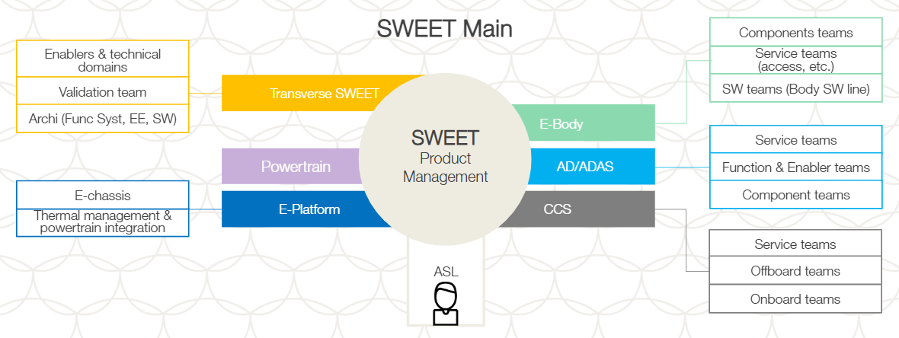
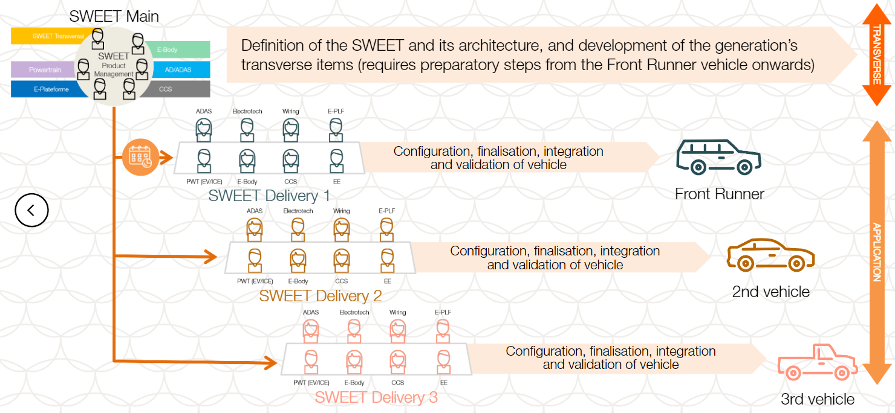
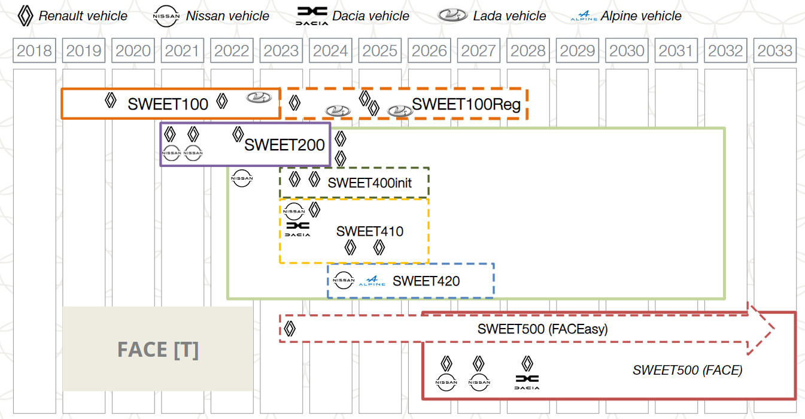
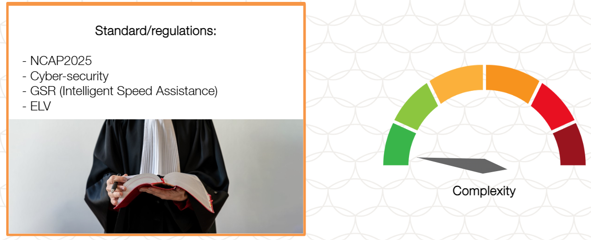

# Life Cycle of SWEET

## Characteristics & Performace of SWEETs

- 

- 
- 

### Agile developement of SWEETs

The SWEET Main represents all aspects of the development of the transverse part of the SWEET platform or generation and is managed by the **ASL - the Alliance Sweet Leader**. The ASL manages the specifications, the hardware and software, and validation and integration.

- 

- 
    - 

The SWEET Main team and the SWEET Delivery team have to talk to one another synchronise their activities.

The SWEET milestones are based on the V3P4 development logic, and the SWEET projects are managed in accordance with processes O21 (definition phase between kick-off and Master Plan) and O26 (development and industrialisation phase).

- Developing a SWEET in agile mode involves a series of development phases that are broken down into Product Increment Planning sessions (PIPs) and sprints.
    
    - 

    - **PIP(Product Increment Planing) sessesions:**
        - Take place every quarter to synchronise the teams from all the different domains
        - Format: 2 or 3 days of co-design workshops to define the priorties for the next 3 months and ensure synchronisation between teams and throughout development
        - Scheduled between the official V3P milestones
    - **Sprint:**
        - Between each PIP session, the teams work autonomously, following development cycles and deliveries every 3 weeks (sprints).

**Platformisaton of the SWEETs is facilitated by organising the teams in agile mode.**

### Management of SWEET diversity

**1 SWEET Platform = 1 unique EE architecture**

### Example: SWEET 400

## LIFE OF A SWEET

### SWEET life cycle & life duration

### Competitiveness of SWEETs

It is essential to determine how competitive a particular SWEET is to make sure that it compiles with regulation and that its features reflect market demand.

There are several aspects:
- The list of customer/user experiences (UX) that a SWEET variant is technically able to deliver
- The level of performance that can be attained by a given SWEET
- The capacity of SWEET to comply with current and future standars
- Analysis of the competition: does the SWEET have a strong position in the market?

## Future SWEET generations

### Fetures and regulatory requirements for future platforms

As more and more features are integrated in vehicles, SWEETs are going to become more complex. There will be arrival of new standards, 5G, new ADAS and regular service updates via the FOTA will be required.

### New EE architecture introduced with SWEET500

### The future of SWEET

FACE is the SWEET500 architecture that:
- **Limits the number of computers** in the vehicle, reducing volume, weight, and the amount of wiring
- **Simplifies the integration of new software features** by eleminating the distributed static architecuture used in previous SWEET platform and replacing it with centralised resources that can be re-used without changing the hardware
- **Simplifies vehicle integration** by using ongoing software-based integration instead of having to integrate new vehicle parts

## CONCULISION

### KEY TAKEAWAYS

- As markets evolve, to keep our products efficient and competive, and ensure ongoing security and complian e with regulations, the SWEET architectures have to be updated and new families and generations have to be created

- Each SWEET family or generation is developed by around 40 **autonomous, agile teams** organized by domain. Together, these teams make up what we call the **SWEET Main**.

- The **SWEET Delivery** teams, each assigned to given vehicle, are in charge of **integrating the SWEET Main platform** in their vehicle.

- The **SWEET milestones** are based on the **V3P4** development logic, and the SWEET projects are managed in accordance with processes O21 and O26.

- The milestone for each generation are **aligned** with schedulre for the **Front Runner vehicle**.

- Each SWEET platform is developed for a life duration of **10 years**. Each SWEET generation has a life cycle of approximately **1.5 years**. Its life duration varies according to vehicle requirements (regions, regulations).

- To minimise diversity,**certain combinations are re-used as much as possible** within each generation.

- It is essential to determine how competitive a particular SWEET is to make sure that it complies with regulations and that its features reflect market demand.

- SWEET500, with FACE, will have a centralised, modular and flexible eletronic architecture with a real-time automotive opearating system that is independent of the hardware architecture of the vehicle. It will be easier to systematically upgrade it in a targeted manner throughout the life of the vehicle.

- All car manufactures are adopting this type of architecture and it is gradually becoming the standard in the automotive industry.

