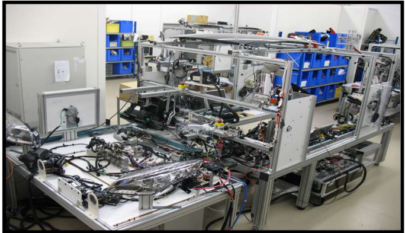
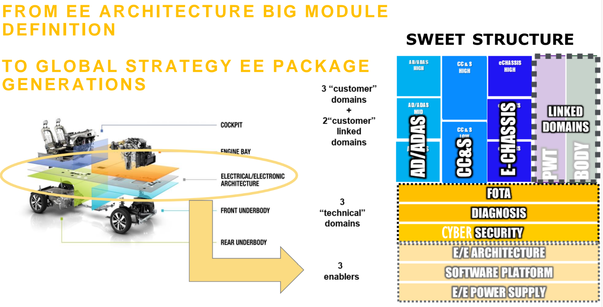
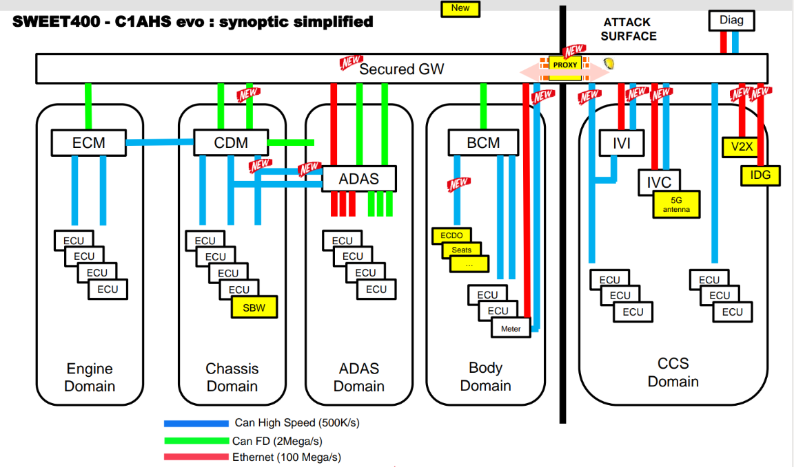

# Terminologies

## Corporate

- **SEA**: Strategic Expertise Area
- **DES**: Domain Expertise Strategy

## EE

### Overall

- **CCP (COTATION CONTENU PRESTATIONS) = «FEATURES CAR LEVEL QUOTATION**

- **EIPF/PIE**: Eletronic Integration PlatForm - An inter-systems validation support, using validate physically all the components software of teh EE Architecture of the vehicle.

### ADAS
- **ISA**: Intelligent Speed Assist
- **AEB**: Automatic Emergency Braking
- **LKA**: Lane Keeping Assist
- **E-LKA**: Emergency Lane Keeping Assist
- **BSIS**: Blind Spot Information System
- **DDAM**: Driver Drowsiness and Attention Monitoring
- **DRMAD**: Automatic Emergency Braking
- **MOIS**: Moving Off Information Sys.
- **ADR**: Advanced Distraction Recognition (Cam based)
- **VRU**: Vulnerable Road User
- **DSSAD**: Data Storage System for Automated Driving
- **AES**: Advanced Emergency Steering 
- **BSW**: Blind Spot Waring
- **LCW**: Lane Change Warning
- **RAEB**: Rear AEB
- **RCTA/B**: Rear Cross Traffic Alert/Braking
- **OSP**: Over Speed Prevention
- **TSR**: Traffic Sign Recognition
- **DMS**: Driver Monitoring System
- **OSE**: Occupant Safe Exit
- **AES**: Advanced Evasive Steering
- **ESS**: Emergency Steering Support

### ARCHI EE and SWEET

### SWEET 400 C1A HS Evo : For new features (Bus Load, Data business Flow, FOTA) and Cyber regulation

